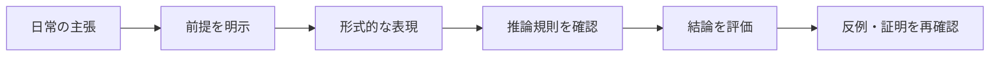

# 論理学とは何をする学問か

このページでは、logic_tower を読み進める前提として
**「そもそも論理学は何をする学問か」**を初学者向けに整理します。

結論を先に言うと、論理学は
- 主張を明確な形に直し、
- そこから妥当な推論だけを取り出し、
- 誰が確認しても同じ結論になる手順を作る
ための学問です。

---

## このページの到達目標
- 論理学が「内容の正しさ」ではなく「推論の構造」を調べる学問でもあると説明できる。
- 真理、妥当性、証明可能性を区別して検討する必要を説明できる。
- 正しい推論と、もっともらしい誤謬を形で見分けられる。
- 形式化しても、すべてがアルゴリズムで決定可能になるわけではないと理解する。

## 1. 論理学の目的（最短版）
論理学の目的は、次の3つです。

1. **主張の前提と構造を明示し、検討できる形式的な形にする。**
2. **推論の正しさを、手続きとして検証する。**
3. **議論を再現可能にし、共有できる形にする。**

数学だけでなく、プログラム仕様、法的文書、データ条件設計などでも
この3つは共通して重要です。

---

## 議論を分解する見取り図
次の図は、日常の主張を論理学で調べるときの流れです。読み取るポイントは、形式化は結論を自動的に正しくする魔法ではなく、前提・規則・結論を点検可能にする工程だということです。

## 2. なぜ学ぶのか（直観）
日常会話では、次のような曖昧さがよく出ます。

- 「たぶん正しい」
- 「普通はそうなる」
- 「みんな分かっているはず」

これらは便利ですが、厳密な検証には向きません。
論理学では、

- 前提（何を仮定するか）
- 規則（どう推論するか）
- 結論（何が言えるか）

を分離して明示します。
これにより、**どこで間違えたかを特定できる**ようになります。

---

## 3. 具体例：論理学がないと何が困るか
次の主張を見ます。

- 「雨なら地面は濡れる」
- 「地面が濡れている」
- 「だから雨が降った」

一見もっともらしいですが、これは一般には正しくありません。
散水や清掃でも地面は濡れるからです。

この混乱は、
- `P -> Q`
- `Q`
- `P`

を正しい推論だと誤認していることが原因です（**後件肯定の誤謬**）。

論理学を学ぶと、
- 正しい型（例: `P -> Q`, `P` なら `Q`）
- 誤った型（例: `P -> Q`, `Q` なら `P`）

を形として区別できるようになります。

---

## 具体例2：内容が奇妙でも推論の形は正しい
次の推論を考えます。

- すべての猫は数学者である。
- ミケは猫である。
- したがって、ミケは数学者である。

最初の前提は現実には偽でしょう。しかし「前提がすべて真なら結論も真になる」という推論の形は妥当です。論理学では、前提が現実に真かという問題と、前提から結論が妥当に導かれるかという問題を分けます。

## 4. 論理学の2つの視点
初学者が最初に混乱しやすいのは、次の2視点の違いです。

### 4.1 証明の視点（proof-theoretic）
- 規則に従って、結論を導く手順に注目する。
- どの行がどの前提・規則に依存しているかを追う。

### 4.2 意味の視点（model-theoretic）
- 主張が、どの解釈で真になるかに注目する。
- 「全ての解釈で真か」「ある解釈で真か」を区別する。

この2視点を往復できると、論理学の理解が一段深まります。
次ページ以降で本格的に扱います。

---

## 5. 最小用語（ここだけは押さえる）
- **命題**: 真偽が定まる文。
- **論理式**: 命題を記号で表したもの。
- **推論**: 前提から結論へ進むこと。
- **妥当**: どの解釈でも推論が崩れない性質。
- **充足**: ある解釈で式が真になること。

この5語は、今後ほぼ毎ページで登場します。
不安ならこの節に戻ってください。

---

## 6. つまずきやすい点
- 記号の暗記をゴールにしてしまう。
- 例を持たずに抽象語だけ追ってしまう。
- 「実際に真」と「論理的に導ける」を混同する。

### つまずいたときの復帰手順
1. 文章を「前提」と「結論」に分ける。
2. 前提を1つずつ書き出す。
3. どの規則で次へ進んだか1行メモする。

この3手順で、ほとんどの混乱は整理できます。

---

## 7. 演習問題
### 問1
論理学で前提・規則・結論を分ける利点を説明しなさい。

### 問2
$P\to Q$ と $Q$ から $P$ を導けない理由を、地面が濡れる例で説明しなさい。

### 問3
「前提が偽」と「推論が妥当でない」は同じですか。

### 問4
証明の視点と意味の視点は、それぞれ何を調べますか。

### 問5
主張を形式化すれば、必ずアルゴリズムで真偽を決定できますか。

### 問6
次の推論は妥当ですか。「すべての鳥は動物である。ペンギンは鳥である。ゆえにペンギンは動物である。」

---

## 8. 演習問題の解答
### 解答1
どの前提や規則に問題があるかを切り分け、他者が同じ手順を再確認できるようになる点です。

### 解答2
雨以外にも散水などで地面が濡れるため、$Q$ が真でも原因 $P$ は確定しません。これは後件肯定です。

### 解答3
同じではありません。前提が現実に偽でも推論の形は妥当な場合があります。妥当性は、前提がすべて真で結論だけ偽になる場合がないことです。

### 解答4
証明の視点は規則に従う導出手順を、意味の視点は解釈のもとでの真偽や反例を調べます。

### 解答5
できません。形式化は構造を明示しますが、すべての論理的問題に決定アルゴリズムがあることまでは保証しません。

### 解答6
妥当です。すべての鳥が動物で、ペンギンが鳥なら、同じ対象について動物であることが従います。

---

## 学習チェック（自己確認）
- 形式化と決定可能性を区別できる。
- 前提の真偽と推論の妥当性を区別できる。
- 後件肯定の反例を1つ作れる。
- 証明とモデルの2視点を説明できる。

---

## ナビゲーション
- 親: [README.md](README.md)
- 前: [README.md](README.md)
- 次: [01_language_and_meaning.md](01_language_and_meaning.md)
