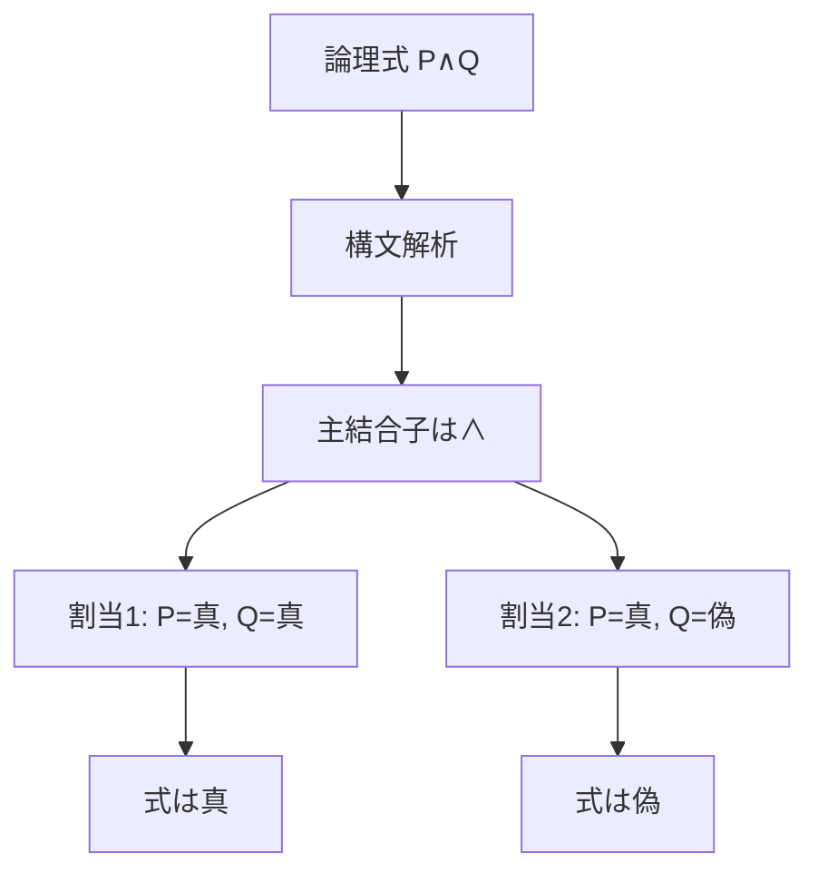

# 論理の言語と意味――構文と意味論を分ける

このページでは、論理学で最初につまずきやすい
**「言語（構文）」と「意味（意味論）」の違い**を整理します。

多くの初学者は、
- 記号の形だけを追ってしまう
- 逆に意味の直観だけで進んでしまう
のどちらかに偏ります。

論理学ではこの2つを分けて扱うことで、
「式として正しいか」と「意味として正しいか」を切り分けます。

---

## このページの到達目標
- 論理式として正しく作られていることと、ある解釈で真であることを区別できる。
- 命題論理の式を構文規則から段階的に組み立てられる。
- 真偽割当を与えて式を評価できる。
- 自然言語から形式化するとき、失われる文脈を確認できる。

## 1. まず結論：何を分けるのか

- **言語（language / syntax）**
  どの記号を、どんなルールで並べると「正しい式」になるか。
- **意味（meaning / semantics）**
  その式が、どんな状況で真・偽になるか。

例えるなら、
- 構文 = 文法として正しい日本語か
- 意味 = その文が現実の状況に合っているか
です。

---

## 構文から意味へ進む図
次の図では、同じ論理式が異なる割当で異なる真偽を持つことを示します。読み取るポイントは、式の木構造は同じでも、意味評価には別途解釈が必要なことです。

## 2. 構文（syntax）の最小イメージ
命題論理を例にすると、構文は次のように決まります。

1. 命題記号 `P, Q, R, ...` は式である。
2. `A` が式なら `¬A` も式である。
3. `A, B` が式なら `(A ∧ B)`, `(A ∨ B)`, `(A -> B)` も式である。
4. 上の規則で作られたものだけを式と呼ぶ。

ここで大事なのは、
**真偽はまだ見ていない**ことです。
構文は「形の正しさ」だけを判定します。

---

## 3. 意味（semantics）の最小イメージ
意味では、命題記号に真偽を割り当てます。

- 例: `P = 真`, `Q = 偽`

この割当（解釈）が決まると、
`¬`, `∧`, `∨`, `->` の意味規則に従って
式全体の真偽が決まります。

例えば `P -> Q` は、
- `P = 真`, `Q = 偽` のときだけ偽
- それ以外は真
です。

つまり意味論は、
**式の形に、真偽の評価ルールを与える作業**です。

---

## 4. 直観例：文法は正しいが内容は偽
次の文を見ます。

- 「2は偶数である」
- 「2は奇数である」

どちらも日本語としては文法的に正しい文です。
しかし意味的には、前者は真、後者は偽です。

論理式でも同じで、
- 「式として合法（well-formed）」
- 「その解釈で真」
は別問題です。

この切り分けができると、
議論のどこでミスしたかを特定しやすくなります。

---

## 具体例2：自然言語の形式化は選択を含む
「学生は本を読んだ」を $P$ と置けば命題論理で扱えます。しかし、誰がどの本を読んだかは消えます。文全体の真偽だけが必要なら有効ですが、対象の違いを扱うなら述語論理が必要です。

形式化では、何を残し何を捨てるかを明示します。記号に置き換えただけで、元の文脈が自動的に保存されるわけではありません。

## 5. よくある誤解

### 誤解1: 式として書けたら正しい
違います。式として正しい（構文OK）だけでは、
意味的な真偽は決まりません。

### 誤解2: 意味が分かれば括弧は不要
違います。括弧は構文を決める重要要素です。
`¬(P ∨ Q)` と `(¬P) ∨ Q` は別の式です。

### 誤解3: 自然言語をそのまま記号化できる
自然言語は省略・含意・文脈依存が多く、
そのままでは論理式に落ちません。
中間段階として「前提の明示化」が必要です。

---

## 6. 演習問題
### 問1
$P\to(Q\land R)$ は構文規則からどの順番で作られますか。

### 問2
$P\land$ が論理式でない理由を説明しなさい。

### 問3
$P=\mathrm{真}$、$Q=\mathrm{偽}$ のとき、$P\to Q$ の真偽を答えなさい。

### 問4
$\lnot(P\lor Q)$ と $(\lnot P)\lor Q$ が別の式である理由を説明しなさい。

### 問5
「式として正しい」と「妥当である」は同じですか。

### 問6
自然言語を形式化するときに確認すべきことを1つ挙げなさい。

---

## 7. 演習問題の解答
### 解答1
まず $Q$ と $R$ から $(Q\land R)$ を作り、次に $P$ とその式から $P\to(Q\land R)$ を作ります。

### 解答2
二項結合子 $\land$ の右側に必要な式がなく、生成規則を満たさないからです。

### 解答3
偽です。含意が偽になる唯一の場合は、前件が真で後件が偽のときです。

### 解答4
否定の作用範囲と主結合子が異なるためです。前者は選言全体を否定し、後者は $P$ だけを否定して $Q$ と選言します。

### 解答5
同じではありません。構文上正しい式でも、ある割当で偽になり得ます。妥当性はすべての割当で真である性質です。

### 解答6
たとえば、誰を対象にするか、どの文脈や時間を捨てるか、同じ語を同じ述語として扱ってよいかを確認します。

---

## 学習チェック（自己確認）
- 構文と意味論を1文ずつ説明できる。
- 式の構文木を内側からたどれる。
- 割当から式の真偽を計算できる。
- 形式化で捨てた情報を指摘できる。

---

## 次ページへの橋渡し
次の [02_proof_and_model.md](02_proof_and_model.md) では、構文側の「証明」と意味側の「モデル」を対応させます。

---

## ナビゲーション
- 親: [README.md](README.md)
- 前: [00_what_is_logic.md](00_what_is_logic.md)
- 次: [02_proof_and_model.md](02_proof_and_model.md)
