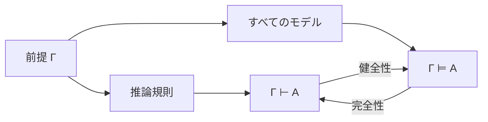

# 証明とモデル――導出と意味を往復する

このページでは、論理学の中核となる
**「証明（proof）」と「モデル（model）」の2つの見方**を整理します。

初学者が混乱しやすいポイントは、
- 証明できること（規則ベース）
- 真であること（意味ベース）

を同じものだと思ってしまう点です。
このページの目標は、両者を区別しつつ、つながりも理解することです。

---

## このページの到達目標
- $\Gamma\vdash A$ と $\Gamma\models A$ を正確に読める。
- 同じ推論を導出と反例探索の両方で調べられる。
- 健全性・完全性が、言語・意味論・証明体系の組に対する性質だと理解する。
- 「真」「妥当」「証明可能」を区別できる。

## 1. まず結論：2つの見方

### 1.1 証明の見方（syntactic / proof-theoretic）
- 前提から出発し、推論規則で結論を導く。
- 重要なのは「手順が規則に従っているか」。
- 記号の**形（構文）**に注目する。

### 1.2 モデルの見方（semantic / model-theoretic）
- ある解釈（真偽の割当や構造）を与えて主張の真偽を判定する。
- 重要なのは「その解釈で本当に成り立つか」。
- 記号の**意味（意味論）**に注目する。

---

## 2つの視点の関係
次の図は、前提 $\Gamma$ と結論 $A$ を、証明側と意味側から調べる流れです。読み取るポイントは、$\vdash$ と $\models$ が別の関係であり、それらの一致を保証する性質が健全性と完全性だということです。

## 2. 証明とは何か（直観→定義）

### 直観
証明は「納得の文章」ではなく、
**規則に基づく到達記録**です。

### 最小定義（命題論理のイメージ）
- 前提集合 `Γ` がある。
- 推論規則を有限回適用して式 `A` に到達できる。
- このとき `Γ ⊢ A`（ガンマからAを証明できる）と書く。

`⊢` は「証明可能」を表す記号で、
真偽そのものを直接表しているわけではありません。

---

## 3. モデルとは何か（直観→定義）

### 直観
モデルは、
「その主張が真になる具体的な世界設定」です。

### 最小定義（命題論理のイメージ）
- 命題記号に真偽を割り当てる（解釈）。
- その割当のもとで `A` が真なら、その解釈は `A` のモデル。
- すべてのモデルで `A` が真なら「意味的に妥当」。

`Γ ⊨ A` は「Γ が真である任意の解釈で A も真」を意味します。

---

## 4. 同じ主張を2視点で見る例
主張: `P -> Q`, `P` から `Q` は言えるか？

### 4.1 証明視点
- 前提: `P -> Q`, `P`
- 規則: modus ponens
- 結論: `Q`

よって `P -> Q, P ⊢ Q`。

### 4.2 モデル視点
`P -> Q` と `P` が同時に真なら、`Q` は必ず真です。
したがって、どの解釈でも前提が真なら結論も真。

よって `P -> Q, P ⊨ Q`。

このように、同じ推論を
- 手順として正しいか
- 意味として崩れないか
の両面で確認できます。

---

## 例2：反例モデルで非妥当性を示す
$P\to Q,Q$ から $P$ を導けるか考えます。$P$ を偽、$Q$ を真とする割当では、$P\to Q$ と $Q$ は真ですが $P$ は偽です。

したがって、

$
P\to Q,Q\not\models P
$

です。この1つの反例で意味的帰結でないと分かります。健全な体系なら、その推論の証明も存在しません。

## 5. なぜ2つ必要なのか

- 証明視点の利点: 機械化しやすい（証明支援系・自動証明）。
- モデル視点の利点: 反例を見つけやすい（どこで崩れるか直観しやすい）。

実務では、
- 仕様検証: モデルで反例探索
- 厳密保証: 証明で最終確定

という使い分けがよく行われます。

---

## 6. 健全性と完全性（入口だけ）
2視点をつなぐキーワードが次の2つです。

- **健全性（soundness）**: `Γ ⊢ A` なら `Γ ⊨ A`。
  - 証明できるものは意味的にも正しい。
- **完全性（completeness）**: `Γ ⊨ A` なら `Γ ⊢ A`。
  - 意味的に正しいものは証明でも到達できる。

固定した言語・意味論・証明体系についてこの2つがそろうと、
「証明」と「意味」がずれない強力な体系になります。別の体系にも無条件で成り立つ一般原則ではありません。
（詳しくは `03_soundness_completeness` 章で扱います）

---

## 7. よくあるつまずき
- `⊢` と `⊨` を同じ記号だと思う。
- 証明が書けないときに、意味側の反例確認をしない。
- 逆に真理値表だけで済ませて、規則ベースの証明練習をしない。

### 対策
1. ノートで `⊢`（証明）と `⊨`（意味）を色分けする。
2. 行き詰まったら「証明で攻めるか、反例を探すか」を先に決める。
3. 同じ問題を2回解く（証明法と真理値法）。

---

## 8. 演習問題
### 問1
$\Gamma\vdash A$ と $\Gamma\models A$ をそれぞれ説明しなさい。

### 問2
$P\land Q\vdash P$ を短く導出しなさい。

### 問3
$P\lor Q\models P$ が成り立たない反例割当を示しなさい。

### 問4
健全でない証明体系では何が起こり得ますか。

### 問5
完全でない証明体系では何が起こり得ますか。

### 問6
完全性は、どのような対象に対する性質ですか。

---

## 9. 演習問題の解答
### 解答1
前者は $\Gamma$ から規則を有限回適用して $A$ を導出できること、後者は $\Gamma$ を真にするすべての解釈で $A$ も真になることです。

### 解答2
前提 $P\land Q$ に $\land$ 除去を適用し、$P$ を得ます。

### 解答3
$P$ を偽、$Q$ を真とします。前提 $P\lor Q$ は真ですが、結論 $P$ は偽です。

### 解答4
意味的には成り立たない式を証明できてしまう可能性があります。

### 解答5
意味的には帰結する式なのに、採用した規則では証明へ到達できない可能性があります。

### 解答6
固定した言語・意味論・証明体系の組に対する性質です。あらゆる体系に無条件で成り立つとは限りません。

---

## 学習チェック（自己確認）
- $\vdash$ と $\models$ を混同せず読める。
- 非妥当性を反例モデル1つで示せる。
- 健全性と完全性の矢印の向きを言える。
- 完全性が体系に相対的な性質だと説明できる。

---

## ナビゲーション
- 親: [README.md](README.md)
- 前: [01_language_and_meaning.md](01_language_and_meaning.md)
- 次: [../01_propositional_logic/00_overview.md](../01_propositional_logic/00_overview.md)
