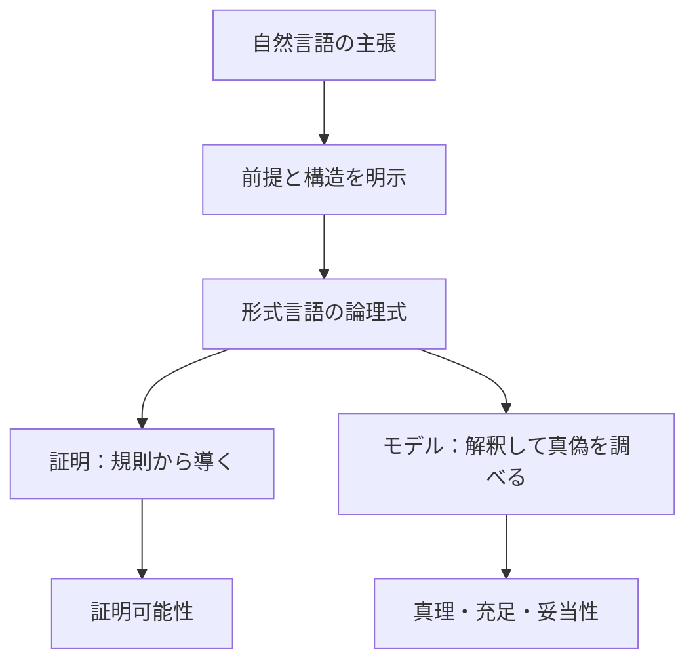

# 論理学への入口――主張・意味・証明を分けて考える

`00_orientation` は、Logicタワー全体を読む前に、**論理学は何を明らかにする学問なのか**を整理する導入章です。

いきなり記号計算に入るのではなく、まず日常の主張を「何が前提か」「どのような構造か」「どの意味で正しいと言うのか」に分けます。ここで見取り図を作っておくと、以降の論理記号を暗号ではなく、議論の構造を表す道具として読めるようになります。

---

## 1. この章の到達目標

この章を読み終えた時点で、次のことができる状態を目指します。

- 論理学の目的を、記号の暗記とは区別して説明できる。
- 日常言語と形式言語の役割の違いを具体例で説明できる。
- 主張、論理式、解釈、モデル、証明という用語を区別できる。
- 真理、妥当性、証明可能性を同じ意味で使わずに説明できる。
- 証明的な見方とモデル的な見方の違いを言える。
- 次章の命題論理で何を学ぶのかを把握できる。

---

## 2. 直観：論理学は「結論の内容」だけでなく「つながり方」を調べる

次の推論を考えます。

1. 雨が降るなら、路面は濡れる。
2. 雨が降っている。
3. したがって、路面は濡れている。

ここで

$$
P=\text{「雨が降っている」}
$$

$$
Q=\text{「路面が濡れている」}
$$

と置けば、推論の形は

$$
P\to Q,\quad P\quad\therefore\quad Q
$$

です。

論理学がまず調べるのは、今日、本当に雨が降っているかではありません。前提が真だとしたとき、この形で結論へ進んでよいかです。

この区別により、推論の**内容**と**構造**をいったん分けて検討できます。同じ推論の形は、雨の話だけでなく、プログラムの条件分岐やデータ抽出条件にも使えます。

---

## 3. この章を導く3つの問い

orientationでは、次の3つの問いを中心に進みます。

### 問い1：何を対象にするのか

真か偽かを問題にできる主張と、その組み立て方を扱います。

### 問い2：どの意味で「正しい」と言うのか

少なくとも、次の観点を区別します。

- 与えられた状況や解釈のもとで真か。
- すべての解釈で崩れないか。
- 採用した証明規則から導けるか。

### 問い3：なぜ記号化するのか

前提、構造、記号の範囲を明示し、他の人が同じ手順で検討できるようにするためです。

記号化しても、あらゆる問題がアルゴリズムで決定可能になるわけではありません。形式化の役割は、主張を**構造と前提が明示された形**にし、真理・妥当性・証明可能性を区別して検討できるようにすることです。

---

## 4. 全体像：自然言語から2つの確認方法へ

次の図は、日常の主張を形式化したあとに、証明とモデルという2つの方向から調べる流れを表します。

この図から読み取るポイントは、次の2つです。

- 形式化は結論を自動的に正しくする工程ではなく、何を検討しているかを明示する工程である。
- 証明とモデルは同じ論理式を見るが、「規則から導けるか」と「解釈のもとで真か」という異なる問いを扱う。

後の章で学ぶ健全性と完全性は、この2方向がどのように対応するかを、特定の言語・意味論・証明体系の組について調べる性質です。

---

## 5. 最初に区別する用語

| 用語 | この教材での役割 | 短い例 |
|---|---|---|
| 主張 | 真偽を問題にする内容 | 「雨が降っている」 |
| 論理式 | 主張の構造を形式記号で表したもの | $P\to Q$ |
| 解釈 | 記号が何を表し、どう真偽を与えるかを決めるもの | $P$ を真、$Q$ を偽とする |
| モデル | 対象の式や前提を真にする解釈・構造 | $P\lor Q$ を真にする解釈 |
| 証明 | 採用した推論規則に従う有限の導出 | $P\to Q$ と $P$ から $Q$ |
| 妥当性 | すべての対象となる解釈で真である性質 | $P\lor\lnot P$ |

この段階では定義を完全に暗記する必要はありません。重要なのは、「式そのもの」「式に意味を与えること」「規則に従って式を導くこと」を同じものだと思わないことです。

### 2つの記号

後のページでは、次の記号を使います。

$$
\Gamma\vdash\varphi
$$

は「前提集合 $\Gamma$ から、証明体系の規則によって $\varphi$ を導ける」という**証明側**の記述です。

$$
\Gamma\models\varphi
$$

は「$\Gamma$ をすべて真にするどのモデルでも $\varphi$ が真である」という**意味側**の記述です。

$\vdash$ と $\models$ は見た目が似ていますが、答えている問いが異なります。

---

## 6. 具体例1：基準を明示する

次の2文を比べます。

- 彼は背が高い。
- 彼の身長は180cm以上である。

1つ目の「高い」は、年齢、集団、会話の目的によって基準が変わります。2つ目は、少なくとも比較基準が明示されています。

この違いから、形式化の第一歩を次のように整理できます。

1. 誰についての主張かを決める。
2. 「高い」の基準を決める。
3. 必要なら、測定方法や単位も決める。
4. 決めた前提のもとで主張を評価する。

ここで注意したいのは、「180cm以上」という文も現実世界について絶対に誤りなく判定できるわけではないことです。測定誤差や時点の指定は残ります。それでも、何を前提に検討するかは明確になります。

論理学は、曖昧さを魔法のように消すのではありません。どこに選択や前提があるかを表に出します。

---

## 7. 具体例2：推論の形を検査する

先ほどとは異なる推論を考えます。

1. 雨が降るなら、路面は濡れる。
2. 路面が濡れている。
3. したがって、雨が降った。

形式化すると、

$$
P\to Q,\quad Q\quad\therefore\quad P
$$

です。

この推論は一般には妥当ではありません。散水によって路面が濡れた可能性があるからです。

反例となる解釈を、次のように置けます。

$$
P=\mathrm{F},\qquad Q=\mathrm{T}
$$

このとき $P\to Q$ は真で、$Q$ も真ですが、結論 $P$ は偽です。前提がすべて真なのに結論が偽になる解釈が1つ見つかったので、この推論は妥当ではありません。これは**後件肯定**と呼ばれる典型的な誤りです。

一方、

$$
P\to Q,\quad P\quad\therefore\quad Q
$$

では、前提をすべて真にしながら結論だけを偽にする解釈はありません。この形を**モーダス・ポネンス**と呼びます。

---

## 8. 証明的な見方とモデル的な見方

同じ推論を、2つの方向から確認できます。

### 証明的な見方

採用した推論規則を使い、前提から結論へ進めるかを調べます。

$$
P\to Q,\quad P\vdash Q
$$

ここでは「モーダス・ポネンスという規則を適用できる」と説明します。

### モデル的な見方

前提をすべて真にする解釈を考え、そのどれでも結論が真になるかを調べます。

$$
P\to Q,\quad P\models Q
$$

ここでは「前提を真、結論を偽にする反例がない」と説明します。

初学者の段階では、片方だけで済ませず、「規則ではどう見るか」「解釈ではどう見るか」を往復すると理解が安定します。

---

## 9. 典型的な誤解と反例

### 誤解1：形式化すれば、すべて機械的に判定できる

形式化は、問題の構造を明示します。しかし、形式体系によっては、妥当性や証明可能性をあらゆる入力について必ず停止して判定するアルゴリズムが存在しません。

**復帰の問い**：「いま主張の構造を明示したのか、それとも判定アルゴリズムの存在まで示したのか」を分けます。

### 誤解2：前提が現実に偽なら、推論の形も誤りである

妥当性は、前提と結論のつながり方の性質です。現実に前提が真かどうかとは別に検討できます。

たとえば、

$$
\text{月がチーズなら月は食べ物である}
$$

$$
\text{月はチーズである}
$$

したがって「月は食べ物である」という推論は、前提の事実性とは別に、モーダス・ポネンスの形を持ちます。

### 誤解3：「真」と「証明できる」は同じである

「真」は解釈・モデルに関する語で、「証明できる」は証明体系に関する語です。両者の対応を述べるには、どの言語・意味論・証明体系を採用したかを指定する必要があります。

### 誤解4：記号にすれば曖昧さは消える

$P$ と書いても、$P$ が何を表すかが不明なら曖昧さは残ります。記号化と意味づけは別の工程です。

---

## 10. つまずいたときの復帰方法

論理式が読めなくなったら、次の順で戻ります。

1. **日本語へ戻す**：各記号が表す主張を短い文で書く。
2. **前提と結論を分ける**：どこまでを仮定し、何を示したいかを書く。
3. **括弧を補う**：論理記号の働く範囲を明示する。
4. **問いを選ぶ**：真偽、妥当性、証明可能性のどれを調べているか決める。
5. **小さい例を作る**：命題を2個程度に減らし、真偽を具体的に割り当てる。
6. **反例を探す**：前提が真で結論が偽になる場合がないか調べる。

特に、式変形だけを繰り返して迷ったときは、1と4へ戻るのが有効です。

---

## 11. この章の読み方

この章は次の順で進みます。

1. [論理学とは何か](00_what_is_logic.md)  
   論理学の目的、射程、推論の形を学びます。
2. [言語と意味](01_language_and_meaning.md)  
   記号列を作る規則と、記号に意味を与える規則を分けます。
3. [証明とモデル](02_proof_and_model.md)  
   $\vdash$ と $\models$ の2つの見方を比較します。

この3ページを読んだあと、[命題論理](../01_propositional_logic/00_overview.md)で論理式の文法、真理値表、標準形、自然演繹へ進みます。

---

## 12. 演習問題

### 問1

論理学で自然言語の主張を形式化する目的を、「機械的に判定できるようにする」という表現を使わず、2文以内で説明しなさい。

### 問2

次の推論を $P$ と $Q$ を使って形式化しなさい。

- 会員なら入場できる。
- アキラは会員である。
- したがって、アキラは入場できる。

### 問3

次の推論が一般には妥当でないことを、別の原因を1つ挙げて説明しなさい。

- 火災が起きれば警報が鳴る。
- 警報が鳴っている。
- したがって、火災が起きた。

### 問4

$\Gamma\vdash\varphi$ と $\Gamma\models\varphi$ は、それぞれ何を表しますか。

### 問5

「式を形式記号で書いたこと」と「その式に意味を与えたこと」が同じでない理由を説明しなさい。

### 問6

ある推論が妥当でないことをモデル的な見方で示すには、どのような反例を1つ見つければよいですか。

---

## 13. 演習問題の解答

### 解答1

主張の前提と構造を明示し、同じ規則のもとで検討できる形にします。また、真理、妥当性、証明可能性のどれを問題にしているかを区別しやすくします。

### 解答2

$$
P=\text{「アキラは会員である」}
$$

$$
Q=\text{「アキラは入場できる」}
$$

と置けば、

$$
P\to Q,\quad P\quad\therefore\quad Q
$$

です。モーダス・ポネンスの形です。

### 解答3

点検や訓練、機器の故障によって警報が鳴った可能性があります。したがって、警報が鳴ったという結果だけから火災という原因は確定しません。推論の形は後件肯定です。

### 解答4

$\Gamma\vdash\varphi$ は、前提 $\Gamma$ から採用した証明規則によって $\varphi$ を導けることを表します。$\Gamma\models\varphi$ は、$\Gamma$ をすべて真にするどのモデルでも $\varphi$ が真であることを表します。

### 解答5

記号列の作り方だけでは、各記号が現実や数学の何を指すか、どのとき真になるかは決まりません。構文に加えて、解釈や意味論を指定する必要があります。

### 解答6

前提をすべて真にし、結論を偽にする解釈を1つ見つければ十分です。その解釈が、推論の妥当性に対する反例になります。

---

## 14. 学習チェック

- 論理学の目的を「記号の暗記」と区別して説明できる。
- 形式化と決定可能性を同じものだと思っていない。
- 主張、論理式、解釈、モデル、証明を区別できる。
- $\vdash$ と $\models$ の違いを日本語で説明できる。
- モーダス・ポネンスと後件肯定を区別できる。
- 推論が妥当でないことを、反例となる解釈で示せる。
- 迷ったときに、前提・結論・調べている問いへ戻れる。

3つ以上説明できない項目がある場合は、[論理学とは何か](00_what_is_logic.md)へ進む前に、該当する節と演習の解答をもう一度対応づけてください。

---

## ナビゲーション

- 親: [Logicタワー入口](../README.md)
- 前: [Logicタワー入口](../README.md)
- 次: [論理学とは何か](00_what_is_logic.md)
- 子:
  - [論理学とは何か](00_what_is_logic.md)
  - [言語と意味](01_language_and_meaning.md)
  - [証明とモデル](02_proof_and_model.md)
