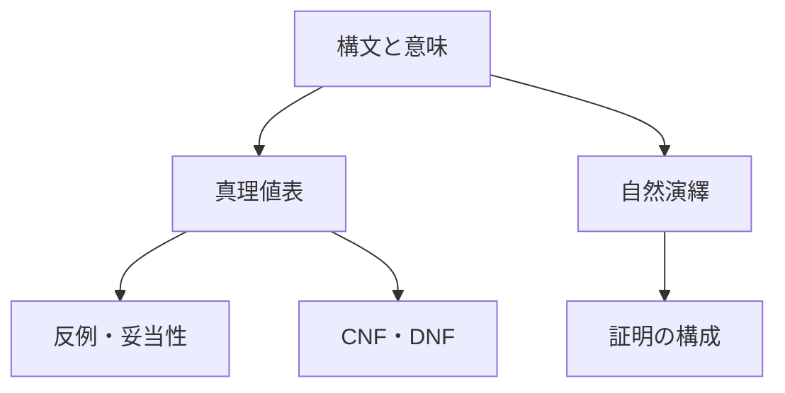

# 命題論理への入口――文の真偽と推論の形

この章は、logic_tower の中で最初に本格的な計算と推論を扱う章です。
ここで学ぶ命題論理は、後続の述語論理・証明論・計算理論の土台になります。

初学者向けに言うと、命題論理は
- 文を記号に直し、
- その文同士の関係を厳密に扱い、
- 推論が正しいかを機械的に確認する
ための最初の道具箱です。

---

## 1. この章の到達目標
この章を終える時点で、次を目指します。

- 命題・論理結合子（`¬, ∧, ∨, ->`）の意味を説明できる。
- 真理値表で主張の真偽を判定できる。
- 論理式を標準形（CNF/DNF）に変形できる。
- 自然演繹で短い推論を構成できる。
- ある推論が妥当かどうかを、複数手段で確認できる。

---

## 2. なぜ命題論理から始めるのか
いきなり述語論理へ進むと、量化記号や変数束縛が同時に入り難しくなります。
命題論理ではまず、

- 1文を1つの記号（`P`, `Q` など）として扱う
- 文同士を結合子でつなぐ

という最小構成に集中できます。

この段階で「推論の型」を掴んでおくと、
後の `∀`, `∃` を含む議論でも迷いにくくなります。

---

## 章の見取り図
次の図は、論理式を作ってから、意味と証明の2方向で調べる学習順を示します。読み取るポイントは、真理値表・標準形・自然演繹が競合する手法ではなく、同じ式を異なる角度から扱う道具だということです。

## 3. この章の学習マップ

### 3.1 [01_syntax_semantics.md](01_syntax_semantics.md)
- 何が「式として正しいか（構文）」
- その式をどう評価するか（意味）
を整理します。

### 3.2 [02_truth_tables.md](02_truth_tables.md)
- 真理値表を使い、式や推論の妥当性を判定します。
- 反例（どの割当で崩れるか）を探す力を育てます。

### 3.3 [03_normal_forms.md](03_normal_forms.md)
- DNF/CNF への変形を学びます。
- 自動推論・SAT・回路設計との接続の入口になります。

### 3.4 [04_natural_deduction.md](04_natural_deduction.md)
- 規則ベースの証明手順を学びます。
- 「真理値で確かめる」から「証明を組み立てる」へ進みます。

---

## 4. 典型例（導入）
次の推論を考えます。

- もし試験勉強をしたら合格する（`P -> Q`）
- 試験勉強をした（`P`）
- よって合格する（`Q`）

これは命題論理の最重要規則 **modus ponens** です。

この1例だけでも、
- 真理値表で妥当性を確認する方法
- 自然演繹で証明を書く方法

の2通りで確認できます。
この「同じ主張を別手段で検証する」習慣が重要です。

---

## 具体例2：条件文を論理式へ分ける
「会員であり、かつ年齢が18歳以上なら入場できる」を

$
(M\land A)\to E
$

と置きます。$M$ は会員、$A$ は18歳以上、$E$ は入場可能です。括弧を外して $M\land(A\to E)$ とすると、「会員である」と「18歳以上なら入場可能」を並べた別の主張になります。

命題記号の意味を先に書き、主結合子を確認すると誤読を減らせます。

## 5. つまずきやすい点
- `P -> Q` を「PとQが因果で結ばれている」と思い込みすぎる。
- `Q` が真だから `P` も真だろうと逆向き推論してしまう（後件肯定）。
- 括弧を省略して式の構造を取り違える。
- 真理値表の列を途中で取り違えて計算ミスする。

### 対策
1. 推論規則の名前（MP, MT など）で整理する。
2. 誤りやすい型を「禁止パターン」としてメモする。
3. 真理値表は列見出しを固定し、手順を毎回同じ順序で行う。

---

## 6. 演習問題
### 問1
「雨が降らず、風が強い」を $R,W$ で表しなさい。

### 問2
$P\to Q$ が偽になる割当を答えなさい。

### 問3
$P\to Q,Q$ から $P$ を導く推論が誤りである反例を示しなさい。

### 問4
真理値表と自然演繹の役割の違いを説明しなさい。

### 問5
CNFとDNFは、それぞれどの結合子が外側の骨格になりますか。

### 問6
命題論理が「すべての学生」を内部構造のまま表しにくい理由を説明しなさい。

---

## 7. 演習問題の解答
### 解答1
$\lnot R\land W$ です。

### 解答2
$P$ が真、$Q$ が偽のときです。

### 解答3
$P$ を偽、$Q$ を真とすれば、$P\to Q$ と $Q$ は真ですが $P$ は偽です。

### 解答4
真理値表は全割当を調べて真偽や妥当性を判定し、自然演繹は推論規則で結論へ至る証明を構成します。

### 解答5
CNFは節の連言、DNFは項の選言が外側の骨格です。

### 解答6
命題論理では文全体を1つの命題記号として扱い、対象・性質・量化を分解しないからです。

---

## 学習チェック（自己確認）
- 主結合子と括弧から式の構造を読める。
- 含意が偽になる条件を説明できる。
- 反例割当を使って非妥当性を示せる。
- 真理値表・標準形・自然演繹の役割を区別できる。

---

## 次章との接続
命題論理で文と推論の型を固めたら、[述語論理](../02_predicate_logic/00_overview.md) で対象・性質・量化を導入します。

---

## ナビゲーション
- 親: [../README.md](../README.md)
- 前: [../00_orientation/02_proof_and_model.md](../00_orientation/02_proof_and_model.md)
- 次: [01_syntax_semantics.md](01_syntax_semantics.md)
