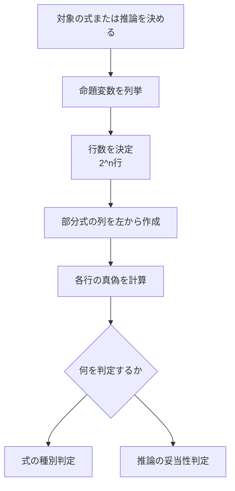

# 02_truth_tables

このページでは、命題論理の判定手法である**真理値表**を学びます。
真理値表を使うと、

- ある論理式が常に真か（トートロジー）
- ある推論が妥当か（前提が真なら結論も真か）

を機械的に確認できます。

---

## 1. このページの到達目標
- 式の変数数から必要な行数を決められる。
- 真理値表を手順どおり作成できる。
- 論理式の種別（常真・充足可能・矛盾）を判定できる。
- 推論の妥当性を反例探索で判定できる。

---

## 2. 全体フロー（この図で「作表→判定」の順を読む）
次の図は、真理値表で判定するときの標準手順です。

ポイントは、最終列だけでなく**途中の部分式列**を丁寧に作ることです。

---

## 3. 基本記号（TeX表記）
本ページでは論理記号を次のように扱います。

- 否定: $\lnot P$
- 連言: $P \land Q$
- 選言: $P \lor Q$
- 含意: $P \to Q$

ASCII記法（`!`, `&&`, `||`, `->`）は補助としてのみ使い、
本文の説明はTeX記法を優先します。

---

## 4. 真理値表の作り方

### 4.1 行数を決める
命題変数が $n$ 個なら、行数は

$$
2^n
$$

です。例えば $P,Q$ の2変数なら4行、$P,Q,R$ なら8行です。

### 4.2 列を設計する
対象式が

$$
(P \to Q) \land P
$$

なら、少なくとも次の列を用意します。

1. $P$
2. $Q$
3. $P \to Q$
4. $(P \to Q) \land P$

### 4.3 値を埋める
各行で、部分式から順に真偽を埋めます。
特に含意 $P \to Q$ は

- $P=\text{真}, Q=\text{偽}$ のときだけ偽

という規則を毎回確認します。

---

## 5. 具体例1：式の種別判定
次の式を判定します。

$$
P \lor \lnot P
$$

全行で真になるため、これは**トートロジー**です。

対照的に

$$
P \land \lnot P
$$

は全行で偽になり、**矛盾式**です。

---

## 6. 具体例2：推論の妥当性判定
次の推論を判定します。

$$
P \to Q,\; P \vdash Q
$$

真理値表で「前提が両方真で結論が偽」の行を探します。
その行が存在しなければ妥当です。

この推論では反例行が存在しないため、妥当です（modus ponens）。

一方、

$$
P \to Q,\; Q \vdash P
$$

は反例（$P=\text{偽},Q=\text{真}$ など）があるため非妥当です。

---

## 7. よくあるつまずき
- 行数を間違える（$2^n$ を忘れる）。
- 部分式列を省略して最終列だけ埋めようとしてミスする。
- $P \to Q$ を「因果関係」で判断し、真理値規則から外れる。

### 対策
1. 最初に変数数と行数を紙の上部に固定で書く。
2. 部分式を必ず小さい順に列化する。
3. 含意だけは「偽になる1ケース」を先に覚える。

---

## 8. ミニ演習
1. 次の式の行数を答える。

$$
(P \land Q) \to R
$$

2. 次の式がトートロジーか判定する。

$$
(P \to Q) \lor (Q \to P)
$$

3. 次の推論が妥当か判定する。

$$
P \lor Q,\; \lnot P \vdash Q
$$

---

## 学習チェック（自己確認）
- 真理値表の行数を $2^n$ で即答できる。
- 式判定と推論判定の違いを説明できる。
- 反例行の有無で妥当性を判断できる。

---

## ナビゲーション
- 親: [00_overview.md](00_overview.md)
- 前: [01_syntax_semantics.md](01_syntax_semantics.md)
- 次: [03_normal_forms.md](03_normal_forms.md)
