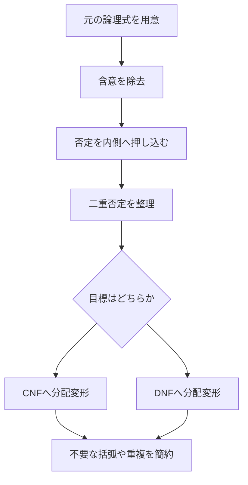

# 03_normal_forms

このページでは、命題論理の式を**標準形（normal form）**に変換する方法を学びます。
標準形は、見た目をそろえるためだけでなく、

- 真偽判定の整理
- SATソルバへの入力
- 論理回路・制約処理との接続

に直結する実用的な道具です。

---

## 1. このページの到達目標
- $\mathrm{DNF}$（選言標準形）と $\mathrm{CNF}$（連言標準形）の違いを説明できる。
- 基本同値変形（ド・モルガン、分配、二重否定）を使える。
- 任意の式を段階的に標準形へ変換できる。
- 変換後の式が元の式と同値である理由を説明できる。

---

## 2. 変換の全体フロー（この図で「否定押し下げ→分配」の順を読む）
次の図は、標準形変換の典型手順です。

特に重要なのは、**分配を行う前に否定を原子命題まで押し込む**ことです。

---

## 3. 基本用語と形

### 3.1 リテラル
- 命題記号 $P$ またはその否定 $\lnot P$。

### 3.2 DNF（選言標準形）
- リテラルの連言（$\land$）を、さらに選言（$\lor$）でつないだ形。
- 例:

$$
(P \land \lnot Q) \lor (\lnot P \land R)
$$

### 3.3 CNF（連言標準形）
- リテラルの選言（$\lor$）を、さらに連言（$\land$）でつないだ形。
- 例:

$$
(P \lor Q) \land (\lnot P \lor R)
$$

---

## 4. 使う同値変形（最小セット）

1. 含意除去

$$
P \to Q \equiv \lnot P \lor Q
$$

2. 二重否定

$$
\lnot\lnot P \equiv P
$$

3. ド・モルガン

$$
\lnot(P \land Q) \equiv \lnot P \lor \lnot Q
$$

$$
\lnot(P \lor Q) \equiv \lnot P \land \lnot Q
$$

4. 分配法則

$$
P \lor (Q \land R) \equiv (P \lor Q) \land (P \lor R)
$$

$$
P \land (Q \lor R) \equiv (P \land Q) \lor (P \land R)
$$

---

## 5. 具体例1：CNFへ変換
次の式をCNFへ変換します。

$$
P \to (Q \land R)
$$

### 手順
1. 含意除去:

$$
\lnot P \lor (Q \land R)
$$

2. 分配:

$$
(\lnot P \lor Q) \land (\lnot P \lor R)
$$

これでCNFです。

---

## 6. 具体例2：DNFへ変換
次の式をDNFへ変換します。

$$
(P \lor Q) \land R
$$

分配により

$$
(P \land R) \lor (Q \land R)
$$

となり、DNFの形になります。

---

## 7. なぜ標準形が重要か
- CNFはSATソルバ入力で事実上の標準。
- DNFは「真になる条件の列挙」に向く。
- 等価変形の練習として、推論規則の理解が深まる。

実務では、
- 仕様条件をCNF化して自動検査
- ルールの可読化のためDNF化

のような使い分けがよくあります。

---

## 8. よくあるつまずき
- 含意除去を忘れて分配を始める。
- ド・モルガンで $\land$ と $\lor$ の入れ替えを忘れる。
- 途中式で同値（$\equiv$）と導出（$\vdash$）を混同する。

### 対策
1. 変換テンプレートを固定する（含意除去→否定押し下げ→分配）。
2. 1行ごとに「何の法則を使ったか」を横にメモする。
3. 最後にランダムな真偽割当で元式と一致確認をする。

---

## 9. ミニ演習
1. 次をCNFへ変換する。

$$
(P \to Q) \land (R \to S)
$$

2. 次をDNFへ変換する。

$$
P \land (Q \lor R)
$$

3. 次の式で、最初に使うべき法則を答える。

$$
\lnot(P \to Q)
$$

---

## 学習チェック（自己確認）
- CNFとDNFの違いを、式の形で説明できる。
- 変換手順を順番どおりに再現できる。
- 少なくとも1つの式について、CNF/DNF両方へ変換できる。

---

## ナビゲーション
- 親: [00_overview.md](00_overview.md)
- 前: [02_truth_tables.md](02_truth_tables.md)
- 次: [04_natural_deduction.md](04_natural_deduction.md)
