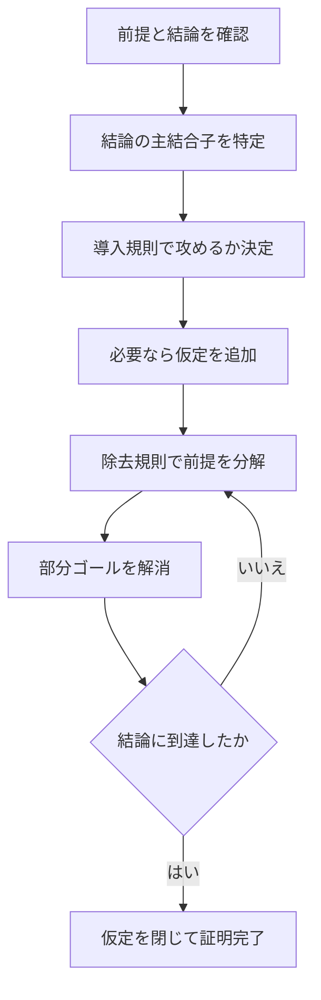

# 04_natural_deduction

このページでは、命題論理の証明手法である**自然演繹（natural deduction）**を学びます。
真理値表は「正しいかを判定」する道具でしたが、自然演繹は

- どの前提から
- どの規則を使って
- どの結論を導いたか

を行単位で明示する道具です。

---

## 1. このページの到達目標
- 自然演繹の役割（判定ではなく構成）を説明できる。
- 導入規則（introduction）と除去規則（elimination）の違いを説明できる。
- 基本規則（$\land, \lor, \to, \lnot$）で短い証明を書ける。
- よくある誤謬（後件肯定など）を規則レベルで検出できる。

---

## 2. 証明の流れ（この図で「目標分解→規則適用→到達」を読む）
次の図は、自然演繹で問題を解くときの標準フローです。

ポイントは、**結論の形を見て規則を選ぶ**ことです。

---

## 3. 自然演繹の基本観点

### 3.1 記号
- $\Gamma \vdash A$ : 前提集合 $\Gamma$ から結論 $A$ を証明できる。
- ここでの $\vdash$ は「証明可能」を表します（意味的真理そのものではない）。

### 3.2 導入規則と除去規則
- 導入規則: ある結合子を**作る**規則。
- 除去規則: ある結合子を**分解して使う**規則。

例:
- $\to$ 導入: 仮定 $P$ から $Q$ を導けたら $P \to Q$。
- $\to$ 除去（modus ponens）: $P \to Q$ と $P$ から $Q$。

---

## 4. 主要規則（最小セット）

### 4.1 連言
- $\land$ 導入: $P$ と $Q$ があれば $P \land Q$。
- $\land$ 除去: $P \land Q$ から $P$、または $Q$。

### 4.2 選言
- $\lor$ 導入: $P$ があれば $P \lor Q$（対称に $Q \lor P$ も可）。
- $\lor$ 除去: 場合分け。$P \lor Q$ と
  - $P$ なら $R$
  - $Q$ なら $R$
  が示せれば $R$。

### 4.3 含意
- $\to$ 導入: 仮定 $P$ の下で $Q$ を示し、仮定を閉じて $P \to Q$。
- $\to$ 除去: $P \to Q$ と $P$ から $Q$。

### 4.4 否定
- 実装流儀により差はあるが、典型的には
  - $\lnot P$ を $P \to \bot$ とみなす
  - 背理法や矛盾導出を使う

---

## 5. 具体例1：$P \land Q \vdash P$
これは $\land$ 除去の最短例です。

1. $P \land Q$（前提）
2. $P$（1から $\land$ 除去）

これで完了です。

---

## 6. 具体例2：$P \to Q,\; P \vdash Q$

1. $P \to Q$（前提）
2. $P$（前提）
3. $Q$（1,2 から $\to$ 除去）

これは modus ponens の自然演繹版です。

---

## 7. 具体例3：$P \vdash Q \to P$
結論の主結合子が $\to$ なので、$\to$ 導入で攻めます。

1. $P$（前提）
2. $Q$ を仮定
3. $P$（1を再利用）
4. $Q \to P$（2–3 から $\to$ 導入）

ここで重要なのは、仮定 $Q$ を**閉じる**操作です。

---

## 8. よくあるつまずき
- 結論を見ずに規則を当てずっぽうで使う。
- 仮定の開閉（スコープ）を管理できず混乱する。
- $\lor$ 除去の「両場合で同じ結論が必要」を忘れる。

### 対策
1. 1行目に「最終結論の主結合子」を書く。
2. 仮定ブロックをインデントや番号で明示する。
3. 各行の右に「どの規則を使ったか」を必ずメモする。

---

## 9. ミニ演習
1. $P \land Q \vdash Q \land P$ を示す。
2. $P \to Q,\; Q \to R,\; P \vdash R$ を示す。
3. $P \lor Q,\; P \to R,\; Q \to R \vdash R$ を示す（$\lor$ 除去の練習）。

---

## 学習チェック（自己確認）
- 「導入規則」と「除去規則」を例付きで説明できる。
- $\to$ 導入で仮定を開いて閉じる流れを再現できる。
- 真理値表と自然演繹の役割の違いを説明できる。

---

## ナビゲーション
- 親: [00_overview.md](00_overview.md)
- 前: [03_normal_forms.md](03_normal_forms.md)
- 次章入口: [../02_predicate_logic/00_overview.md](../02_predicate_logic/00_overview.md)
