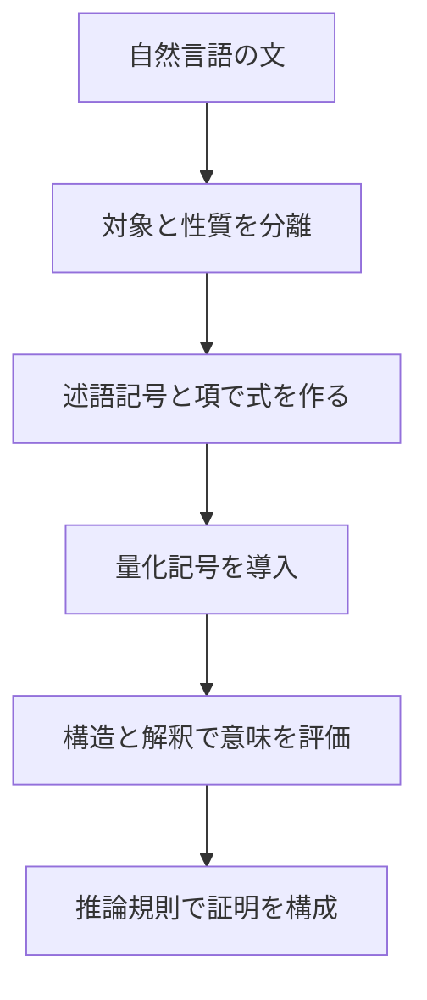

# 述語論理への入口――対象・性質・量化

この章は、命題論理の次の段階として
**述語論理（predicate logic）**を学ぶ入口です。

命題論理では「文全体」を $P,Q$ のような記号で扱いましたが、
述語論理では文の内部構造まで踏み込み、

- 対象（個体）
- 性質・関係（述語）
- 量化（すべて / ある）

を明示できるようにします。

---

## 1. この章の到達目標
- 命題論理と述語論理の違いを説明できる。
- 全称量化 $\forall$ と存在量化 $\exists$ を使い分けられる。
- 構造（モデル）を使って式の真偽を判定できる。
- 量化記号のスコープと束縛変数の扱いでミスしない。

---

## 2. 学習フロー（この図で「文→述語化→量化→証明」の流れを読む）
次の図は、述語論理章で何を順に学ぶかを示します。

```mermaid
flowchart TD
    A[自然言語の文] --> B[対象と性質を分離]
    B --> C[述語記号と項で式を作る]
    C --> D[量化記号を導入]
    D --> E[構造と解釈で意味を評価]
    E --> F[推論規則で証明を構成]
```

要点は、**量化記号を入れる前に「何が対象で何が性質か」を分ける**ことです。

---

## 3. 命題論理との違い（直観）
命題論理では、例えば

- 「すべての学生は提出した」
- 「ある学生は提出していない」

を1つの命題記号として扱うしかありません。

述語論理では、
- 個体変数 $x$
- 述語 $\mathrm{Submitted}(x)$

を使って次のように書けます。

$$
\forall x\, \mathrm{Submitted}(x)
$$

$$
\exists x\, \lnot \mathrm{Submitted}(x)
$$

この表現力の差が、述語論理を学ぶ最大の理由です。

---

## 4. この章のサブページ

### 4.1 [01_quantifiers.md](01_quantifiers.md)
- $\forall, \exists$ の意味、否定との関係、スコープ管理を学びます。

### 4.2 [02_structures_and_models.md](02_structures_and_models.md)
- 定義域、解釈、充足関係を使って意味論を学びます。

### 4.3 [03_proofs.md](03_proofs.md)
- 述語論理の証明規則（全称導入/除去、存在導入/除去など）を扱います。

---

## 5. 典型例
次を考えます。

- 「すべての学生は論理を履修している」
- 「田中は学生である」

ここから「田中は論理を履修している」を導きたい。

述語で書くと

$$
\forall x\,(\mathrm{Student}(x) \to \mathrm{LogicCourse}(x))
$$

$$
\mathrm{Student}(\mathrm{Tanaka})
$$

ゆえに

$$
\mathrm{LogicCourse}(\mathrm{Tanaka})
$$

です。命題論理では難しい「対象付き推論」が可能になります。

---

### 例2：量化の順序で意味が変わる
「すべての学生に、相談できる教員がいる」は、

$$
\forall x\,(\mathrm{Student}(x)\to\exists y\,(\mathrm{Teacher}(y)\land\mathrm{CanConsult}(x,y)))
$$
と表せます。学生ごとに別の教員を選べます。一方、先頭を $\exists y\forall x$ にすると、全学生が相談できる共通の教員が1人いるという、より強い主張になります。

---

## 6. よくあるつまずき
- $\forall x\, P(x) \to Q(x)$ と $\forall x\,(P(x) \to Q(x))$ を混同する。
- $\lnot \forall x\, P(x)$ と $\forall x\, \lnot P(x)$ を取り違える。
- 自由変数と束縛変数の区別が曖昧になる。

### 対策
1. 量化記号の作用範囲に括弧を必ず付ける。
2. 否定と量化は、まず同値変形を書いてから読む。
3. 変数ごとに「自由/束縛」を注記する習慣をつける。

---

## 7. 演習問題
### 問1
「すべての猫は眠る」を $\mathrm{Cat},\mathrm{Sleeps}$ で表しなさい。

### 問2
「眠らない猫がいる」を表しなさい。

### 問3
$\lnot\forall x\,P(x)$ を同値変形しなさい。

### 問4
$\exists x\,P(x)$ が真でも $\forall x\,P(x)$ が真とは限らない例を作りなさい。

### 問5
自由変数と束縛変数の違いを説明しなさい。

### 問6
述語論理式の真偽を決めるため、式以外に何が必要ですか。

---

## 8. 演習問題の解答
### 解答1
$\forall x\,(\mathrm{Cat}(x)\to\mathrm{Sleeps}(x))$ です。

### 解答2
$\exists x\,(\mathrm{Cat}(x)\land\lnot\mathrm{Sleeps}(x))$ です。

### 解答3
$\exists x\,\lnot P(x)$ です。

### 解答4
定義域を2人とし、$P$ を満たす人が1人だけいる構造なら、存在は真で全称は偽です。

### 解答5
束縛変数は対応する量化記号の作用範囲内にあり、自由変数はどの量化記号にも束縛されていません。

### 解答6
定義域と、定数・関数・述語記号の解釈を含む構造が必要です。自由変数があれば変数割当も必要です。

---

## 学習チェック（自己確認）
- 命題論理と述語論理の表現力の差を説明できる。
- 対象条件を含意または連言で表せる。
- 全称・存在・否定を日本語と往復できる。
- 構造が意味評価に必要だと説明できる。

---

## ナビゲーション
- 親: [../README.md](../README.md)
- 前: [../01_propositional_logic/04_natural_deduction.md](../01_propositional_logic/04_natural_deduction.md)
- 次: [01_quantifiers.md](01_quantifiers.md)
