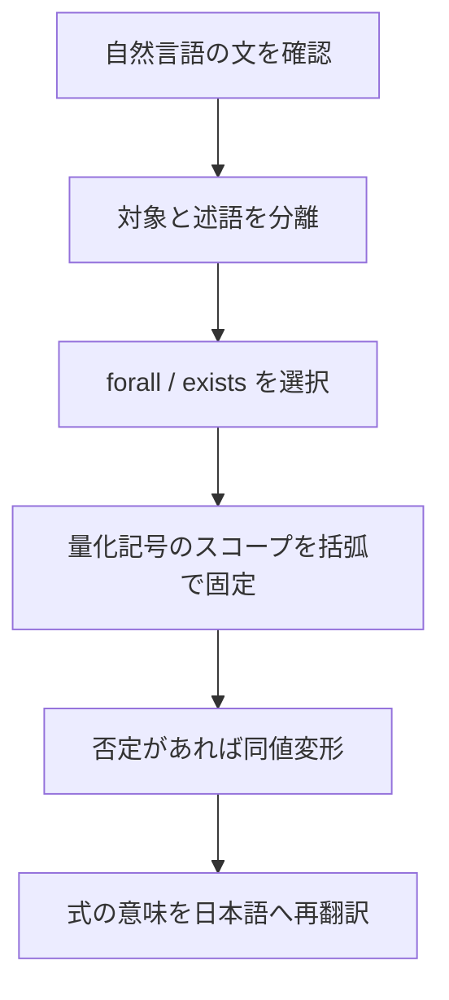

# 01_quantifiers

このページでは、述語論理の中心である**量化記号**を学びます。
量化記号を使えるようになると、

- 「すべての〜」
- 「ある〜」

を曖昧さなく書けるようになります。

---

## 1. このページの到達目標
- 全称量化 $\forall$ と存在量化 $\exists$ の意味を説明できる。
- 自然言語を量化式へ変換できる。
- 否定と量化の同値変形を正しく使える。
- スコープ（作用範囲）と束縛変数のミスを回避できる。

---

## 2. 学習フロー（この図で「文→量化→否定処理」の順を読む）
次の図は、量化を扱うときの基本手順です。

重要なのは、**量化を入れたら必ず括弧でスコープを固定する**ことです。

---

## 3. 基本定義

### 3.1 全称量化

$$
\forall x\, P(x)
$$

は「すべての $x$ について $P(x)$ が成り立つ」です。

### 3.2 存在量化

$$
\exists x\, P(x)
$$

は「ある $x$ が存在して $P(x)$ が成り立つ」です。

---

## 4. 自然言語との対応例

- 「すべての学生が提出した」

$$
\forall x\,(\mathrm{Student}(x) \to \mathrm{Submitted}(x))
$$

- 「提出していない学生が少なくとも1人いる」

$$
\exists x\,(\mathrm{Student}(x) \land \lnot \mathrm{Submitted}(x))
$$

ポイントは、対象条件（学生）を述語に含めることです。

---

## 5. 否定と量化の同値変形
量化の否定は頻出なので、必ず覚えます。

$$
\lnot \forall x\, P(x) \equiv \exists x\, \lnot P(x)
$$

$$
\lnot \exists x\, P(x) \equiv \forall x\, \lnot P(x)
$$

直観的には、
- 「全員が満たす」を否定すると「満たさない人がいる」
- 「満たす人がいる」を否定すると「誰も満たさない」

です。

---

## 6. スコープの注意点
次の2式は異なります。

$$
\forall x\, P(x) \to Q(x)
$$

$$
\forall x\,(P(x) \to Q(x))
$$

前者は通常

$$
(\forall x\, P(x)) \to Q(x)
$$

と読まれるため、$Q(x)$ の $x$ が自由変数として残り不自然です。
後者のように括弧でスコープを明示するのが基本です。

---

## 7. よくあるつまずき
- $\forall$ と $\exists$ の選択を直感で決めてしまう。
- 量化の否定で記号は変えたが、述語の否定を忘れる。
- 変数名の再利用で、束縛範囲が混乱する。

### 対策
1. まず日本語で「全員か、少なくとも1人か」を明記する。
2. 否定変形は「記号反転 + 述語否定」をセットで確認する。
3. 束縛変数は節ごとに別名（$x,y,z$）を使って整理する。

---

## 8. ミニ演習
1. 次を量化式で書く。
   - 「すべての利用者はログインした」
2. 次を日本語に直す。

$$
\exists x\,(\mathrm{User}(x) \land \lnot \mathrm{Login}(x))
$$

3. 次を同値変形する。

$$
\lnot \forall x\,(P(x) \to Q(x))
$$

---

## 学習チェック（自己確認）
- $\forall$ と $\exists$ を具体例付きで説明できる。
- 量化否定の2公式を暗記ではなく意味で説明できる。
- スコープ違いによる意味差を例で示せる。

---

## ナビゲーション
- 親: [00_overview.md](00_overview.md)
- 次: [02_structures_and_models.md](02_structures_and_models.md)
