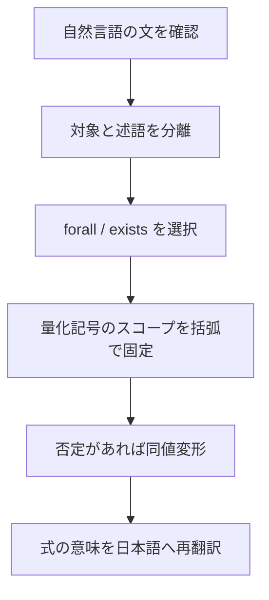

# 量化記号――「すべて」と「ある」を正確に書く

このページでは、述語論理の中心である**量化記号**を学びます。
量化記号を使えるようになると、

- 「すべての〜」
- 「ある〜」

を曖昧さなく書けるようになります。

---

## 1. このページの到達目標
- 全称量化 $\forall$ と存在量化 $\exists$ の意味を説明できる。
- 自然言語を量化式へ変換できる。
- 否定と量化の同値変形を正しく使える。
- スコープ（作用範囲）と束縛変数のミスを回避できる。

---

## 2. 学習フロー（この図で「文→量化→否定処理」の順を読む）
次の図は、量化を扱うときの基本手順です。

```mermaid
flowchart TD
    A[自然言語の文を確認] --> B[対象と述語を分離]
    B --> C[forall / exists を選択]
    C --> D[量化記号のスコープを括弧で固定]
    D --> E[否定があれば同値変形]
    E --> F[式の意味を日本語へ再翻訳]
```

重要なのは、**量化を入れたら必ず括弧でスコープを固定する**ことです。

---

## 3. 基本定義

### 3.1 全称量化

$$
\forall x\, P(x)
$$

は「すべての $x$ について $P(x)$ が成り立つ」です。

### 3.2 存在量化

$$
\exists x\, P(x)
$$

は「ある $x$ が存在して $P(x)$ が成り立つ」です。

---

## 4. 自然言語との対応例

- 「すべての学生が提出した」

$$
\forall x\,(\mathrm{Student}(x) \to \mathrm{Submitted}(x))
$$

- 「提出していない学生が少なくとも1人いる」

$$
\exists x\,(\mathrm{Student}(x) \land \lnot \mathrm{Submitted}(x))
$$

ポイントは、対象条件（学生）を述語に含めることです。

---

## 5. 否定と量化の同値変形
量化の否定は頻出なので、必ず覚えます。

$$
\lnot \forall x\, P(x) \equiv \exists x\, \lnot P(x)
$$

$$
\lnot \exists x\, P(x) \equiv \forall x\, \lnot P(x)
$$

直観的には、
- 「全員が満たす」を否定すると「満たさない人がいる」
- 「満たす人がいる」を否定すると「誰も満たさない」

です。

---

## 6. スコープの注意点
次の2式は異なります。

$$
\forall x\, P(x) \to Q(x)
$$

$$
\forall x\,(P(x) \to Q(x))
$$

括弧を省略した場合の読み方は、教科書や形式体系の約束によって異なります。この教材では、誤解を防ぐため、量化記号の作用範囲を括弧で明記します。

たとえば意図が「すべての $x$ について、$P(x)$ なら $Q(x)$」なら、

$$
\forall x\,(P(x)\to Q(x))
$$

と書きます。

---

## 7. よくあるつまずき
- $\forall$ と $\exists$ の選択を直感で決めてしまう。
- 量化の否定で記号は変えたが、述語の否定を忘れる。
- 変数名の再利用で、束縛範囲が混乱する。

### 対策
1. まず日本語で「全員か、少なくとも1人か」を明記する。
2. 否定変形は「記号反転 + 述語否定」をセットで確認する。
3. 束縛変数は節ごとに別名（$x,y,z$）を使って整理する。

---

## 8. 演習問題
### 問1
「すべての利用者はログインした」を表しなさい。

### 問2
「ログインしていない利用者がいる」を表しなさい。

### 問3
$\lnot\forall x\,(P(x)\to Q(x))$ を否定が原子式に付く形へ変形しなさい。

### 問4
$\forall x\exists y\,R(x,y)$ と $\exists y\forall x\,R(x,y)$ の意味の違いを説明しなさい。

### 問5
$\exists x\,P(x)\to Q(x)$ の問題点を、スコープと自由変数の観点から説明しなさい。

### 問6
定義域が空でないとき、$\forall x\,P(x)$ と $\exists x\,\lnot P(x)$ は同時に真になれますか。

---

## 9. 演習問題の解答
### 解答1
$\forall x\,(\mathrm{User}(x)\to\mathrm{Login}(x))$ です。

### 解答2
$\exists x\,(\mathrm{User}(x)\land\lnot\mathrm{Login}(x))$ です。

### 解答3
$\exists x\,\lnot(P(x)\to Q(x))\equiv\exists x\,(P(x)\land\lnot Q(x))$ です。

### 解答4
前者は各 $x$ に対して相手 $y$ を選び直せます。後者はすべての $x$ に共通する1つの $y$ が必要です。

### 解答5
括弧がなければ量化の作用範囲が教材や体系の規則に依存し、$Q(x)$ の $x$ が自由に残る読み方も生じます。この教材では $\exists x\,(P(x)\to Q(x))$ など意図した範囲を括弧で明示します。

### 解答6
なれません。全称が真なら反例となる $x$ は存在せず、存在命題は偽です。

---

## 学習チェック（自己確認）
- $\forall$ と $\exists$ の意味を具体例で説明できる。
- 量化否定を「量化子反転＋内側の否定」で変形できる。
- 量化記号の順序の違いを説明できる。
- 自由変数と束縛変数を識別できる。
- 括弧を明記してスコープを固定できる。

---

## ナビゲーション
- 親: [00_overview.md](00_overview.md)
- 前: [00_overview.md](00_overview.md)
- 次: [02_structures_and_models.md](02_structures_and_models.md)
