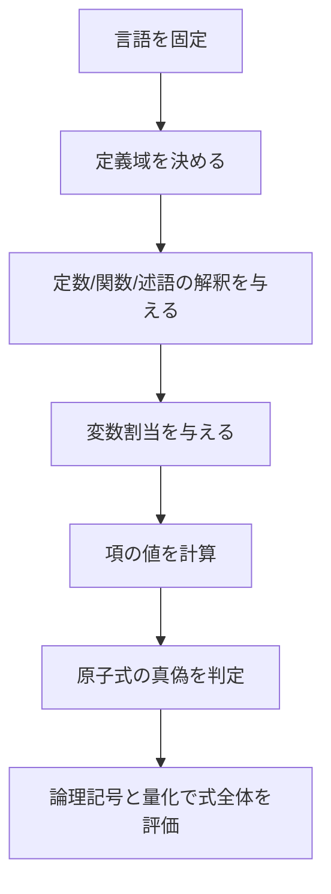

# 02_structures_and_models

このページでは、述語論理の意味論で使う
**構造（structure）**と**モデル（model）**を学びます。

量化式を書けるようになっても、
「その式がどの状況で真か」を決める枠組みがないと意味論は完成しません。
ここで扱う構造とモデルは、そのための基礎です。

---

## 1. このページの到達目標
- 構造 $\mathcal{M}$ の要素（定義域・記号解釈）を説明できる。
- 充足記号 $\mathcal{M} \models \varphi$ の意味を説明できる。
- 具体的な構造を与えて式の真偽を判定できる。
- 「モデルがある」と「妥当である」の違いを区別できる。

---

## 2. 意味評価フロー（この図で「構造定義→解釈→充足判定」を読む）
次の図は、述語論理式を意味論で評価する手順です。

重要なのは、**式だけで真偽は決まらず、構造と割当が必要**という点です。

---

## 3. 構造の定義
述語論理言語 $L$ に対し、構造 $\mathcal{M}$ は次を持ちます。

1. 定義域 $M$（対象の集合）
2. 各定数記号 $c$ への値 $c^{\mathcal{M}} \in M$
3. 各関数記号 $f$ への写像 $f^{\mathcal{M}}$
4. 各述語記号 $P$ への関係 $P^{\mathcal{M}} \subseteq M^n$

### 直観
- 定義域: 「どの世界の何を対象にするか」
- 解釈: 記号に具体的な意味を割り当てる操作

---

## 4. モデルと充足

### 4.1 充足

$$
\mathcal{M} \models \varphi
$$

は「構造 $\mathcal{M}$ で式 $\varphi$ が真」を意味します。

### 4.2 モデル
式集合 $\Gamma$ に対し

$$
\mathcal{M} \models \Gamma
$$

（$\Gamma$ の全式を満たす）なら、$\mathcal{M}$ は $\Gamma$ のモデルです。

### 4.3 妥当性との違い
- モデルがある: ある構造では真（充足可能）
- 妥当: すべての構造で真

この区別は非常に重要です。

---

## 5. 具体例（有限構造）
言語に1項述語 $\mathrm{Even}(x)$ を入れ、構造を

$$
M = \{0,1,2\}
$$

とします。

$$
\mathrm{Even}^{\mathcal{M}} = \{0,2\}
$$

このとき

$$
\mathcal{M} \models \exists x\, \mathrm{Even}(x)
$$

は真です（例: $x=0$）。

一方

$$
\mathcal{M} \models \forall x\, \mathrm{Even}(x)
$$

は偽です（$x=1$ が反例）。

---

## 6. 変数割当の役割
自由変数を含む式は、割当 $s$ が必要です。

$$
\mathcal{M}, s \models P(x)
$$

は「$s(x)$ を代入したとき真」を意味します。

量化が入ると、割当を変えて評価します。
例えば

$$
\mathcal{M}, s \models \forall x\, \varphi
$$

は、$x$ に定義域内の全要素を割り当てた場合に
常に $\varphi$ が真であることを表します。

---

## 7. よくあるつまずき
- 式だけ見て真偽を決めようとする。
- 定義域を明示せず議論を進める。
- 量化評価時の割当変更を忘れる。

### 対策
1. 評価時に必ず「言語・構造・割当」を先頭で書く。
2. まず原子式の真偽から順に評価する。
3. 反例候補を1つずつ代入して確認する。

---

## 8. ミニ演習
1. 定義域 $M=\{a,b\}$、$P^{\mathcal{M}}=\{a\}$ のとき、
   - $\exists x\, P(x)$
   - $\forall x\, P(x)$
   の真偽を判定する。
2. 「モデルがある」と「妥当である」の違いを1文ずつ説明する。
3. $\mathcal{M} \models \exists x\, Q(x)$ が偽になる例を1つ作る。

---

## 学習チェック（自己確認）
- 構造 $\mathcal{M}$ の構成要素を列挙できる。
- $\mathcal{M} \models \varphi$ の意味を説明できる。
- 同じ式でも構造が変わると真偽が変わる例を示せる。

---

## ナビゲーション
- 親: [00_overview.md](00_overview.md)
- 前: [01_quantifiers.md](01_quantifiers.md)
- 次: [03_proofs.md](03_proofs.md)
