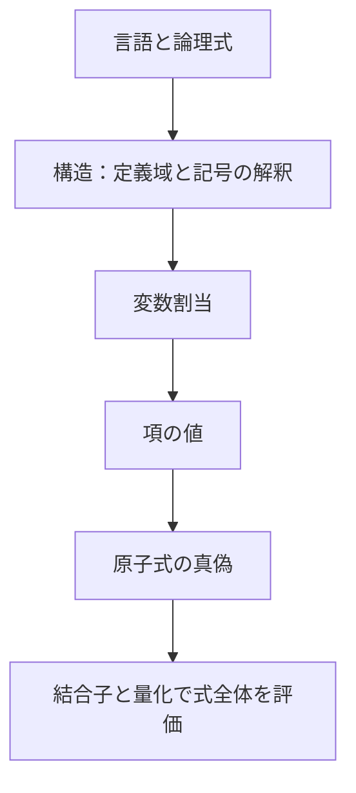

# 構造とモデル――記号に世界を与える

述語論理の式は、記号だけでは真偽が決まりません。どの対象を扱い、定数・関数・述語を何として解釈するかを決めて、はじめて評価できます。

このページでは、**構造**、**変数割当**、**充足**、**モデル**を区別し、式を具体的な世界で読む方法を学びます。

---

## 1. このページの到達目標

- 構造 $\mathcal{M}$ の構成要素を説明できる。
- 項の値と論理式の真偽を、変数割当のもとで評価できる。
- $\mathcal{M},s\models\varphi$ と $\mathcal{M}\models\varphi$ を使い分けられる。
- 充足可能性・モデル・意味論的帰結・妥当性を区別できる。
- 反例モデルを1つ作って、意味論的帰結でないことを示せる。

---

## 2. 直観：式は設計図、構造は具体的な世界

$P(c)$ という式だけを見ても、$c$ が誰で、$P$ がどの性質かは分かりません。

- 定義域：話題にする対象の集合
- 定数の解釈：$c$ が指す対象
- 関数の解釈：入力から出力を返す具体的な写像
- 述語の解釈：どの対象や組で成り立つか

を与えると、式を評価できるようになります。

次の図は、記号列から真偽へ進む流れです。読み取るポイントは、自由変数を含む式では構造だけでなく割当も必要であり、量化記号は割当を動かして評価することです。

```mermaid
flowchart TD
    A["言語と論理式"] --> B["構造：定義域と記号の解釈"]
    B --> C["変数割当"]
    C --> D["項の値"]
    D --> E["原子式の真偽"]
    E --> F["結合子と量化で式全体を評価"]
```

---

## 3. 形式的な定義

述語論理言語 $L$ に対する構造 $\mathcal{M}$ は、空でない定義域 $M$ と、言語中の非論理記号の解釈からなります。

1. 各定数記号 $c$ に要素 $c^{\mathcal{M}}\in M$
2. 各 $n$ 項関数記号 $f$ に関数 $f^{\mathcal{M}}:M^n\to M$
3. 各 $n$ 項述語記号 $P$ に関係 $P^{\mathcal{M}}\subseteq M^n$

等号を論理記号として扱う通常の一階述語論理では、$=$ は定義域上の実際の同一性として解釈します。

変数割当 $s$ は、各変数に定義域の要素を対応させます。

$$
s:\mathrm{Var}\to M
$$

項 $t$ の値を $t^{\mathcal{M},s}$ と書きます。

---

## 4. 充足とモデル

$$
\mathcal{M},s\models\varphi
$$

は「構造 $\mathcal{M}$ と割当 $s$ のもとで $\varphi$ が真」を意味します。

閉じた式、つまり自由変数を持たない**文**では、真偽が割当に依存しないため、

$$
\mathcal{M}\models\varphi
$$

と書けます。

式集合 $\Gamma$ のすべての式を $\mathcal{M}$ が満たすとき、

$$
\mathcal{M}\models\Gamma
$$

と書き、$\mathcal{M}$ を $\Gamma$ の**モデル**と呼びます。

---

## 5. 量化記号は割当を動かす

$s[x\mapsto a]$ を、$x$ だけを $a$ に割り当て直し、他の変数は $s$ と同じ割当とします。

$$
\mathcal{M},s\models\forall x\,\varphi
\iff
\text{すべての }a\in M\text{ について }\mathcal{M},s[x\mapsto a]\models\varphi
$$

$$
\mathcal{M},s\models\exists x\,\varphi
\iff
\text{ある }a\in M\text{ について }\mathcal{M},s[x\mapsto a]\models\varphi
$$

量化されていない別の変数の値は、そのまま残ります。

---

## 6. 段階例1：有限構造を評価する

言語に定数 $c$、1項述語 $\mathrm{Even}$、1項関数 $f$ があるとします。

$$
M=\{0,1,2\}
$$

$$
c^{\mathcal{M}}=1,\qquad
\mathrm{Even}^{\mathcal{M}}=\{0,2\},\qquad
f^{\mathcal{M}}(a)=(a+1)\bmod 3
$$

まず項 $f(c)$ の値は2です。したがって、

$$
\mathcal{M}\models\mathrm{Even}(f(c))
$$

です。また、0または2を証人にできるので、

$$
\mathcal{M}\models\exists x\,\mathrm{Even}(x)
$$

です。一方、1が反例なので、

$$
\mathcal{M}\not\models\forall x\,\mathrm{Even}(x)
$$

です。

---

## 7. 段階例2：同じ式でも構造で真偽が変わる

式

$$
\forall x\,P(x)
$$

を考えます。

- $\mathcal{M}_1$：$M_1=\{a,b\}$、$P^{\mathcal{M}_1}=\{a,b\}$
- $\mathcal{M}_2$：$M_2=\{a,b\}$、$P^{\mathcal{M}_2}=\{a\}$

すると、

$$
\mathcal{M}_1\models\forall x\,P(x)
$$

ですが、

$$
\mathcal{M}_2\not\models\forall x\,P(x)
$$

です。式の形だけでなく、述語の解釈が真偽を決めます。

---

## 8. 充足可能性・帰結・妥当性

- $\varphi$ が**充足可能**：$\varphi$ を真にする構造と割当が少なくとも1つある。
- $\Gamma\models\varphi$：$\Gamma$ のすべてのモデルが $\varphi$ も満たす。
- $\models\varphi$：すべての構造で $\varphi$ が真、つまり妥当。

「あるモデルで真」と「すべてのモデルで真」は別です。

たとえば $\exists x\,P(x)$ は、$P$ を満たす要素を持つモデルがあるので充足可能です。しかし $P^{\mathcal{M}}=\varnothing$ の構造では偽なので、妥当ではありません。

意味論的帰結でないことを示すには、

$$
\mathcal{M}\models\Gamma
\quad\text{かつ}\quad
\mathcal{M}\not\models\varphi
$$

となる**反例モデル**を1つ作れば十分です。

---

## 9. 典型的な誤解と復帰方法

### 誤解1：構造とモデルは同じもの

構造は記号の解釈を与えた世界です。モデルは「どの式集合についてか」を伴う呼び名です。同じ構造が、ある理論のモデルでも別の理論のモデルでないことがあります。

### 誤解2：自由変数のある式も構造だけで真偽が決まる

$P(x)$ は $s(x)$ に依存します。まず自由変数を確認します。

### 誤解3：充足可能なら妥当

充足可能性はモデルが1つあればよく、妥当性はすべての構造を要求します。

### 誤解4：全称式が偽なら、全部の対象で偽

全称式を偽にするには反例が1つあれば十分です。

迷ったら、次の順に戻ります。

1. 自由変数を丸で囲む。
2. 定義域と各記号の解釈を書く。
3. 項の値を内側から計算する。
4. $\forall$ なら反例、$\exists$ なら証人を探す。
5. 「1つのモデル」か「すべてのモデル」かを確認する。

---

## 10. 演習問題

### 問1

$M=\{a,b\}$、$P^{\mathcal{M}}=\{a\}$ のとき、$\exists x\,P(x)$ と $\forall x\,P(x)$ の真偽を答えなさい。

### 問2

同じ構造で、$s(x)=a$、$t(x)=b$ とする。$\mathcal{M},s\models P(x)$ と $\mathcal{M},t\models P(x)$ の真偽を答えなさい。

### 問3

構造と、理論 $\Gamma$ のモデルとの違いを説明しなさい。

### 問4

$\exists x\,Q(x)$ が偽になる2要素の構造を1つ作りなさい。

### 問5

$\forall x(P(x)\to Q(x)),\ \exists xP(x)\models\exists xQ(x)$ を、証人を追う形で説明しなさい。

### 問6

$\exists xP(x)\not\models\forall xP(x)$ の反例モデルを作りなさい。

---

## 11. 演習問題の解答

### 解答1

$a$ が証人なので $\exists x\,P(x)$ は真です。$b$ が反例なので $\forall x\,P(x)$ は偽です。

### 解答2

$s(x)=a\in P^{\mathcal{M}}$ なので前者は真、$t(x)=b\notin P^{\mathcal{M}}$ なので後者は偽です。

### 解答3

構造は定義域と記号解釈の組です。その構造が $\Gamma$ の全式を満たすときに限り、$\Gamma$ のモデルと呼びます。

### 解答4

$M=\{0,1\}$、$Q^{\mathcal{M}}=\varnothing$ とすれば、証人がないため偽です。

### 解答5

$\exists xP(x)$ の証人を $a$ とします。全称前提から $P(a)\to Q(a)$ が得られ、$P(a)$ と合わせて $Q(a)$ が得られます。したがって $a$ を証人として $\exists xQ(x)$ が成り立ちます。

### 解答6

$M=\{a,b\}$、$P^{\mathcal{M}}=\{a\}$ とします。存在式は $a$ により真ですが、全称式は $b$ により偽です。

---

## 学習チェック

- 言語・構造・割当を分けて書ける。
- 閉じた式と自由変数を含む式の評価を区別できる。
- 充足可能性、モデル、意味論的帰結、妥当性を説明できる。
- 反例モデルを使って非帰結を示せる。

---

## ナビゲーション

- 親: [00_overview.md](00_overview.md)
- 前: [01_quantifiers.md](01_quantifiers.md)
- 次: [03_proofs.md](03_proofs.md)
