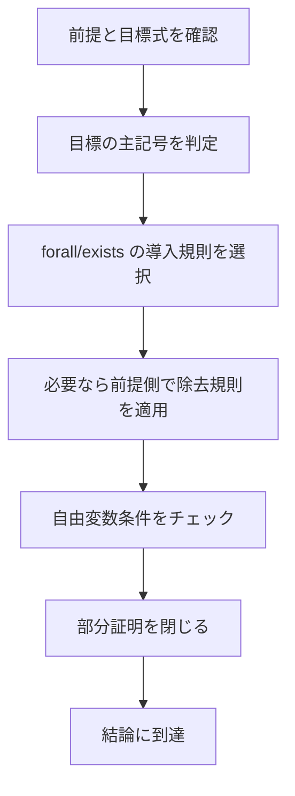

# 03_proofs

このページでは、述語論理の**証明規則**を学びます。
命題論理の自然演繹に加えて、量化記号 $\forall, \exists$ の規則が入ることで、

- 「任意の対象について示す」
- 「ある対象の存在を使う」

という推論が可能になります。

---

## 1. このページの到達目標
- 述語論理で追加される主要規則を説明できる。
- $\forall$ 導入/除去、$\exists$ 導入/除去を使って短い証明を書ける。
- 自由変数条件（eigenvariable 条件）に関する基本注意を守れる。
- 量化を含む推論の誤りを規則レベルで見抜ける。

---

## 2. 証明の進め方（この図で「結論型→量化規則選択→条件確認」を読む）
次の図は、述語論理で証明を組み立てる基本手順です。

ポイントは、**規則適用の前に変数条件を確認する**ことです。

---

## 3. 主要規則（述語論理で増える部分）

### 3.1 全称除去（$\forall E$）

$$
\forall x\, P(x) \Rightarrow P(t)
$$

任意の項 $t$ を代入できます。

### 3.2 全称導入（$\forall I$）
$P(a)$ を示したあと、適切な条件の下で

$$
\forall x\, P(x)
$$

を導きます。

注意: $a$ は「特別な前提に依存しない任意元」として扱う必要があります。

### 3.3 存在導入（$\exists I$）

$$
P(t) \Rightarrow \exists x\, P(x)
$$

具体例が1つあれば存在を主張できます。

### 3.4 存在除去（$\exists E$）

$$
\exists x\, P(x)
$$

から「新しい記号 $a$ で $P(a)$ を仮定」し、そこから結論 $R$ を導ければ $R$ を得ます。

注意: この $a$ は外側に漏らしてはいけません（新鮮性条件）。

---

## 4. 具体例1：全称から具体例へ
次の推論を示します。

$$
\forall x\,(\mathrm{Student}(x) \to \mathrm{Read}(x)),\; \mathrm{Student}(t) \vdash \mathrm{Read}(t)
$$

手順:
1. $\forall x\,(\mathrm{Student}(x) \to \mathrm{Read}(x))$（前提）
2. $\mathrm{Student}(t)$（前提）
3. $\mathrm{Student}(t) \to \mathrm{Read}(t)$（1 に $\forall E$）
4. $\mathrm{Read}(t)$（2,3 から $\to E$）

---

## 5. 具体例2：具体例から存在へ

$$
\mathrm{Prime}(2) \vdash \exists x\, \mathrm{Prime}(x)
$$

これは $\exists I$ を1回使うだけです。

1. $\mathrm{Prime}(2)$
2. $\exists x\, \mathrm{Prime}(x)$（1 から $\exists I$）

---

## 6. 具体例3：存在を使った推論の形
次を考えます。

$$
\exists x\, \mathrm{Student}(x),\; \forall x\,(\mathrm{Student}(x) \to \mathrm{Busy}(x)) \vdash \exists x\, \mathrm{Busy}(x)
$$

概略:
- $\exists x\, \mathrm{Student}(x)$ から新記号 $a$ で $\mathrm{Student}(a)$ を仮定。
- 全称前提から $\mathrm{Student}(a) \to \mathrm{Busy}(a)$ を得る。
- $\mathrm{Busy}(a)$ を導き、$\exists I$ で $\exists x\, \mathrm{Busy}(x)$。
- $\exists E$ を閉じて結論完成。

---

## 7. よくあるつまずき
- $\forall I$ で、前提依存の変数をそのまま一般化してしまう。
- $\exists E$ の仮定記号を外側で使ってしまう。
- 量化記号のスコープを見誤って誤代入する。

### 対策
1. 規則適用時に「この変数は新鮮か」を毎回チェックする。
2. 存在除去で導入した記号には印を付け、ブロック外で使わない。
3. 代入前に括弧でスコープを確認する。

---

## 8. ミニ演習
1. 次を示す。

$$
\forall x\, P(x) \vdash \exists x\, P(x)
$$

（定義域非空を仮定）

2. 次を示す。

$$
\forall x\,(P(x) \to Q(x)),\; \forall x\,P(x) \vdash \forall x\,Q(x)
$$

3. 次の誤りを説明する。
- $\exists x\,P(x)$ から、特定定数 $c$ に対し $P(c)$ を無条件で外側へ出す推論

---

## 学習チェック（自己確認）
- $\forall E, \forall I, \exists I, \exists E$ を例付きで説明できる。
- 変数条件（新鮮性・依存関係）を言語化できる。
- 量化式を含む短い証明を自力で2題以上書ける。

---

## ナビゲーション
- 親: [00_overview.md](00_overview.md)
- 前: [02_structures_and_models.md](02_structures_and_models.md)
- 次章入口: [../03_soundness_completeness/00_overview.md](../03_soundness_completeness/00_overview.md)
