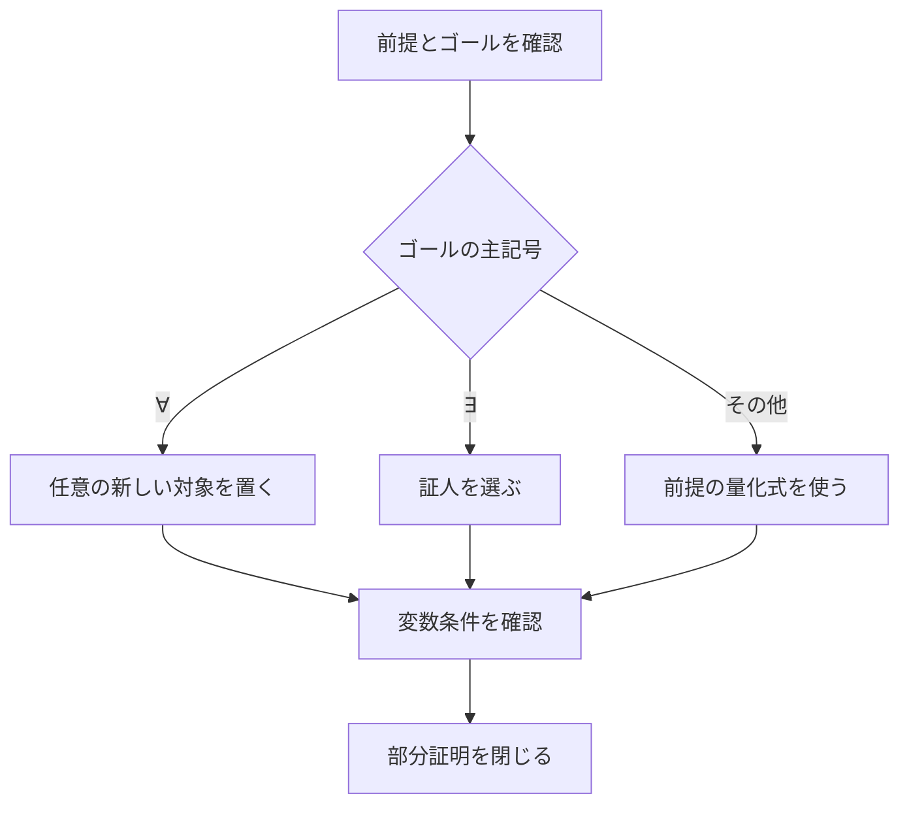

# 述語論理の証明――量化規則を安全に使う

述語論理の自然演繹では、命題論理の規則に $\forall$ と $\exists$ の導入・除去規則が加わります。ただし、対象を勝手に固定したり一般化したりしないための**変数条件**が必要です。

---

## 1. このページの到達目標

- $\forall E$、$\forall I$、$\exists I$、$\exists E$ を説明できる。
- 目標と前提の形から、使う量化規則を選べる。
- 全称導入と存在除去の変数条件を説明できる。
- 典型的な誤証明を、依存関係の観点から見抜ける。
- 量化を含む短い証明を書ける。

---

## 2. 直観：任意の対象と、ある対象を混同しない

- $\forall x\,P(x)$ を示すには、特別でない任意の対象 $a$ について $P(a)$ を示す。
- $\exists x\,P(x)$ を示すには、具体的な証人 $t$ と $P(t)$ を示す。
- $\exists x\,P(x)$ を使うとき、証人が誰かは分からないので、新しい名前 $a$ を一時的に置く。

次の図は規則選択の流れです。読み取るポイントは、規則名より先に、ゴールの主記号と導入した名前の依存範囲を確認することです。

```mermaid
flowchart TD
    A["前提とゴールを確認"] --> B{"ゴールの主記号"}
    B -->|"∀"| C["任意の新しい対象を置く"]
    B -->|"∃"| D["証人を選ぶ"]
    B -->|"その他"| E["前提の量化式を使う"]
    C --> F["変数条件を確認"]
    D --> F
    E --> F
    F --> G["部分証明を閉じる"]
```

---

## 3. 4つの量化規則

### 全称除去 $\forall E$

$$
\frac{\forall x\,P(x)}{P(t)}
$$

$t$ は、その位置へ自由に代入できる項でなければなりません。変数捕獲が起きないことを確認します。

### 全称導入 $\forall I$

任意に選んだ新しい対象 $a$ について $P(a)$ を示し、$a$ が未解消の特別な仮定に依存しないとき、

$$
\frac{P(a)}{\forall x\,P(x)}
$$

と一般化できます。

### 存在導入 $\exists I$

$$
\frac{P(t)}{\exists x\,P(x)}
$$

証人 $t$ が1つあれば存在を示せます。

### 存在除去 $\exists E$

$\exists x\,P(x)$ から、新しい名前 $a$ と $P(a)$ を一時的に仮定し、その仮定から $R$ を導きます。$a$ が $R$ や他の未解消仮定に自由に現れないとき、仮定を閉じて $R$ を得ます。

$$
\frac{\exists x\,P(x)\qquad [P(a)]\ \vdots\ R}{R}
$$

---

## 4. 段階例1：全称前提を具体化する

$$
\forall x(\mathrm{Student}(x)\to\mathrm{Read}(x)),\
\mathrm{Student}(t)
\vdash
\mathrm{Read}(t)
$$

1. $\forall x(\mathrm{Student}(x)\to\mathrm{Read}(x))$　前提
2. $\mathrm{Student}(t)$　前提
3. $\mathrm{Student}(t)\to\mathrm{Read}(t)$　1に $\forall E$
4. $\mathrm{Read}(t)$　2, 3に $\to E$

全称前提は、必要な対象 $t$ に具体化してから使います。

---

## 5. 段階例2：任意性を保って一般化する

$$
\forall x(P(x)\to Q(x)),\
\forall xP(x)
\vdash
\forall xQ(x)
$$

1. 任意の新しい対象 $a$ を取る。
2. $P(a)\to Q(a)$　1つ目の前提に $\forall E$
3. $P(a)$　2つ目の前提に $\forall E$
4. $Q(a)$　2, 3に $\to E$
5. $\forall xQ(x)$　$a$ の任意性を確認して $\forall I$

$a$ に固有の仮定を使っていないため、最後に一般化できます。

---

## 6. 段階例3：存在する対象を使う

$$
\exists x\,\mathrm{Student}(x),\
\forall x(\mathrm{Student}(x)\to\mathrm{Busy}(x))
\vdash
\exists x\,\mathrm{Busy}(x)
$$

1. $\exists x\,\mathrm{Student}(x)$　前提
2. 新しい $a$ について $\mathrm{Student}(a)$ を一時的に仮定
3. $\mathrm{Student}(a)\to\mathrm{Busy}(a)$　全称前提に $\forall E$
4. $\mathrm{Busy}(a)$　2, 3に $\to E$
5. $\exists x\,\mathrm{Busy}(x)$　4に $\exists I$
6. 2の仮定を閉じ、1と部分証明から $\exists E$

最終結論に $a$ は残っていません。

---

## 7. 典型的な誤証明

### 誤り1：特別な対象から全称へ飛ぶ

$P(c)$ から $\forall xP(x)$ は導けません。$c$ について分かったことを、全対象へ一般化しているからです。

### 誤り2：存在の証人を勝手に固定する

$\exists xP(x)$ から、あらかじめ指定された $c$ について $P(c)$ を結論にしてはいけません。存在する対象が $c$ とは限りません。

### 誤り3：存在除去の名前を外へ漏らす

新しい $a$ は一時的な代表です。結論 $R(a)$ のように残すと、未知の証人を特定したことになります。

### 誤り4：変数捕獲を起こす

$\forall x\,\exists y\,R(x,y)$ の $x$ に $y$ をそのまま代入すると、もとの自由な $y$ が内側の量化に捕まる場合があります。束縛変数を先に改名します。

---

## 8. つまずいたときの復帰方法

1. ゴールの最外側の記号を見る。
2. $\forall$ を示すなら「任意の新しい対象」、$\exists$ を示すなら「証人」を書く。
3. 存在除去で導入した名前を枠で囲む。
4. 一般化前に、その名前を含む未解消仮定がないか確認する。
5. 代入前に束縛変数を必要に応じて改名する。

---

## 9. 演習問題

### 問1

定義域が非空である通常の一階述語論理で、$\forall xP(x)\vdash\exists xP(x)$ を示しなさい。

### 問2

$P(c)\vdash\forall xP(x)$ が一般には不正な理由を説明しなさい。

### 問3

$\forall x(P(x)\to Q(x)),\forall xP(x)\vdash\forall xQ(x)$ を証明しなさい。

### 問4

$P(t)\land Q(t)\vdash\exists x(P(x)\land Q(x))$ を証明しなさい。

### 問5

$\exists xP(x),\forall x(P(x)\to R)\vdash R$ を証明しなさい。ただし $x$ は $R$ に自由に現れないものとします。

### 問6

$\exists xP(x)\vdash P(c)$ という推論の誤りを、反例の状況で説明しなさい。

---

## 10. 演習問題の解答

### 解答1

定義域から任意の項または新しい対象 $a$ を取り、全称除去で $P(a)$、存在導入で $\exists xP(x)$ を得ます。非空性が必要です。

### 解答2

$c$ は特別な対象かもしれず、$P(c)$ の導出が $c$ に関する前提に依存しています。任意性がないため $\forall I$ の条件を満たしません。

### 解答3

任意の新しい $a$ を取ります。2つの全称前提を具体化して $P(a)\to Q(a)$ と $P(a)$ を得るため、$Q(a)$ が従います。$a$ の任意性から $\forall xQ(x)$ と一般化します。

### 解答4

連言除去をする必要はありません。前提 $P(t)\land Q(t)$ をそのまま、証人 $t$ による存在導入へ使います。

### 解答5

新しい $a$ と $P(a)$ を一時的に仮定します。全称除去で $P(a)\to R$、含意除去で $R$ を得ます。$a$ が $R$ に現れないので部分証明を閉じ、存在除去で $R$ を得ます。

### 解答6

定義域を $\{a,b\}$、$P$ が $a$ だけで成り立ち、$c$ が $b$ を指す構造にします。$\exists xP(x)$ は真ですが $P(c)$ は偽です。

---

## 学習チェック

- 4つの量化規則を例付きで説明できる。
- 「任意の対象」と「未知の証人」を区別できる。
- $\forall I$ と $\exists E$ の変数条件を確認できる。
- 誤証明に対して、規則違反または反例を示せる。

---

## ナビゲーション

- 親: [00_overview.md](00_overview.md)
- 前: [02_structures_and_models.md](02_structures_and_models.md)
- 次章入口: [../03_soundness_completeness/00_overview.md](../03_soundness_completeness/00_overview.md)
