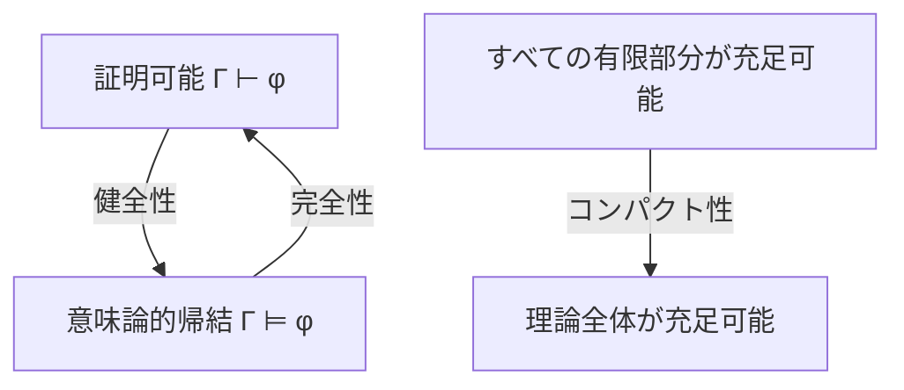

# 健全性・完全性・コンパクト性への入口

この章では、証明体系で導けることを表す $\vdash$ と、すべてのモデルで成り立つことを表す $\models$ の関係を学びます。

重要なのは、健全性や完全性が「論理一般に無条件で成り立つ性質」ではないことです。**言語・意味論・証明体系**を固定したうえで、その組がどの性質を持つかを問います。

---

## 1. この章の到達目標

- $\Gamma\vdash\varphi$ と $\Gamma\models\varphi$ を区別できる。
- 健全性と完全性を、向きと対象を明示して説明できる。
- 古典一階述語論理の完全性とGödelの不完全性を混同しない。
- コンパクト性を、判定アルゴリズムの存在と区別できる。
- 3つの定理が何を保証し、何を保証しないか説明できる。

---

## 2. 2つの見方

証明論では、有限個の規則適用で結論へ到達できるかを調べます。

$$
\Gamma\vdash\varphi
$$

意味論では、$\Gamma$ を満たすすべての構造が $\varphi$ も満たすかを調べます。

$$
\Gamma\models\varphi
$$

次の図は両者とコンパクト性の関係です。読み取るポイントは、健全性と完全性が逆向きの橋であり、コンパクト性は有限部分と理論全体の充足可能性を結ぶ別の性質だということです。

---

## 3. 3つの性質

固定した言語 $L$、意味論、証明体系 $S$ について考えます。

### 健全性

$$
\Gamma\vdash_S\varphi\Rightarrow\Gamma\models\varphi
$$

証明体系が意味論的に誤った結論を作らないという保証です。

### 完全性

$$
\Gamma\models\varphi\Rightarrow\Gamma\vdash_S\varphi
$$

意味論的帰結を証明体系が取りこぼさないという保証です。

### コンパクト性

$$
\left(\text{すべての有限 }\Delta\subseteq\Gamma\text{ が充足可能}\right)
\Rightarrow
\Gamma\text{ が充足可能}
$$

これはモデルの存在に関する定理です。有限部分を順に試せば必ず判定できる、というアルゴリズムの主張ではありません。

---

## 4. 段階例1：modus ponens

$$
P\to Q,\ P\vdash Q
$$

この規則は、前提が真のどの割当でも結論が真なので局所的に健全です。一方、完全性は個別規則ではなく、意味論的に正しいすべての帰結へ体系全体が到達できるかを問います。

---

## 5. 段階例2：意味論的帰結と有限な証明

$\Gamma\models\varphi$ で完全性が成り立つなら、$\Gamma\vdash_S\varphi$ です。証明は有限なので、実際に使う前提も有限個です。したがって、ある有限な $\Delta\subseteq\Gamma$ について、

$$
\Delta\models\varphi
$$

となります。これがコンパクト性の帰結形式につながります。

---

## 6. 完全性と不完全性は矛盾しない

Gödelの完全性定理は、古典一階述語論理の意味論的帰結と形式的証明の対応を述べます。

Gödelの第一不完全性定理は、十分に強く、無矛盾で、実効的に公理化された算術理論 $T$ には、標準自然数について真でも $T$ では証明できない文があることを述べます。

対象が違います。

- 完全性：論理体系と、そのすべてのモデルに関する意味論
- 不完全性：特定の算術理論と、標準自然数での真理

---

## 7. 典型的な誤解と復帰方法

- 健全なら完全でもある：逆向きは別証明が必要です。
- 完全性はすべての数学的真理を証明できるという意味：どの意味論と証明体系の組かを確認します。
- 証明が存在すれば簡単に発見できる：存在保証と探索効率は別です。
- コンパクト性は有限回の判定手順：量化されているのは「すべての有限部分」であり、一般に無限個あります。

迷ったら、主張の左辺と右辺に $\vdash$ / $\models$ を書き、対象の言語・意味論・証明体系を明記します。

---

## 8. 演習問題

1. 健全性と完全性を記号で書きなさい。
2. $\Gamma\vdash\varphi$ と $\Gamma\models\varphi$ の違いを説明しなさい。
3. 完全性が証明探索の速さを保証しない理由を述べなさい。
4. コンパクト性が判定アルゴリズムを直接与えない理由を述べなさい。
5. 完全性定理と不完全性定理の対象の違いを述べなさい。
6. 健全だが完全でない証明体系が、どのような体系か説明しなさい。

---

## 9. 演習問題の解答

1. 健全性は $\Gamma\vdash_S\varphi\Rightarrow\Gamma\models\varphi$、完全性は逆向きです。
2. 前者は規則による有限な導出、後者は前提の全モデルで結論が真であることです。
3. 完全性は証明の存在を保証しますが、短さや効率的探索手順を保証しません。
4. 任意の有限部分という条件は、有限個の部分だけ調べればよいという意味ではありません。
5. 完全性は古典一階論理の全モデルと証明体系、不完全性は十分強い実効的算術理論と標準自然数での真理を扱います。
6. 導ける結論はすべて意味論的に正しい一方、意味論的帰結の一部を導けない体系です。

---

## 学習チェック

- 3性質の向きと対象を説明できる。
- 完全性と不完全性を区別できる。
- コンパクト性と決定可能性を区別できる。

---

## ナビゲーション

- 親: [../README.md](../README.md)
- 前: [../02_predicate_logic/03_proofs.md](../02_predicate_logic/03_proofs.md)
- 次: [01_soundness.md](01_soundness.md)
- 子: [健全性](01_soundness.md) / [完全性](02_completeness.md) / [コンパクト性](03_compactness_low_level.md)
