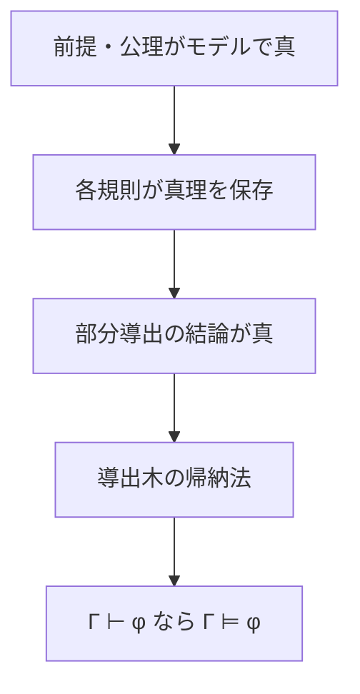

# 健全性――証明規則が真理を壊さない

健全性は、形式的に証明できた結論が意味論的にも正しいことを保証します。証明を信頼するための最低条件ですが、どの言語・意味論・証明体系についての性質かを明示する必要があります。

---

## 1. このページの到達目標

- 健全性を記号で定義できる。
- 局所健全性と体系全体の健全性を区別できる。
- 規則ごとの意味保存から全導出へ進む帰納法を説明できる。
- 健全性が保証しないことを説明できる。

---

## 2. 証明から意味への橋

固定した証明体系 $S$ について、

$$
\Gamma\vdash_S\varphi\Rightarrow\Gamma\models\varphi
$$

が健全性です。

次の図は証明の葉から根まで真理が保存される流れです。読み取るポイントは、各規則の局所健全性だけで終わらず、導出木の高さに関する帰納法で体系全体へ拡張することです。

---

## 3. 局所健全性

推論規則が局所的に健全とは、任意の構造と割当で、規則の前提がすべて真なら結論も真になることです。

### 例1：含意除去

$$
\frac{P\to Q\qquad P}{Q}
$$

$P\to Q$ と $P$ がともに真なら、含意の意味から $Q$ も真です。

### 例2：全称除去

$$
\frac{\forall xP(x)}{P(t)}
$$

全対象について $P$ が成り立つなら、項 $t$ が指す対象についても成り立ちます。ここでは $t$ が自由に代入可能であることが必要です。

---

## 4. 体系全体の健全性

典型的な証明は導出木の高さに関する帰納法です。

1. 基底：前提 $\gamma\in\Gamma$ や公理が、必要な意味で真であることを示す。
2. 帰納仮定：直前の部分導出の結論が、$\Gamma$ の任意のモデルで真と仮定する。
3. 帰納段階：最後に使った規則の局所健全性から、現在の結論も真と示す。

すべての規則と公理を確認して、はじめて体系全体の健全性が得られます。

---

## 5. 段階例：仮定を閉じる規則

含意導入では、$P$ を一時的に仮定して $Q$ を導き、

$$
P\to Q
$$

を得ます。$\Gamma$ の任意のモデルを考えると、$P$ が偽なら含意は真です。$P$ が真なら、部分証明の健全性から $Q$ も真です。どちらの場合も $P\to Q$ は真になります。

この例は、単純な真理値保存だけでなく、仮定のスコープも健全性証明に含まれることを示します。

---

## 6. 健全性が壊れる例

誤った規則

$$
\frac{P\to Q}{P}
$$

を追加するとします。$P$ が偽、$Q$ が真の割当では前提 $P\to Q$ は真ですが結論 $P$ は偽です。局所健全でないため、体系全体も健全ではありません。

---

## 7. 健全性が保証しないこと

- 意味論的に正しいすべての結論を証明できること：完全性の課題です。
- 証明探索が停止することや高速であること。
- 公理や形式化が現実の意図を正しく表すこと。
- 前提 $\Gamma$ 自体が現実に真であること。

健全性が述べるのは「$\Gamma$ が真なら、そこから正規の規則で導いた結論も真」という条件付き保証です。

---

## 8. 典型的な誤解と復帰方法

- 1規則を確認すれば十分：すべての規則・公理を確認します。
- 例で反例が見つからなければ健全：全構造に対する証明が必要です。
- 健全なら何でも証明できる：取りこぼしの有無は完全性です。

復帰するときは、最後の規則を特定し、「任意のモデルで前提が真なら結論も真か」を確認してから、導出木の一段下へ戻ります。

---

## 9. 演習問題

1. 健全性を記号で書きなさい。
2. $\frac{P\land Q}{Q}$ の局所健全性を説明しなさい。
3. $\frac{P}{P\lor Q}$ の局所健全性を説明しなさい。
4. $\frac{P\to Q}{P}$ の反例割当を示しなさい。
5. 局所健全性から体系全体の健全性へ進む2段階を説明しなさい。
6. 健全性だけから $\Gamma\models\varphi\Rightarrow\Gamma\vdash\varphi$ を言えない理由を述べなさい。

---

## 10. 演習問題の解答

1. $\Gamma\vdash_S\varphi\Rightarrow\Gamma\models\varphi$ です。
2. 連言が真なら両成分が真なので、$Q$ も真です。
3. $P$ が真なら選言 $P\lor Q$ は $Q$ の真偽によらず真です。
4. $P$ を偽、$Q$ を真にすると、前提は真で結論は偽です。
5. 各規則の意味保存を示し、導出木の高さに関する帰納法で全導出へ拡張します。
6. それは意味から証明への逆向きであり、完全性という別の性質だからです。

---

## 学習チェック

- 局所健全性を具体例で確認できる。
- 導出木の帰納法の役割を説明できる。
- 健全性の保証範囲を限定して言える。

---

## ナビゲーション

- 親: [00_overview.md](00_overview.md)
- 前: [00_overview.md](00_overview.md)
- 次: [02_completeness.md](02_completeness.md)
