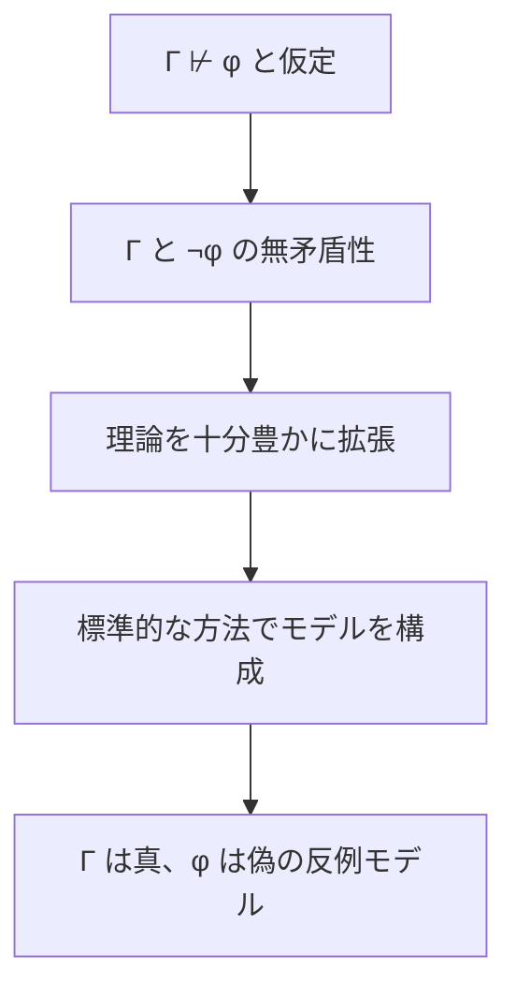

# 完全性――意味論的帰結を証明が取りこぼさない

完全性は、意味論的に必ず成り立つ帰結へ証明体系が到達できることを保証します。ただし、言語・意味論・証明体系の組に対する性質であり、証明探索の容易さや「あらゆる数学的真理」の証明可能性を意味しません。

---

## 1. このページの到達目標

- 完全性を対象と向きを明示して定義できる。
- 健全性との違いを説明できる。
- 完全性証明の対偶的な見通しを説明できる。
- 古典一階論理の完全性と算術理論の不完全性を区別できる。

---

## 2. 意味から証明への橋

古典一階述語論理の標準的意味論と適切な証明体系 $S$ について、

$$
\Gamma\models\varphi\Rightarrow\Gamma\vdash_S\varphi
$$

が完全性定理です。

次の図は対偶を使う証明の見取り図です。読み取るポイントは、証明不能なら反例モデルを構成することで、意味論的帰結でないことを示す点です。

---

## 3. 完全性証明の見通し

詳細は証明体系に依存しますが、典型的には次の流れです。

1. $\Gamma\nvdash_S\varphi$ と仮定する。
2. $\Gamma\cup\{\lnot\varphi\}$ が構文的に無矛盾であることを使う。
3. 証人を扱えるよう理論を拡張し、極大無矛盾集合などを作る。
4. 項や式から構造を構成する。
5. 真理補題により、構成した構造が $\Gamma$ を満たし $\varphi$ を偽にすると示す。

したがって、反例モデルがないなら証明が存在します。

---

## 4. 段階例1：命題論理

$P\lor\lnot P$ はすべての真理値割当で真です。命題論理の完全性により、適切な完全な証明体系では、

$$
\vdash_S P\lor\lnot P
$$

となります。完全性は証明の存在を保証しますが、最短証明や探索時間は保証しません。

---

## 5. 段階例2：帰結でない場合

$$
\exists xP(x)\not\models\forall xP(x)
$$

です。2要素の定義域で $P$ が片方だけに成り立つ反例モデルがあります。健全な証明体系なら、この不正な帰結を証明できません。

完全性は「意味論的帰結なら証明できる」と述べるのであり、帰結でないものまで証明するわけではありません。

---

## 6. 不完全性定理との区別

古典一階述語論理の完全性は、

$$
\Gamma\models\varphi
$$

すなわち $\Gamma$ の**すべての一階構造**で $\varphi$ が真なら、$\Gamma$ から形式的に証明できると述べます。

一方、Gödelの第一不完全性定理は、十分に強く、無矛盾で、実効的に公理化された算術理論 $T$ について、標準自然数構造 $\mathbb{N}$ では真でも $T$ から証明できない文があると述べます。

その文は、$T$ の非標準モデルでは偽になり得ます。したがって、

$$
T\not\models\varphi
$$

であっても、標準構造では真ということがあり、完全性定理と矛盾しません。

---

## 7. 完全性が保証しないこと

- 証明を効率よく発見できること
- 証明が短いこと
- 一階論理の妥当性を常に停止する手続きで判定できること
- 任意の理論が完全、無矛盾、実効的公理化可能であること
- 標準モデルだけでの真理をすべて捉えること

---

## 8. 典型的な誤解と復帰方法

- 完全性＝何でも証明可能：前提の全モデルで成り立つ帰結に限ります。
- 証明できない＝偽：体系や理論、意味論を特定します。
- 不完全性定理が完全性定理を否定する：扱う「真」の範囲が異なります。

復帰するときは、$\models$ が「どのモデル全部」を量化しているか、$\vdash$ が「どの公理・規則」を使うかを書き出します。

---

## 9. 演習問題

1. 完全性を記号で書きなさい。
2. 完全性と健全性の向きを答えなさい。
3. 完全性証明で対偶を使う発想を説明しなさい。
4. 完全性が決定可能性を意味しない理由を述べなさい。
5. 完全性定理と第一不完全性定理の「真」の違いを説明しなさい。
6. $\exists xP(x)\not\models\forall xP(x)$ の反例モデルを示しなさい。

---

## 10. 演習問題の解答

1. $\Gamma\models\varphi\Rightarrow\Gamma\vdash_S\varphi$ です。
2. 完全性は $\models$ から $\vdash$、健全性はその逆です。
3. 証明不能を仮定し、前提を真・結論を偽にするモデルを構成します。
4. 証明の存在と、有限時間で証明または非証明を必ず判定する手続きは別だからです。
5. 完全性は理論の全モデルでの真理、不完全性は標準自然数構造での真理と特定算術理論での証明可能性を比較します。
6. 定義域 $\{a,b\}$ で $P^{\mathcal{M}}=\{a\}$ とすれば、存在式は真、全称式は偽です。

---

## 学習チェック

- 完全性を対象に相対化して述べられる。
- 証明不能と反例モデルの関係を説明できる。
- 完全性と不完全性が両立する理由を説明できる。

---

## ナビゲーション

- 親: [00_overview.md](00_overview.md)
- 前: [01_soundness.md](01_soundness.md)
- 次: [03_compactness_low_level.md](03_compactness_low_level.md)
