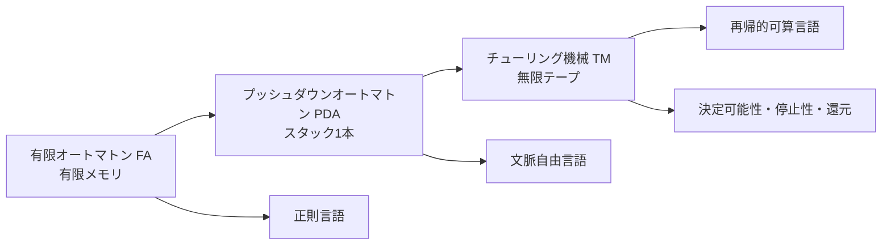

# 04_computability_and_automata

この章では、
「**何が機械的に判定できるのか**」をテーマに、
オートマトンからチューリング機械、決定可能性までをつなげて学びます。

これまでの章で学んだ「何が論理的に正しいか（妥当性・証明可能性）」に対して、
ここでは「それを**計算手順として実行できるか**」を見ます。

---

## 1. この章の到達目標
- 有限オートマトン・プッシュダウンオートマトン・チューリング機械の違いを説明できる。
- 言語クラス（正則・文脈自由・再帰的可算/決定可能）の対応関係を整理できる。
- 「認識可能（recognizable）」と「決定可能（decidable）」を区別できる。
- 具体例に対して、どのモデルで扱うのが自然かを判断できる。

---

## 2. 全体マップ（この図で“計算モデルの増強”を読む）
次の図は、計算モデルが強化されるにつれて扱える言語が広がる関係を示します。

読むポイント:
- 上に行くほど「計算資源」が増え、表現力が上がる。
- ただし、強くなるほど「何でも必ず判定できる」わけではない。

---

## 3. 章内の学習順序
### Step 1: 有限オートマトン
まずは「状態遷移だけ」で読める最小モデルを学びます。
典型問題は、文字列が特定パターンに一致するかどうかです。

### Step 2: プッシュダウンオートマトン
次にスタックを導入し、
括弧列の整合性のような入れ子構造を扱います。

### Step 3: チューリング機械
一般計算の抽象モデルとして、
アルゴリズムという概念を最も素朴に定義します。

### Step 4: 決定可能性
最後に「そもそも判定可能か」を問います。
停止性問題や還元の発想を通して、計算の限界を確認します。

---

## 4. 先に押さえる最小用語（TeX記法つき）
- 言語 $L$：文字列集合。
- 認識可能（recognizable）：
  あるTMが $x\in L$ のとき停止して受理する（$x\notin L$ では停止保証なし）。
- 決定可能（decidable）：
  あるTMが任意入力 $x$ で必ず停止し、$x\in L$ か否かを正しく判定する。

記号で書くと、判定器 $M$ は

$$
\forall x\;\bigl(M(x)\text{ は停止し、 }x\in L \Leftrightarrow M(x)=\text{accept}\bigr)
$$

を満たします。

---

## 5. 直観例：どのモデルを使うべきか
### 例1: 末尾が `01` の2進文字列
有限個の状態で十分なので、FAが自然です。

### 例2: 括弧列が正しいか
`(()())` はOK、`(()` はNGという判定には入れ子深さの記憶が必要です。
これはスタックが必要なのでPDAが自然です。

### 例3: 任意プログラムが停止するか
一般にはTMレベルの話で、しかも停止性問題は決定不能です。
つまり「計算モデルを強くしても限界が残る」代表例です。

---

## 6. つまずきやすい点
- 「認識可能」と「決定可能」を同じ意味で使ってしまう。
- 「TMなら全部解ける」と思ってしまう。
- モデル差を“速度差”だけで理解してしまう（本質は表現力差）。

### 対策
1. 各概念を「停止保証の有無」で言い換える。
2. 停止性問題を、限界を示す基準例として常に思い出す。
3. 例題ごとに「必要な記憶資源（有限状態/スタック/テープ）」を明示する。

---

## 7. 演習問題（イメージ重視）
### 問1（モデル選択）
次の問題に対して、最も自然なモデルを選びなさい（FA / PDA / TM）。

1. 文字列中の `a` の個数が偶数か判定
2. 括弧列の整合性判定
3. 任意プログラムの停止判定

### 問2（概念区別）
次の2文がそれぞれ「認識可能」「決定可能」のどちらを表すか答えなさい。

- (A) 正例では停止して受理するが、負例で停止しない場合がある。
- (B) すべての入力で停止し、正誤を返す。

### 問3（言語クラスの直観）
正則言語と文脈自由言語の違いを、
「必要な記憶装置」の観点で2〜4行で説明しなさい。

### 問4（限界の理解）
「TMが最も強い計算モデルなのに、なぜ決定不能問題が存在するのか」を
3〜5行で説明しなさい。

---

## 8. 演習問題の解答
### 解答1
1. FA（有限状態だけで偶奇を追跡可能）
2. PDA（入れ子をスタックで管理）
3. TM（一般計算モデルだが、停止判定自体は決定不能）

### 解答2
- (A) 認識可能
- (B) 決定可能

### 解答3（例）
正則言語は有限状態だけで判定できる範囲で、
過去情報を無限に保持できない。
文脈自由言語はスタックを使えるため、
括弧対応のような入れ子構造を扱える。

### 解答4（例）
TMは「実行可能な手続き」を最も広く表せるが、
その内部で自己参照的に停止性を問う問題が作れてしまう。
このため、どんなTM判定器でも正しく一律判定できない問題が存在する。
よって強力さと万能判定可能性は同義ではない。

---

## 学習チェック（自己確認）
- FA / PDA / TM の違いを「記憶資源」で説明できる。
- 認識可能と決定可能を、停止保証の有無で区別できる。
- この章で「計算の限界」を学ぶ意味を言語化できる。

---

## ナビゲーション
- 親: [../README.md](../README.md)
- 子:
  - [01_finite_automata.md](01_finite_automata.md)
  - [02_pushdown_automata.md](02_pushdown_automata.md)
  - [03_turing_machines.md](03_turing_machines.md)
  - [04_decidability.md](04_decidability.md)
- 前: [../03_soundness_completeness/03_compactness_low_level.md](../03_soundness_completeness/03_compactness_low_level.md)
- 次: [01_finite_automata.md](01_finite_automata.md)
