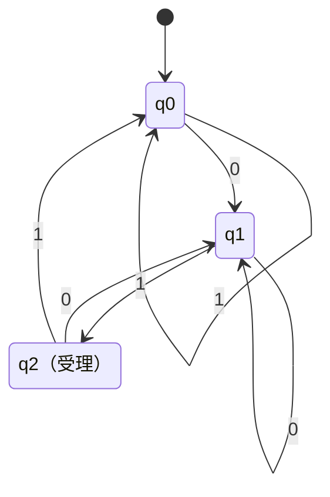

# 01_finite_automata

有限オートマトン（finite automaton; FA）は、入力を左から1文字ずつ読みながら、**有限個の状態**の間を移動する計算モデルです。

たとえば「2進文字列の末尾が `01` か」「文字列中の `1` の個数が偶数か」は、入力全体を保存しなくても、いま必要な情報だけを状態として覚えれば判定できます。

このページでは、まず決定性有限オートマトン（deterministic finite automaton; DFA）を中心に学びます。

---

## 1. このページの到達目標

- DFAを「状態・入力記号・遷移」の組として説明できる。
- 遷移図と形式的な5つ組を対応づけられる。
- 文字列を1文字ずつ追跡し、受理・拒否を判定できる。
- 有限オートマトンが覚えられることと、覚えられないことを区別できる。
- DFA・非決定性有限オートマトン（NFA）・正規表現の関係を説明できる。

---

## 2. 直観：必要な過去だけを状態にする

有限オートマトンは、過去の入力をすべて記録する機械ではありません。
判定に必要な情報だけを、有限個の「状態」に圧縮します。

例として、アルファベット

$$
\Sigma=\{0,1\}
$$

上の文字列について、「末尾が `01` なら受理する」機械を考えます。
この判定で必要なのは、文字列全体ではなく次の3種類の情報だけです。

- まだ末尾が `01` ではなく、直前も `0` ではない。
- 直前の文字が `0` である。
- 現在の末尾が `01` である。

この3種類を、それぞれ状態

$$
q_0,\ q_1,\ q_2
$$

として表します。

---

## 3. 状態遷移図

次の図では、矢印のラベルが「読んだ文字」、二重丸の代わりに「受理」と書いた状態が受理状態です。
入力を左から読み、現在状態から対応する矢印を1本ずつたどります。

この図から読み取るポイントは、次の2つです。

- どの状態でも、入力 `0` と `1` の行き先がそれぞれ1つに決まっている。
- 入力をすべて読んだ時点で $q_2$ にいれば、末尾が `01` なので受理する。

---

## 4. DFAの形式的な定義

DFAは、次の5つ組で定義されます。

$$
M=(Q,\Sigma,\delta,q_0,F)
$$

それぞれの意味は次の通りです。

| 記号 | 意味 | この例 |
|---|---|---|
| $Q$ | 状態の有限集合 | $\{q_0,q_1,q_2\}$ |
| $\Sigma$ | 入力アルファベット | $\{0,1\}$ |
| $\delta$ | 状態遷移関数 | 状態と1文字から次状態を決める |
| $q_0$ | 初期状態 | $q_0$ |
| $F$ | 受理状態の集合 | $\{q_2\}$ |

遷移関数は

$$
\delta:Q\times\Sigma\to Q
$$

という関数です。
たとえば図中の「$q_1$ で `1` を読むと $q_2$ へ移る」は、

$$
\delta(q_1,1)=q_2
$$

と書けます。

「決定性」とは、現在状態と次の1文字が決まれば、次状態がただ1つに決まることです。

---

## 5. 文字列を最後まで読む

1文字ではなく文字列全体を扱うため、遷移関数を拡張した

$$
\delta^{*}:Q\times\Sigma^{*}\to Q
$$

を使います。

ここで $\Sigma^{*}$ は、$\Sigma$ の文字から作れる有限長の文字列すべての集合で、空文字列 $\varepsilon$ も含みます。

拡張遷移関数は、次のように再帰的に定義できます。

$$
\delta^{*}(q,\varepsilon)=q
$$

$$
\delta^{*}(q,wa)=\delta(\delta^{*}(q,w),a)
$$

ただし、$w$ は途中までの文字列、$a$ は最後の1文字です。
つまり「まず $w$ を読み、その到着状態から $a$ を読む」というだけです。

DFA $M$ が受理する言語は、

$$
L(M)=\{w\in\Sigma^{*}\mid \delta^{*}(q_0,w)\in F\}
$$

です。

---

## 6. 例題：`1101` は受理されるか

初期状態 $q_0$ から、文字列 `1101` を左から追います。

| 読み終えた部分 | 読んだ文字 | 到着状態 |
|---|---|---|
| $\varepsilon$ | まだ読まない | $q_0$ |
| `1` | `1` | $q_0$ |
| `11` | `1` | $q_0$ |
| `110` | `0` | $q_1$ |
| `1101` | `1` | $q_2$ |

最後に受理状態 $q_2$ へ到着するので、`1101` は受理されます。

一方、`11010` は最後の `0` によって $q_2$ から $q_1$ へ移るため、拒否されます。
途中で受理状態を通ったかではなく、**入力を読み終えた時点の状態**で判定する点に注意してください。

---

## 7. 設計のコツ：状態に意味を持たせる

DFAを設計するときは、いきなり丸と矢印を描くより、各状態が何を覚えているかを日本語で決めると整理しやすくなります。

### 手順

1. 何を判定したいかを明確にする。
2. 判定に必要な過去の情報を列挙する。
3. 区別すべき情報ごとに状態を作る。
4. 各状態について、すべての入力記号の行き先を決める。
5. 受理すべき状態を選ぶ。
6. 受理例と拒否例を実際に流して確認する。

たとえば「`1` の個数が偶数」という判定なら、個数そのものを覚える必要はありません。
必要なのは「いま偶数か、奇数か」だけなので、2状態で十分です。

---

## 8. NFAと正規表現との関係

非決定性有限オートマトン（nondeterministic finite automaton; NFA）では、同じ状態・同じ入力から複数の行き先を持てます。
さらに入力を消費しない $\varepsilon$ 遷移も許すモデルは、特に $\varepsilon$-NFAと呼ばれます（教科書によっては、これもまとめてNFAと呼びます）。

一見するとNFAのほうが強そうですが、言語を受理できる範囲はDFAと同じです。
任意のNFAは、状態集合の部分集合を1つの状態として扱う**部分集合構成法**によって、等価なDFAへ変換できます。

また、DFA・NFA・正規表現は、いずれも同じ言語クラスを表します。

$$
\text{DFAで受理可能}
\iff
\text{NFAで受理可能}
\iff
\text{正規表現で記述可能}
$$

この言語クラスを**正則言語**と呼びます。

---

## 9. 有限オートマトンの限界

有限オートマトンが持てる状態数は有限です。
したがって、上限のない個数を正確に覚え続けることはできません。

代表例は、

$$
L=\{0^n1^n\mid n\geq 0\}
$$

です。
この言語を判定するには、最初の `0` の個数を覚え、後半の `1` の個数と一致するか比べる必要があります。
$n$ に上限がないため、有限個の状態だけでは必要な個数をすべて区別できません。

ただし、「`1` の個数が偶数」や「`1` の個数を3で割った余りが2」のように、有限個の分類へ圧縮できる情報ならDFAで扱えます。

この違いが、次のページでスタックを持つプッシュダウンオートマトンを導入する理由です。

---

## 10. つまずきやすい点

### つまずき1：状態を入力文字そのものだと思う

状態は「最後に読んだ文字」に限りません。
判定のために保持したい情報を表すラベルです。

### つまずき2：受理状態を一度通れば受理だと思う

DFAでは通常、入力をすべて読んだ時点の状態で判定します。
読み終える前に受理状態を通っても、その後に別状態へ移れば拒否されます。

### つまずき3：遷移を書き忘れる

DFAの遷移関数 $\delta$ は、すべての状態と入力記号の組に対して行き先を持ちます。
不正な入力をまとめて拒否する必要があるときは、デッド状態を追加します。

### つまずき4：有限長の入力しか扱えないから「有限」だと思う

「有限」は入力長の上限ではなく、状態数が有限であることを指します。
DFAは任意の有限長文字列を読めます。

---

## 11. 演習問題

### 問1（受理判定）

このページの「末尾が `01`」のDFAについて、次の文字列が受理されるか答えなさい。

1. $\varepsilon$
2. `01`
3. `1011`
4. `0001`

### 問2（遷移の追跡）

文字列 `1001` を読んだときの状態列を、初期状態から順に書きなさい。

### 問3（2状態の設計）

`1` の個数が偶数である2進文字列を受理するDFAを考えます。
必要な2状態の意味、初期状態、受理状態、入力 `0` と `1` に対する遷移を説明しなさい。

### 問4（有限メモリで足りるか）

次のうち、有限オートマトンで判定できると考えられるものを選び、理由を説明しなさい。

1. 文字列に `101` が含まれる。
2. `0` と `1` の個数が等しい。
3. `1` の個数を3で割った余りが2である。

### 問5（形式的な定義）

DFA

$$
M=(Q,\Sigma,\delta,q_0,F)
$$

の5要素を、それぞれ日本語で説明しなさい。

### 問6（DFAとNFA）

NFAでは複数の遷移候補を許すのに、DFAより広い言語クラスを扱えるわけではないのはなぜですか。
2〜4行で説明しなさい。

---

## 12. 演習問題の解答

### 解答1

1. 拒否。初期状態 $q_0$ は受理状態ではない。
2. 受理。$q_0\to q_1\to q_2$ と移る。
3. 拒否。最後の2文字が `11` であり、最終状態は $q_0$ である。
4. 受理。最後の2文字が `01` であり、最終状態は $q_2$ である。

### 解答2

$$
q_0\xrightarrow{1}q_0\xrightarrow{0}q_1\xrightarrow{0}q_1\xrightarrow{1}q_2
$$

最終状態が $q_2$ なので受理されます。

### 解答3

状態を「偶数個の `1` を読んだ状態」$q_{\mathrm{even}}$ と「奇数個の `1` を読んだ状態」$q_{\mathrm{odd}}$ とします。
初期状態と受理状態は $q_{\mathrm{even}}$ です。
`0` では状態を変えず、`1` では2状態を相互に移動します。

### 解答4

1と3は有限オートマトンで判定できます。

- 1は、`101` のどこまで一致したかを有限個の状態で覚えればよい。
- 3は、余り $0,1,2$ の3状態を用意すればよい。
- 2は、差に上限がないため、一般には有限個の状態だけでは正確に覚えられない。

### 解答5

- $Q$：状態の有限集合。
- $\Sigma$：入力に使用する記号の有限集合。
- $\delta$：現在状態と入力記号から次状態を決める関数。
- $q_0$：入力を読む前の初期状態。
- $F$：受理状態の集合。

### 解答6

NFAが同時に取り得る状態の集合を、DFAの1状態として表せるからです。
部分集合構成法により任意のNFAを等価なDFAへ変換できるため、記述の簡潔さは異なっても受理できる言語クラスは同じです。

---

## 学習チェック（自己確認）

- 遷移図から5つ組 $M=(Q,\Sigma,\delta,q_0,F)$ を読み取れる。
- 与えられた文字列について、状態を順に追って受理・拒否を判断できる。
- 「状態は必要な過去の情報を圧縮したもの」と説明できる。
- 正則言語と、DFA・NFA・正規表現の関係を説明できる。
- 有限オートマトンでは扱えない問題の特徴を、記憶量の観点から説明できる。

---

## ナビゲーション

- 親: [00_overview.md](00_overview.md)
- 前: [00_overview.md](00_overview.md)
- 次: [02_pushdown_automata.md](02_pushdown_automata.md)
