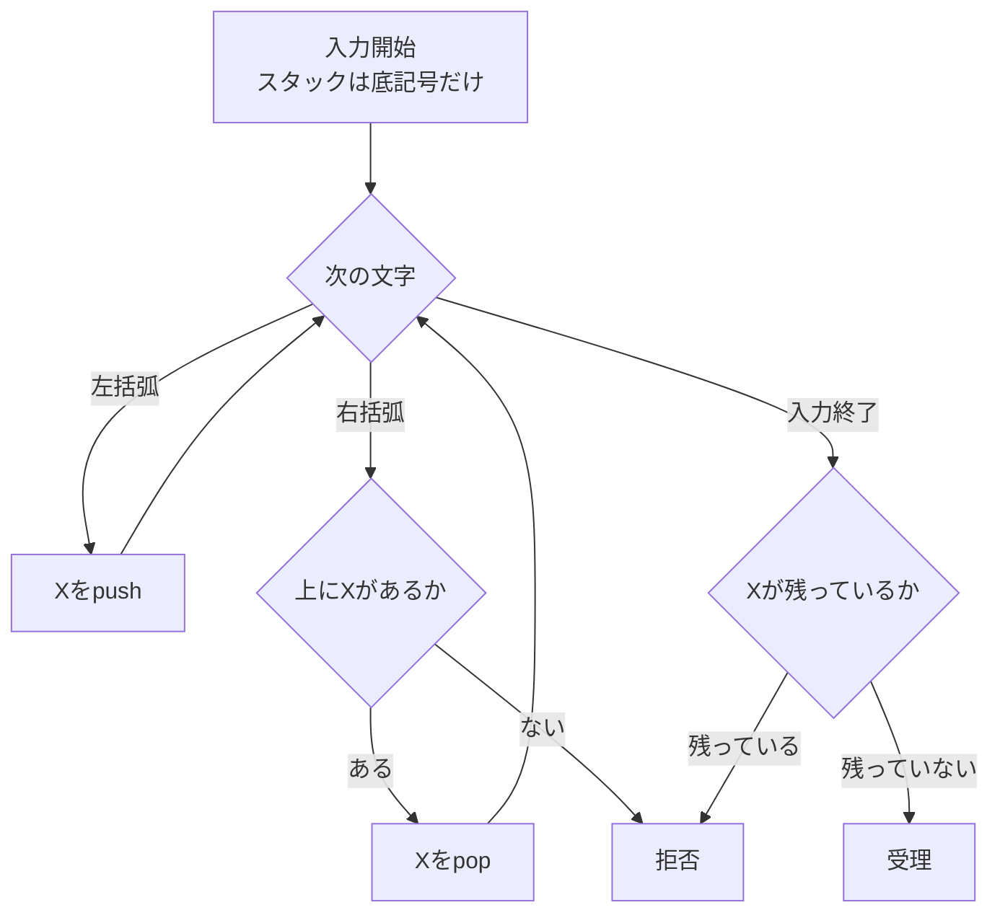

# 02_pushdown_automata

プッシュダウンオートマトン（pushdown automaton; PDA）は、有限オートマトンに**スタック**を1本追加した計算モデルです。

有限オートマトンは有限個の状態しか持たないため、入力に応じて増え続ける情報を記憶できません。
PDAはスタックへ記号を積み、後から逆順に取り出すことで、括弧の入れ子や「前半と後半の個数を対応させる」構造を扱えます。

---

## 1. このページの到達目標

- PDAを「有限制御とスタックを組み合わせた機械」として説明できる。
- push・pop・何もしない、というスタック操作を区別できる。
- 入力文字列に対する状態とスタックの変化を追跡できる。
- PDAと文脈自由言語・文脈自由文法の関係を説明できる。
- スタックが1本あっても扱えない代表的な言語を挙げられる。

---

## 2. なぜ有限オートマトンでは足りないのか

正しい括弧列を集めた言語を考えます。

$$
L_{\mathrm{paren}}=
\{\varepsilon,\ (),\ (()),\ ()(),\ (()()),\ldots\}
$$

左から読むとき、`(` を読むたびに「まだ対応する `)` が必要な括弧」が1つ増え、`)` を読むたびに1つ減ります。
さらに、途中で閉じ括弧が多くなってはいけません。

入れ子の深さに上限がなければ、必要な記憶量にも上限がありません。
有限個の状態だけで深さをすべて区別しようとすると、どこかで異なる深さを同じ状態にまとめることになります。

そこで、状態とは別に、必要な個数だけ記号を積めるスタックを導入します。

---

## 3. スタック：最後に入れたものを最初に出す

スタックは、皿を重ねたような記憶装置です。
操作できるのは一番上だけで、最後に積んだ記号を最初に取り出します。
この方式をLIFO（last in, first out）と呼びます。

- **push**：一番上へ記号を積む。
- **pop**：一番上の記号を取り出す。
- **置換**：一番上の記号を、0個以上の記号列に置き換える。pushとpopを統一的に表せる。

次の図では、正しい括弧列を読むときのスタックの役割を示します。
`(` で記号を積み、`)` で1個取り出すため、入れ子の深さがそのままスタックの高さになります。

この図から読み取るポイントは次の2つです。

- 途中で対応相手のない `)` が現れたら、その場で拒否する。
- 入力を読み終えたとき、対応待ちの `(` が残っていなければ受理する。

---

## 4. PDAの形式的な定義

PDAは、流儀によって細部が異なりますが、ここでは次の7つ組で表します。

$$
P=(Q,\Sigma,\Gamma,\delta,q_0,Z_0,F)
$$

| 記号 | 意味 |
|---|---|
| $Q$ | 状態の有限集合 |
| $\Sigma$ | 入力アルファベット |
| $\Gamma$ | スタックアルファベット |
| $\delta$ | 遷移関係 |
| $q_0$ | 初期状態 |
| $Z_0$ | スタックの底を表す初期記号 |
| $F$ | 受理状態の集合 |

非決定性PDAの遷移関係は、代表的には次のように書けます。

$$
\delta:
Q\times(\Sigma\cup\{\varepsilon\})\times\Gamma
\to
\mathcal{P}(Q\times\Gamma^{*})
$$

ここで

$$
(p,\gamma)\in\delta(q,a,X)
$$

は、次の操作を表します。

1. 現在状態が $q$ である。
2. 入力から $a$ を読む。ただし $a=\varepsilon$ なら入力を消費しない。
3. スタック最上部の $X$ を取り除く。
4. 代わりに記号列 $\gamma$ を積む。
5. 状態 $p$ へ移る。

このページでは、$\gamma$ の左端を新しいスタック最上部とする約束を使います。
したがって、$\gamma=\varepsilon$ なら単純なpop、$\gamma=YX$ なら $X$ の上へ $Y$ をpushする操作です。

$\mathcal{P}$ はべき集合を表します。
遷移先が集合になっているのは、同じ状況から複数の選択肢を持てる非決定性を許すためです。

---

## 5. 状況（configuration）で計算を追う

PDAの計算途中は、次の3要素で表せます。

$$
(q,w,\alpha)
$$

- $q$：現在状態。
- $w$：まだ読んでいない入力。
- $\alpha$：現在のスタック内容。

たとえば

$$
(q,\mathtt{abba},XZ_0)
$$

なら、状態は $q$、未読入力は `abba`、スタック最上部は $X$、その下に底記号 $Z_0$ があるという意味です。

状態だけを追えばよかったDFAと違い、PDAでは**状態とスタックの組**を追う必要があります。

---

## 6. 例題1：正しい括弧列を判定する

入力アルファベットを

$$
\Sigma=\{\mathtt{(},\mathtt{)}\}
$$

とします。
次の方針で判定できます。

1. `(` を読んだら、スタックへ $X$ をpushする。
2. `)` を読んだら、$X$ を1個popする。
3. popしたいのに $X$ がなければ拒否する。
4. 入力終了時に $X$ が残っていなければ受理する。

`(()())` を読んだときの変化を追うと、次のようになります。

| 読み終えた部分 | 操作 | スタック |
|---|---|---|
| $\varepsilon$ | 開始 | $Z_0$ |
| `(` | push | $XZ_0$ |
| `((` | push | $XXZ_0$ |
| `(()` | pop | $XZ_0$ |
| `(()(` | push | $XXZ_0$ |
| `(()()` | pop | $XZ_0$ |
| `(()())` | pop | $Z_0$ |

入力終了時に底記号だけなので受理します。

一方、`())(` は3文字目の `)` でpopする $X$ がなくなるため、その時点で拒否できます。
`(()` は途中では矛盾しませんが、入力終了時に $X$ が残るため拒否します。

---

## 7. 例題2：同じ個数を対応させる

次の言語を考えます。

$$
L=\{a^n b^n\mid n\geq 0\}
$$

これは「最初に $a$ が $n$ 個並び、続いて同じ個数の $b$ が並ぶ」文字列の集合です。
たとえば、$\varepsilon$、`ab`、`aabb`、`aaabbb` は含まれますが、`aab`、`abab` は含まれません。

PDAは次のように動けます。

1. $a$ を読む間は、1文字につき $A$ を1個pushする。
2. 最初の $b$ を読んだら、pop段階へ移る。
3. $b$ を1文字読むたびに、$A$ を1個popする。
4. pop段階で $a$ が現れたら拒否する。
5. 入力終了時に $A$ が残っていなければ受理する。

`aabb` の追跡は次の通りです。

| 未読入力 | 段階 | スタック |
|---|---|---|
| `aabb` | push段階 | $Z_0$ |
| `abb` | push段階 | $AZ_0$ |
| `bb` | push段階 | $AAZ_0$ |
| `b` | pop段階 | $AZ_0$ |
| $\varepsilon$ | pop段階 | $Z_0$ |

有限オートマトンでは $n$ に上限がない個数を記憶できません。
PDAでは $a$ の個数をスタックの高さとして保存し、後半の $b$ と1対1に対応させられます。

---

## 8. 受理方法は2通りある

PDAの代表的な受理方法には、次の2つがあります。

### 最終状態による受理

入力をすべて読み、受理状態

$$
q\in F
$$

へ到着したら受理します。

### 空スタックによる受理

入力をすべて読み、スタックを空にできたら受理します。
底記号を使う定義では、最後に底記号もpopする遷移を用意します。

定義の見た目は違いますが、非決定性PDAでは、どちらの方法でも受理できる言語クラスは同じです。
ただし、個々のPDAを読むときは、どちらの受理条件を採用しているかを必ず確認してください。

---

## 9. 非決定性は「ランダム」ではない

非決定性PDA（NPDA）は、ある状況から複数の遷移を選べます。
入力を読まない $\varepsilon$ 遷移も使えるため、「ここから後半として照合を始める」といった境界を推測できます。

受理の意味は、すべての分岐が成功することではありません。

$$
\text{可能な計算経路のうち、少なくとも1本が受理すれば受理}
$$

です。

これは乱数で運よく正解を引くという意味ではなく、言語を定義するための数学的なモデルです。

DFAとNFAは受理できる言語クラスが同じでした。
一方、決定性PDA（DPDA）が受理する言語は、NPDAが受理する文脈自由言語の真部分集合です。
つまりPDAでは、非決定性によって受理能力そのものが広がります。

---

## 10. 文脈自由文法との関係

文脈自由文法（context-free grammar; CFG）は、たとえば正しい括弧列を次の生成規則で表せます。

$$
S\to SS\mid (S)\mid\varepsilon
$$

この規則は、空文字列、正しい括弧列の連結、正しい括弧列を括弧で囲んだものを生成します。

PDAとCFGには、有限オートマトンと正規表現に似た対応があります。

$$
\text{PDAで受理可能}
\iff
\text{CFGで生成可能}
\iff
\text{文脈自由言語}
$$

文法は「文字列をどう生成するか」、PDAは「入力文字列をどう認識するか」という見方の違いです。
構文解析では、文法に従う入れ子構造をスタックで処理するという形で、この対応が実用上も現れます。

---

## 11. PDAにも限界がある

スタックは上限なく伸ばせますが、自由に読み書きできるわけではありません。
取り出せるのは最上部だけです。

たとえば次の言語は、1本のスタックを持つPDAでは受理できません。

$$
L=\{a^n b^n c^n\mid n\geq 0\}
$$

$a$ と $b$ の個数を照合するためにスタックを取り崩すと、さらに同じ個数の $c$ と照合する情報を残せません。
この言語は文脈自由言語ではありません。

また、任意の文字列 $w$ を同じ順序でもう一度繰り返す

$$
L=\{ww\mid w\in\{0,1\}^{*}\}
$$

も文脈自由言語ではありません。
スタックは逆順の照合には向きますが、前半を同じ順序で取り出すことはできないからです。

この限界を越え、より一般的な計算を表すために、次のページではチューリング機械を導入します。

---

## 12. つまずきやすい点

### つまずき1：スタックの途中を直接読めると思う

PDAが直接操作できるのは最上部だけです。
途中の記号を見るには、その上の記号を先にpopしなければなりません。

### つまずき2：入力を読む操作とスタック操作を混同する

1回の遷移では、「入力を読むか」と「スタック最上部を何に置き換えるか」を別々に考えます。
$\varepsilon$ 遷移なら、入力位置を進めずにスタックや状態だけを変更できます。

### つまずき3：入力終了だけで受理だと思う

入力を使い切っても、受理条件を満たすとは限りません。
最終状態による受理か、空スタックによる受理かを確認する必要があります。

### つまずき4：スタックがあれば何個でも比較できると思う

記憶容量が無限でも、アクセス方法はLIFOに制限されています。
1本のスタックで扱えるのは文脈自由言語までです。

### つまずき5：NPDAの全経路を成功させようとする

NPDAは、少なくとも1本の受理経路が存在すれば受理します。
失敗する分岐があっても構いません。

---

## 13. 演習問題

### 問1（括弧列の追跡）

このページの括弧列PDAの方針に従い、次の文字列が受理されるか答えなさい。

1. `()(())`
2. `(()))`
3. `())(`
4. $\varepsilon$

拒否する場合は、どの時点で何が問題になるかも説明しなさい。

### 問2（スタックの追跡）

言語

$$
L=\{a^n b^n\mid n\geq 0\}
$$

を認識するPDAについて、入力 `aaabbb` を読んだときのスタック内容を、初期状態から入力終了まで順に書きなさい。

### 問3（言語の判定）

次の文字列のうち、

$$
L=\{a^n b^n\mid n\geq 0\}
$$

に含まれるものをすべて選びなさい。

1. $\varepsilon$
2. `ab`
3. `aabb`
4. `abab`
5. `aaabbbb`

### 問4（受理方法）

最終状態による受理と空スタックによる受理の違いを説明しなさい。
また、非決定性PDAでは両者が表す言語クラスについても答えなさい。

### 問5（モデル選択）

次の各言語について、有限オートマトン、PDA、チューリング機械のうち、受理に必要な最も弱いモデルを答えなさい。

1. `1` の個数が偶数である2進文字列
2. 正しい括弧列
3. $\{a^n b^n c^n\mid n\geq 0\}$

### 問6（PDAとCFG）

PDAと文脈自由文法が同じ言語クラスを表すことを、「生成」と「認識」という語を使って2〜4行で説明しなさい。

---

## 14. 演習問題の解答

### 解答1

1. 受理。途中で閉じ括弧が先行せず、入力終了時に対応待ちの開き括弧も残らない。
2. 拒否。最後の `)` を読んだとき、popする $X$ がない。
3. 拒否。3文字目の `)` を読んだとき、popする $X$ がない。その後の `(` では取り消せない。
4. 受理。最初から対応待ちの括弧がなく、入力終了時も底記号だけである。

### 解答2

スタック最上部を左に書くと、次のように変化します。

$$
Z_0
\to AZ_0
\to AAZ_0
\to AAAZ_0
\to AAZ_0
\to AZ_0
\to Z_0
$$

前半の3個の $a$ で3個の $A$ をpushし、後半の3個の $b$ で1個ずつpopします。

### 解答3

1、2、3が含まれます。

- $\varepsilon$ は $n=0$。
- `ab` は $n=1$。
- `aabb` は $n=2$。
- `abab` はすべての $a$ の後にすべての $b$ が並ぶ形ではない。
- `aaabbbb` は $a$ と $b$ の個数が異なる。

### 解答4

最終状態による受理では、入力を読み終えたときの状態が受理状態かを調べます。
空スタックによる受理では、入力を読み終えてスタックを空にできたかを調べます。
個々の機械の構成は異なりますが、非決定性PDAでは両者が受理する言語クラスは同じです。

### 解答5

1. 有限オートマトン。偶数・奇数の2状態で十分である。
2. PDA。上限のない入れ子深さをスタックで記憶する。
3. チューリング機械。これは文脈自由言語ではなく、1本のスタックを持つPDAでは受理できない。

### 解答6

文脈自由文法は、生成規則を使って言語の文字列を生成します。
PDAは、スタックを使って入力文字列がその言語に属するかを認識します。
任意のCFGに等価なPDAがあり、任意のPDAに等価なCFGがあるため、両者は文脈自由言語を表します。

---

## 学習チェック（自己確認）

- 有限オートマトンにスタックを加えると何ができるか説明できる。
- 遷移関係 $\delta$ の入力と出力を読み取れる。
- 括弧列や $a^n b^n$ について、スタックの変化を追跡できる。
- 最終状態による受理と空スタックによる受理を区別できる。
- PDA・CFG・文脈自由言語の関係を説明できる。
- $a^n b^n c^n$ がPDAの範囲を越えることを直観的に説明できる。

---

## ナビゲーション

- 親: [00_overview.md](00_overview.md)
- 前: [01_finite_automata.md](01_finite_automata.md)
- 次: [03_turing_machines.md](03_turing_machines.md)
