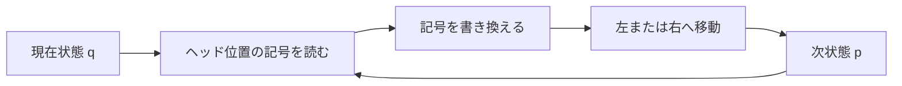

# 03_turing_machines

チューリング機械（Turing machine）は、有限個の状態と、必要に応じて読み書きできるテープを組み合わせた計算モデルです。

有限オートマトンは有限個の状態だけを使い、PDAはスタックの一番上だけを操作しました。チューリング機械は、テープ上の記号を読み、書き換え、ヘッドを左右へ動かせます。この単純な仕組みで、通常のコンピュータが行う計算を数学的に捉えられます。

---

## 1. このページの到達目標

- チューリング機械を「有限制御・テープ・ヘッド」の組として説明できる。
- 1回の遷移で行う、読み取り・書き込み・移動を区別できる。
- 簡単な入力について瞬間記述を追跡できる。
- 「認識する」と「決定する」の違いを説明できる。
- チャーチ＝チューリングのテーゼを数学的定理と混同しない。

---

## 2. なぜ新しい計算モデルが必要なのか

PDAのスタックは必要なだけ伸ばせますが、操作できるのは最上部だけです。そのため、前に保存した情報の途中へ戻って調べたり、自由に書き換えたりできません。

たとえば

$$
L=\{a^n b^n c^n\mid n\geq 0\}
$$

では、3種類の記号の個数がすべて同じかを確かめる必要があります。チューリング機械なら、照合済みの文字へ印を付け、テープ上を何度も往復して確認できます。

次の図は、チューリング機械の1ステップを示します。読み取るポイントは、入力を一方向に消費するだけでなく、同じ場所へ戻って再利用できることです。

---

## 3. テープ・ヘッド・有限制御

標準的なチューリング機械には、次の3要素があります。

- **テープ**：マス目に分かれた、理論上いくらでも使える記憶領域。
- **ヘッド**：現在の1マスを読み書きし、左右へ1マス移動する装置。
- **有限制御**：現在状態と読んだ記号から、次の動作を決める有限個の規則。

「無限テープ」は、計算開始時に無限の情報を持つという意味ではありません。最初は入力以外が空白で、有限時間の計算では有限個のマスしか訪れません。必要な記憶量に固定上限を置かないための理想化です。

---

## 4. 形式的な定義

ここでは決定性チューリング機械を7つ組で表します。

$$
M=(Q,\Sigma,\Gamma,\delta,q_0,q_{\mathrm{acc}},q_{\mathrm{rej}})
$$

| 記号 | 意味 |
|---|---|
| $Q$ | 状態の有限集合 |
| $\Sigma$ | 入力アルファベット。空白記号を含まない |
| $\Gamma$ | テープアルファベット。$\Sigma$ と空白記号を含む |
| $\delta$ | 遷移関数 |
| $q_0$ | 初期状態 |
| $q_{\mathrm{acc}}$ | 受理状態 |
| $q_{\mathrm{rej}}$ | 拒否状態 |

受理状態と拒否状態は異なるものとします。

$$
q_{\mathrm{acc}}\neq q_{\mathrm{rej}}
$$

遷移関数は、停止状態を除けば次の形です。

$$
\delta:
(Q\setminus\{q_{\mathrm{acc}},q_{\mathrm{rej}}\})\times\Gamma
\to Q\times\Gamma\times\{L,R\}
$$

たとえば

$$
\delta(q,a)=(p,X,R)
$$

は、「状態 $q$ で $a$ を読んだら、$X$ を書き、右へ1マス動き、状態 $p$ へ移る」という意味です。

定義によっては、ヘッドを動かさない $S$ を許したり、テープを片方向だけ無限にしたりします。これらは扱いやすさの違いであり、計算できる関数や認識できる言語のクラスは変わりません。

---

## 5. 瞬間記述で計算を追う

計算途中の「状態・テープ内容・ヘッド位置」をまとめたものを瞬間記述（configuration）と呼びます。

表記の一例として

$$
u q a v
$$

と書けば、テープ上の有限な関連部分が $uav$、現在状態が $q$、ヘッドが記号 $a$ を読んでいることを表します。

遷移を1回行った関係を

$$
C_1\vdash_M C_2
$$

と書き、0回以上の遷移で到達できる関係を

$$
C_1\vdash_M^{*} C_2
$$

と書きます。

上付きの $*$ は「0回以上の繰り返し」であり、掛け算ではありません。

---

## 6. 例題1：入力末尾に `1` を追加する

入力アルファベットを

$$
\Sigma=\{0,1\}
$$

とします。入力の右端まで進み、最初の空白へ `1` を書いて停止する機械を考えます。

必要な状態は、右へ進む状態 $q_0$ と受理状態 $q_{\mathrm{acc}}$ だけです。空白記号を $\sqcup$ とします。

$$
\delta(q_0,0)=(q_0,0,R)
$$

$$
\delta(q_0,1)=(q_0,1,R)
$$

$$
\delta(q_0,\sqcup)=(q_{\mathrm{acc}},1,R)
$$

入力 `010` に対しては、ヘッドが右へ進み、空白へ到着した時点で `1` を書くので、テープ上の結果は `0101` です。

この例から、チューリング機械は言語の受理判定だけでなく、入力を出力へ変換する計算にも使えることが分かります。

---

## 7. 例題2：同じ個数を3回照合する

次の言語を再び考えます。

$$
L=\{a^n b^n c^n\mid n\geq 0\}
$$

チューリング機械は、次の方針で判定できます。

1. 左端から未処理の $a$ を1つ探し、$X$ に書き換える。
2. 右へ進み、未処理の $b$ を1つ探して $Y$ に書き換える。
3. さらに右へ進み、未処理の $c$ を1つ探して $Z$ に書き換える。
4. 左端へ戻り、同じ操作を繰り返す。
5. 未処理の $a$ がなくなったら、未処理の $b$ や $c$ が残っていないことを確認して受理する。
6. 対応する記号が見つからない、または順序が崩れていれば拒否する。

たとえば `aabbcc` は、概略的に次のように変化します。

$$
\mathtt{aabbcc}
\to
\mathtt{XaYbZc}
\to
\mathtt{XXYYZZ}
$$

PDAでは難しかった照合ができるのは、テープ上を往復し、処理済みの場所へ印を残せるからです。

---

## 8. 受理・拒否・ループ

入力 $w$ に対する計算には、3つの可能性があります。

- $q_{\mathrm{acc}}$ へ到達して停止する。
- $q_{\mathrm{rej}}$ へ到達して停止する。
- どちらにも到達せず、計算を続ける。

チューリング機械 $M$ が受理する言語を

$$
L(M)=\{w\in\Sigma^{*}\mid M\text{ は }w\text{ を受理する}\}
$$

と定義します。

言語 $L$ を**認識する**とは

$$
L(M)=L
$$

が成り立つことです。$w\notin L$ のとき、機械は拒否しても、永久にループしても構いません。

一方、言語 $L$ を**決定する**とは、すべての入力で必ず停止し、所属する入力を受理し、所属しない入力を拒否することです。

$$
\begin{aligned}
w\in L &\Rightarrow M\text{ は受理して停止する}\\
w\notin L &\Rightarrow M\text{ は拒否して停止する}
\end{aligned}
$$

したがって、決定できる言語は必ず認識できますが、認識できても決定できない言語があります。

---

## 9. 変種を増やしても計算能力は変わらない

複数テープ、複数ヘッド、非決定性、ヘッド停止などを許す変種があります。多くの場合、標準的な1テープ決定性チューリング機械でシミュレートできます。

シミュレーションに必要な時間は増えることがあります。しかし、有限時間で計算できるかどうかという**計算可能性**の境界は変わりません。

ここで区別すべきなのは次の2点です。

- **計算可能性**：そもそも計算できるか。
- **計算量**：計算できるとして、時間や領域をどれだけ使うか。

---

## 10. チャーチ＝チューリングのテーゼ

チャーチ＝チューリングのテーゼは、直観的に実行可能な計算はチューリング機械で計算できる、という主張です。

$$
\text{効果的に計算可能}
\quad\Longleftrightarrow\quad
\text{チューリング機械で計算可能}
$$

左辺の「効果的に計算可能」は日常的・直観的な概念で、形式的に定義された数学的対象ではありません。そのため、これは通常の意味で証明される定理ではなく、形式概念と直観概念を結ぶテーゼです。

ラムダ計算や再帰関数など、独立に提案された複数の形式体系が同じ計算可能関数を与えることは、このテーゼを支える強い根拠です。

---

## 11. つまずきやすい点

### つまずき1：テープに最初から無限の情報があると思う

最初に書かれている非空白記号は有限個です。無限なのは、必要に応じて使える領域の上限がないという意味です。

### つまずき2：認識できれば必ず答えが返ると思う

認識器は、言語に含まれない入力でループする可能性があります。必ず答えを返すのは決定器です。

### つまずき3：非決定性で計算可能性が広がると思う

チューリング機械では、非決定性を決定性機械でシミュレートできます。ただし計算時間の議論では重要な違いになります。

### つまずき4：現実のコンピュータは無限メモリを持つと思う

現実の機械は有限ですが、入力サイズに対して固定された有限上限を理論の最初から置かないモデルとして、無限テープを使います。

### つまずき5：テーゼを証明済みの定理だと思う

形式的な概念同士の同値ではなく、直観概念と形式概念の対応を主張しています。

---

## 12. 演習問題

### 問1（遷移の読み取り）

$$
\delta(q,0)=(p,1,L)
$$

が表す1ステップを、状態・書き込み・移動の3点に分けて説明しなさい。

### 問2（計算の追跡）

例題1の機械に入力 `11` を与えたとき、ヘッドが読む記号と状態の変化を追い、停止後のテープ内容を答えなさい。

### 問3（認識と決定）

ある機械が、$w\in L$ なら必ず受理する一方、$w\notin L$ では拒否することもループすることもあるとします。この機械は $L$ の認識器と決定器のどちらですか。

### 問4（モデル比較）

有限オートマトン、PDA、チューリング機械について、主な記憶装置とアクセス方法を比較しなさい。

### 問5（設計の説明）

言語

$$
\{a^n b^n c^n\mid n\geq 0\}
$$

を判定する際、テープ上の $X,Y,Z$ は何を表すか説明しなさい。

### 問6（テーゼ）

チャーチ＝チューリングのテーゼが通常の数学的定理ではない理由を説明しなさい。

---

## 13. 演習問題の解答

### 解答1

状態 $q$ で記号 $0$ を読んだとき、そのマスを $1$ に書き換え、ヘッドを左へ1マス動かし、状態 $p$ へ移ります。

### 解答2

$q_0$ で最初の `1` を読み、記号を変えず右へ進みます。次の `1` でも同じ動作をし、空白を読むと `1` を書いて受理状態へ移ります。停止後の関連部分は `111` です。

### 解答3

認識器です。言語に含まれない入力で停止する保証がないため、決定器ではありません。

### 解答4

- 有限オートマトン：有限個の状態のみ。入力は基本的に一方向へ読む。
- PDA：有限状態とスタック。最上部だけをLIFOで操作する。
- チューリング機械：有限状態とテープ。ヘッド位置を左右へ動かして読み書きする。

### 解答5

$X$ は照合済みの $a$、$Y$ は照合済みの $b$、$Z$ は照合済みの $c$ を表します。1巡ごとに各1個へ印を付けることで、3種類の個数を対応させます。

### 解答6

「チューリング機械で計算可能」は形式的に定義できますが、「人間が手続きとして効果的に計算可能」は先に独立した数学的定義を持つ概念ではありません。したがって、両者の対応は形式体系内で証明する通常の定理ではなくテーゼです。

---

## 学習チェック（自己確認）

- 7つ組の各要素を説明できる。
- 遷移関数から、書き込みとヘッド移動を読み取れる。
- 瞬間記述が何を記録するか説明できる。
- 認識器と決定器を、停止保証の有無で区別できる。
- 計算可能性と計算量を混同せずに説明できる。
- チャーチ＝チューリングのテーゼの位置づけを説明できる。

---

## ナビゲーション

- 親: [00_overview.md](00_overview.md)
- 前: [02_pushdown_automata.md](02_pushdown_automata.md)
- 次: [04_decidability.md](04_decidability.md)
