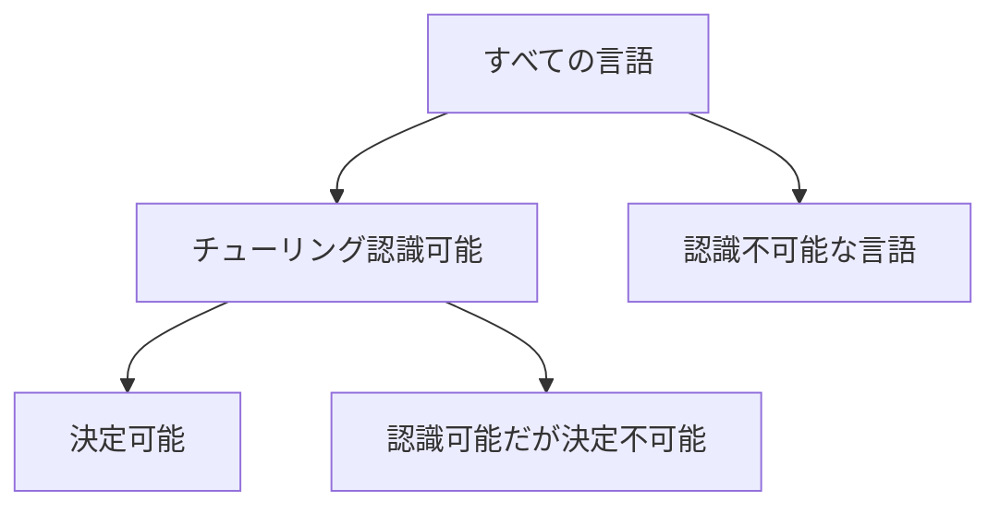

# 04_decidability

決定可能性（decidability）は、「正解が存在するか」ではなく、**あらゆる入力に対して有限時間で正しい yes/no を返すアルゴリズムが存在するか**を問う概念です。

チューリング機械を計算手続きの形式モデルとして使うと、解ける問題だけでなく、原理的に解けない問題も厳密に示せます。

---

## 1. このページの到達目標

- 判定問題を言語として表現できる。
- 決定可能・認識可能・認識不可能を区別できる。
- 停止問題の内容と、対角線論法による証明の骨格を説明できる。
- 写像還元を「既知の難しさを移す方法」として説明できる。
- 「難しい」と「決定不可能」を混同しない。

---

## 2. 判定問題を言語として見る

判定問題は、入力に対して yes または no を返す問題です。yes となる入力の集合を言語 $L$ とすれば、問題は

$$
w\in L
$$

かどうかを判定することになります。

たとえば、DFA $A$ と文字列 $w$ を適切な文字列へ符号化したものを

$$
\langle A,w\rangle
$$

と書きます。DFAが入力を受理するかという問題は、次の言語です。

$$
A_{\mathrm{DFA}}
=
\{\langle A,w\rangle\mid A\text{ は }w\text{ を受理する}\}
$$

DFAは有限個の状態を1文字ずつ遷移するため、その動作を最後までシミュレートすれば必ず停止します。したがって $A_{\mathrm{DFA}}$ は決定可能です。

---

## 3. 3つの範囲

言語は、停止と受理の性質により大きく分けられます。

次の図は包含関係を示します。読み取るポイントは、決定可能言語が認識可能言語に含まれる一方、すべての言語が認識可能とは限らないことです。

### 決定可能

あるチューリング機械が、すべての入力で停止して正しく受理または拒否します。

### チューリング認識可能

言語に含まれる入力では受理して停止します。含まれない入力では拒否しても、ループしても構いません。

### 認識不可能

その言語を認識するチューリング機械さえ存在しません。

---

## 4. 補言語から見る決定可能性

言語 $L$ の補言語を

$$
\overline{L}
=
\{w\in\Sigma^{*}\mid w\notin L\}
$$

とします。

$L$ が決定可能なら、受理と拒否を入れ替えるだけで $\overline{L}$ も決定できます。

さらに重要な事実として、$L$ と $\overline{L}$ の両方が認識可能なら、$L$ は決定可能です。2つの認識器を1ステップずつ交互に動かせば、入力は必ずどちらか一方の言語に属するため、いずれかが有限時間で受理します。

この並行シミュレーションを鳩尾法（dovetailing）と呼ぶことがあります。

$$
L\text{ が決定可能}
\iff
L\text{ と }\overline{L}\text{ がともに認識可能}
$$

---

## 5. 停止問題

停止問題は、「任意のプログラムと入力について、その実行がいつか停止するか」を判定する問題です。チューリング機械で書けば

$$
\mathrm{HALT}_{\mathrm{TM}}
=
\{\langle M,w\rangle\mid M\text{ は入力 }w\text{ で停止する}\}
$$

です。

特定のプログラムについて停止を証明できる場合はあります。決定不可能という主張は、**すべてのプログラムと入力に対して正しく答える万能判定器は存在しない**という意味です。

$\mathrm{HALT}_{\mathrm{TM}}$ は認識可能です。機械 $M$ を入力 $w$ でシミュレートし、停止したら受理すればよいからです。ただし停止しない場合、シミュレーションも終わりません。

---

## 6. なぜ停止問題は決定できないのか

停止判定器 $H$ が存在すると仮定します。

$$
H(\langle M,w\rangle)
=
\begin{cases}
\text{yes} & M\text{ が }w\text{ で停止する}\\
\text{no} & M\text{ が }w\text{ で停止しない}
\end{cases}
$$

$H$ を使って、入力された機械自身の符号化を調べる新しい機械 $D$ を作ります。

1. $H(\langle M,M\rangle)$ が「停止する」と答えたら、$D$ は永久にループする。
2. $H(\langle M,M\rangle)$ が「停止しない」と答えたら、$D$ は停止する。

ここで $D$ 自身を $D$ へ入力します。

- $H$ が「$D$ は停止する」と答えると、定義により $D$ はループする。
- $H$ が「$D$ は停止しない」と答えると、定義により $D$ は停止する。

どちらでも矛盾します。したがって、仮定した万能な $H$ は存在しません。

この証明の核心は、機械が機械自身の記述を入力として扱えることと、予測結果を反転する自己参照です。

---

## 7. 受理問題も決定不可能

チューリング機械の受理問題を

$$
A_{\mathrm{TM}}
=
\{\langle M,w\rangle\mid M\text{ は }w\text{ を受理する}\}
$$

とします。

$A_{\mathrm{TM}}$ は、機械 $M$ をシミュレートし、受理したら受理することで認識できます。しかし、$M$ が拒否せずループする場合と、後で受理する場合を有限時間で常に見分ける方法はありません。

$A_{\mathrm{TM}}$ も決定不可能です。停止問題と同様に対角線論法で示すことも、既知の決定不可能問題から還元して示すこともできます。

---

## 8. 還元：解けたと仮定して別の問題を解く

言語 $A$ から言語 $B$ への写像還元を

$$
A\leq_m B
$$

と書きます。これは、計算可能な関数 $f$ が存在して

$$
w\in A
\iff
f(w)\in B
$$

となることです。

直観的には、$A$ の任意の問題例を、答えを保ったまま $B$ の問題例へ翻訳します。

$A$ が決定不可能で

$$
A\leq_m B
$$

なら、$B$ も決定不可能です。もし $B$ を決定できれば、変換 $f$ の後に $B$ の決定器を使って $A$ も決定でき、前提に矛盾するからです。

難しさを移す向きを逆にしないことが重要です。$B$ の決定不可能性を示したいなら、**既知の決定不可能問題から $B$ へ**還元します。

---

## 9. 例題：空言語判定への還元の発想

チューリング機械 $M$ が受理する言語が空かを問う問題を

$$
E_{\mathrm{TM}}
=
\{\langle M\rangle\mid L(M)=\varnothing\}
$$

とします。

$A_{\mathrm{TM}}$ の入力 $\langle M,w\rangle$ から、新しい機械 $N$ を作ります。$N$ は入力 $x$ を受け取ると、$x$ の内容を無視して $M$ を $w$ 上でシミュレートし、$M$ が受理した場合だけ $x$ を受理します。

- $M$ が $w$ を受理するなら、$L(N)=\Sigma^{*}$。
- $M$ が $w$ を受理しないなら、$L(N)=\varnothing$。

したがって、$E_{\mathrm{TM}}$ を決定できれば $A_{\mathrm{TM}}$ も決定できます。実際の yes/no の向きに応じて出力を反転すればよく、$E_{\mathrm{TM}}$ は決定不可能です。

---

## 10. ライスの定理

ライスの定理は、チューリング機械が**認識する言語の非自明な性質**は決定不可能だと述べます。

非自明とは、その性質を持つ認識可能言語と、持たない認識可能言語が両方存在することです。

たとえば、次の性質はすべて言語の意味に関する非自明な性質です。

- $L(M)$ が空である。
- $L(M)$ が有限である。
- 特定の文字列を含む。
- 正規言語である。

一方、「機械 $M$ の状態数が10個か」は機械の記述の構文的性質であり、認識する言語の性質ではありません。これは記述を数えれば決定できます。

---

## 11. 「決定不可能」と「実用上難しい」は違う

決定可能でも、入力サイズに対して途方もない時間が必要な問題があります。反対に、決定不可能な一般問題でも、対象を制限すれば実用的に解ける場合があります。

| 分類 | 意味 |
|---|---|
| 決定可能 | 必ず停止する正しいアルゴリズムが存在する |
| 計算量的に困難 | アルゴリズムは存在するが必要資源が大きい |
| 決定不可能 | あらゆる入力を扱う停止保証付きアルゴリズムが存在しない |

型検査、モデル検査、静的解析などは、対象言語や解析精度を制限することで、停止性と有用性を両立させています。

---

## 12. つまずきやすい点

### つまずき1：1例で答えられないことだと思う

決定不可能性は、全入力を正しく扱う単一アルゴリズムが存在しないという主張です。個別例の多くは判定できます。

### つまずき2：時間が長いだけだと思う

有限時間が非常に長いことと、どんなアルゴリズムも全入力で停止できないことは別です。

### つまずき3：認識不可能と混同する

停止問題は決定不可能ですが認識可能です。yes の場合を有限時間で確認できるからです。

### つまずき4：還元の向きを逆にする

$B$ の難しさを示すには、既知の難しい $A$ を $B$ で解ける形へ変換します。

### つまずき5：ライスの定理を機械の全性質へ使う

対象は、機械の見た目ではなく、認識する言語の非自明な性質です。

---

## 13. 演習問題

### 問1（分類）

$A_{\mathrm{DFA}}$ が決定可能である理由を、停止性に触れて説明しなさい。

### 問2（認識可能性）

$\mathrm{HALT}_{\mathrm{TM}}$ を認識する機械の動作を説明し、なぜ決定器とは限らないか答えなさい。

### 問3（補言語）

$L$ と $\overline{L}$ の両方に認識器があるとき、$L$ を決定する方法を説明しなさい。

### 問4（対角線論法）

停止問題の証明で、判定器の予測結果を反転する機械へその機械自身を入力すると何が起こるか説明しなさい。

### 問5（還元の向き）

既知の決定不可能言語 $A$ を用いて $B$ の決定不可能性を示したいとき、目標とする還元は

$$
A\leq_m B
$$

と

$$
B\leq_m A
$$

のどちらですか。理由も答えなさい。

### 問6（ライスの定理）

次のうち、ライスの定理が直接対象とする性質を選びなさい。

1. 機械の状態数が偶数である。
2. 機械が受理する言語が有限である。
3. 機械の記述に状態名 `q7` が現れる。

---

## 14. 演習問題の解答

### 解答1

DFAは入力を左から1文字ずつ読み、有限長の入力を読み終えたら現在状態が受理状態か確認します。入力長に比例する有限回の遷移で必ず停止するため、$A_{\mathrm{DFA}}$ は決定可能です。

### 解答2

入力 $\langle M,w\rangle$ に対し、$M$ を $w$ 上でシミュレートし、$M$ が停止したら受理します。$M$ が停止しない場合はシミュレーションも終わらないため、この方法は認識器ですが決定器ではありません。

### 解答3

$L$ の認識器と $\overline{L}$ の認識器を1ステップずつ交互に実行します。入力はどちらか一方に必ず属するため、対応する認識器がいつか受理します。前者なら受理、後者なら拒否して停止します。

### 解答4

判定器が「停止する」と予測すると機械はループし、「停止しない」と予測すると機械は停止します。どちらの予測も自身の動作と矛盾するため、仮定した万能判定器は存在しません。

### 解答5

$$
A\leq_m B
$$

です。もし $B$ を決定できれば、$A$ の入力を $B$ の入力へ変換して $A$ も決定できてしまい、$A$ の決定不可能性に矛盾します。

### 解答6

2です。「受理する言語が有限」は認識言語の非自明な意味的性質です。1と3は機械の記述から調べる構文的性質です。

---

## 学習チェック（自己確認）

- 判定問題を、yes となる符号化入力の集合として書ける。
- 決定可能と認識可能の違いを停止保証で説明できる。
- 停止問題の対角線論法を自分の言葉で説明できる。
- 還元の向きを正しく選べる。
- ライスの定理の対象と対象外を区別できる。
- 決定不可能性と計算量的困難さを区別できる。

---

## ナビゲーション

- 親: [00_overview.md](00_overview.md)
- 前: [03_turing_machines.md](03_turing_machines.md)
- 次: [../05_modal_and_nonclassical/00_overview.md](../05_modal_and_nonclassical/00_overview.md)
