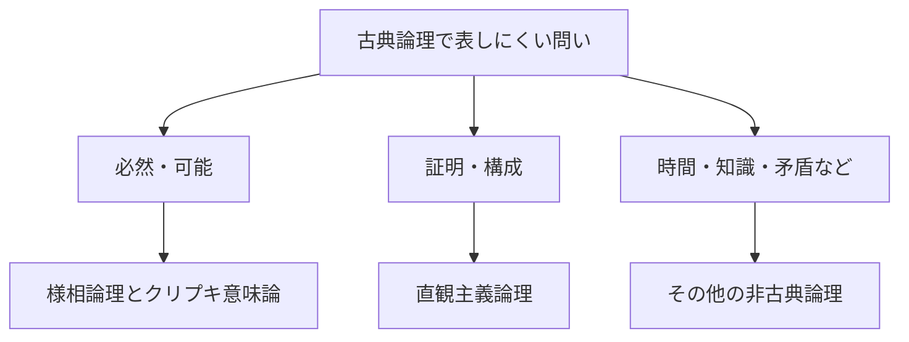

# 05_modal_and_nonclassical

古典論理では、命題は真か偽のどちらかであり、排中律や二重否定除去が一般に使えます。しかし、必然性・時間・知識・構成可能性・矛盾を含む情報などを扱うとき、古典論理だけでは捉えにくい区別があります。

この章では、古典論理を捨てるのではなく、**何を表現したいかに応じて推論規則や意味論を調整する**非古典論理の見取り図を作ります。

---

## 1. この章の到達目標

- 様相論理が必然性と可能性をどう表すか説明できる。
- クリプキ意味論の「世界」と「到達可能性」の役割を説明できる。
- 直観主義論理を、証明・構成の観点から説明できる。
- 古典論理との違いを、単なる真理値の増加だけで捉えない。
- 目的に応じて異なる論理体系を選ぶ発想を持てる。

---

## 2. なぜ論理を拡張・変更するのか

次の文を考えます。

- 「雨が降っている」
- 「雨が降る可能性がある」
- 「明日は必ず雨が降る」
- 「私は雨が降ると知っている」
- 「雨が降ることを証明する方法がある」

含まれる基本命題が同じでも、「可能」「必然」「知っている」「証明できる」という読み方は異なります。命題論理の結合子

$$
\lnot,\quad \land,\quad \lor,\quad \to
$$

だけでは、この違いを式の構造として直接表せません。

また、数学的証明を「真理の確認」ではなく「対象を実際に構成する手続き」と見るなら、古典論理で許される推論の一部を慎重に扱う必要があります。

---

## 3. この章の学習マップ

次の図は、この章で扱う論理体系と問いの対応を示します。読み取るポイントは、非古典論理が1本の階段ではなく、目的ごとに分岐する道具箱だということです。

この章は次の順に読みます。

1. [01_modal_logic_kripke.md](01_modal_logic_kripke.md)：必然・可能と、世界の関係による意味論。
2. [02_intuitionistic_logic.md](02_intuitionistic_logic.md)：証明を構成として読む論理。
3. [03_other_logics_map.md](03_other_logics_map.md)：時相・認識・多値・矛盾許容などの地図。

---

## 4. 様相論理の最小記号

様相論理では、通常の論理記号に2つの演算子を加えます。

$$
\Box P
$$

は「$P$ は必然である」、

$$
\Diamond P
$$

は「$P$ は可能である」と読みます。

否定との間には、標準的な様相論理で次の双対関係があります。

$$
\Diamond P\equiv\lnot\Box\lnot P
$$

$$
\Box P\equiv\lnot\Diamond\lnot P
$$

「$P$ が可能」とは「$P$ でないことが必然、というわけではない」と捉えられます。

---

## 5. 世界をまたいで真理を評価する

古典命題論理では、1つの評価のもとで各命題の真偽を決めました。クリプキ意味論では、複数の「世界」と、世界から世界への到達可能性を考えます。

現在の世界 $w$ で

$$
w\models\Box P
$$

となるのは、$w$ から到達可能なすべての世界 $v$ で

$$
v\models P
$$

となるときです。

一方

$$
w\models\Diamond P
$$

となるのは、到達可能な世界の少なくとも1つで $P$ が真になるときです。

「世界」は別宇宙に限りません。時点、システム状態、知識状態、許された状況など、用途に応じた評価点です。

---

## 6. 直観主義論理の入口

直観主義論理では、命題が真であるとは、その命題の証明を持つことだと考えます。

たとえば存在命題

$$
\exists x\,P(x)
$$

を証明するには、原則として具体的な対象 $a$ と

$$
P(a)
$$

の証明を与えます。

古典論理では一般に排中律

$$
P\lor\lnot P
$$

が成立します。直観主義論理では、任意の $P$ について $P$ の証明または $\lnot P$ の証明を常に構成できるとは限らないため、一般原理としては採用しません。

これは「第3の真理値を足す」というだけの変更ではなく、証明の意味を変える立場です。

---

## 7. 古典論理との関係

非古典論理という名称から、古典論理の誤りを指摘する体系だと誤解しがちです。実際には、目的と前提が異なります。

| 論理 | 主な焦点 | 典型的な用途 |
|---|---|---|
| 古典論理 | 真偽と妥当な推論 | 通常の数学、仕様の基本記述 |
| 様相論理 | 世界をまたぐ必然・可能 | プログラム検証、知識、義務 |
| 直観主義論理 | 証明と構成 | 型理論、証明支援、構成的数学 |
| その他の非古典論理 | 時間・不確実性・矛盾など | 時相検証、知識表現、推論システム |

同じ記号でも体系によって妥当な式や意味が変わります。式だけを見ず、採用している公理・推論規則・意味論を確認する必要があります。

---

## 8. 例題：同じ文を異なる論理で読む

基本命題 $P$ を「データ処理が完了した」とします。

### 古典命題論理

$$
P
$$

現在の評価で処理完了が真であることだけを表します。

### 時相的な読み

$$
\Diamond P
$$

到達可能な将来状態のどこかで処理が完了する、と読めます。

### 認識的な読み

$$
\Box P
$$

$\Box$ を「エージェントが知っている」と解釈する体系では、エージェントの情報と整合するすべての世界で処理が完了している、と読めます。

### 構成的な読み

$P$ の証明を持つとは、完了を確認する具体的な証拠や手続きを持つことだと読めます。

同じ式の見た目だけで意味は確定せず、モデルと解釈が必要です。

---

## 9. 非古典論理を選ぶ3つの問い

新しい論理体系に出会ったら、次を確認します。

1. **何を表現したいか**：時間、知識、義務、構成、矛盾、不確実性など。
2. **何を真とみなすか**：1つの評価、複数世界、証明、情報状態など。
3. **どの推論を保存するか**：古典論理の法則のうち何が成立し、何が制限されるか。

この3点を分けると、記号の暗記ではなく設計思想として理解できます。

---

## 10. つまずきやすい点

### つまずき1：「可能」を確率だと思う

$\Diamond P$ は通常、到達可能な世界に $P$ が真となるものが存在することを表します。確率の大きさを直接表す記号ではありません。

### つまずき2：「世界」を物理的な並行宇宙だと思う

世界は意味評価の点です。時点、実行状態、情報状態などとして使えます。

### つまずき3：非古典論理はすべて多値論理だと思う

様相論理は複数世界の関係を導入し、直観主義論理は証明の構成性を重視します。変更点は真理値の個数だけではありません。

### つまずき4：排中律を使わないことを、排中律の否定だと思う

直観主義論理で一般の排中律を証明原理として採用しないことと、すべての命題についてその否定を主張することは別です。

### つまずき5：記号の意味が常に固定だと思う

$\Box$ は必然、知識、義務、常時成立など、体系に応じて異なる読みを持ちます。

---

## 11. 演習問題

### 問1（記号）

「$P$ でないことが必然ではない」を様相記号で書き、$P$ の可能性との関係を答えなさい。

### 問2（世界）

プログラムの実行状態を世界とみなす場合、到達可能関係は何を表すと考えられますか。

### 問3（構成）

直観主義論理で

$$
\exists x\,P(x)
$$

を証明するとき、どのような情報が求められるか説明しなさい。

### 問4（比較）

様相論理と直観主義論理が、古典論理へそれぞれ何を追加または変更するか答えなさい。

### 問5（誤解）

$\Diamond P$ と「$P$ が70%の確率で起こる」の違いを説明しなさい。

---

## 12. 演習問題の解答

### 解答1

$$
\lnot\Box\lnot P
$$

と書けます。標準的な双対関係により

$$
\Diamond P\equiv\lnot\Box\lnot P
$$

です。

### 解答2

ある実行状態から、プログラムの1回または所定回数の遷移で移れる次の状態を表すと考えられます。

### 解答3

条件を満たす具体的な対象 $a$ と、$P(a)$ が成り立つことの構成的な証明が求められます。

### 解答4

様相論理は複数の世界と到達可能関係を導入し、必然・可能を評価します。直観主義論理は真理を証明や構成と結びつけ、排中律や二重否定除去などを一般原理としては採用しません。

### 解答5

$\Diamond P$ は、到達可能な世界の少なくとも1つで $P$ が真であるという存在的な条件です。70%という主張は、世界や事象に確率測度を与えた量的な条件であり、通常の様相演算子だけでは表していません。

---

## 学習チェック（自己確認）

- $\Box$ と $\Diamond$ を日本語と往復できる。
- クリプキ意味論の世界と到達可能関係を説明できる。
- 直観主義論理の「証明を持つ」という考えを説明できる。
- 排中律を採用しないことの意味を誤解せず説明できる。
- 問題に応じて論理体系を選ぶ3つの問いを使える。

---

## ナビゲーション

- 親: [../README.md](../README.md)
- 前: [../04_computability_and_automata/04_decidability.md](../04_computability_and_automata/04_decidability.md)
- 次: [01_modal_logic_kripke.md](01_modal_logic_kripke.md)
- 子:
  - [01_modal_logic_kripke.md](01_modal_logic_kripke.md)
  - [02_intuitionistic_logic.md](02_intuitionistic_logic.md)
  - [03_other_logics_map.md](03_other_logics_map.md)
