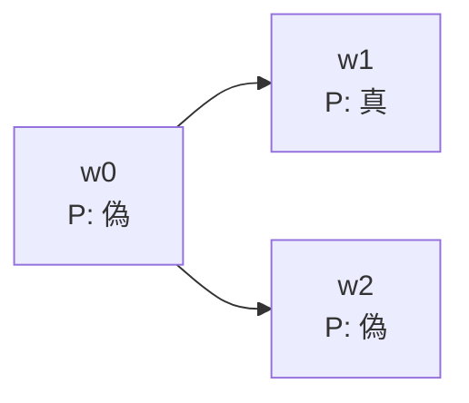

# 01_modal_logic_kripke

様相論理（modal logic）は、命題が単に真か偽かだけでなく、「必然的に真か」「真である可能性があるか」を表す論理です。

クリプキ意味論では、複数の世界と世界間の到達可能関係を使い、様相演算子の意味を明確にします。この仕組みは、時間、知識、義務、プログラム状態などにも応用できます。

---

## 1. このページの到達目標

- $\Box$ と $\Diamond$ の意味をクリプキモデル上で定義できる。
- フレーム・モデル・付値を区別できる。
- 小さなモデルで様相式の真偽を評価できる。
- 到達可能関係の性質と代表的な公理の対応を説明できる。
- 必然性と、現在世界での真理を混同しない。

---

## 2. 様相演算子

命題 $P$ に対して

$$
\Box P
$$

を「必然的に $P$」、

$$
\Diamond P
$$

を「可能的に $P$」と読みます。

標準的な正規様相論理では、両者は否定を介して双対です。

$$
\Diamond P\equiv\lnot\Box\lnot P
$$

したがって、片方を基本演算子として、もう片方を定義することもできます。

---

## 3. クリプキフレームとモデル

クリプキフレームは

$$
\mathcal{F}=(W,R)
$$

です。

- $W$：空でない世界の集合。
- $R\subseteq W\times W$：到達可能関係。

$$
wRv
$$

なら、「世界 $w$ から世界 $v$ を可能な候補として参照できる」と読みます。

クリプキモデルは、フレームへ命題変数の付値を加えたものです。

$$
\mathcal{M}=(W,R,V)
$$

付値 $V$ は、各命題変数 $P$ に、それが真となる世界の集合を割り当てます。

$$
V(P)\subseteq W
$$

フレームは世界の構造だけ、モデルはそこへ具体的な真偽を加えたものです。

---

## 4. 満足関係

世界 $w$ で式 $\varphi$ が真であることを

$$
\mathcal{M},w\models\varphi
$$

と書きます。

命題変数については

$$
\mathcal{M},w\models P
\iff
w\in V(P)
$$

です。否定や連言は古典命題論理と同様に世界ごとに評価します。

$$
\mathcal{M},w\models\lnot\varphi
\iff
\mathcal{M},w\not\models\varphi
$$

$$
\mathcal{M},w\models\varphi\land\psi
\iff
\mathcal{M},w\models\varphi
\text{ かつ }
\mathcal{M},w\models\psi
$$

様相演算子は到達可能な世界を使います。

$$
\mathcal{M},w\models\Box\varphi
\iff
\forall v\in W\,
(wRv\to\mathcal{M},v\models\varphi)
$$

$$
\mathcal{M},w\models\Diamond\varphi
\iff
\exists v\in W\,
(wRv\land\mathcal{M},v\models\varphi)
$$

---

## 5. 小さなモデルを読む

次の図では、$w_0$ から $w_1$ と $w_2$ へ到達でき、$P$ は $w_1$ だけで真です。

この図から読み取るポイントは、$\Diamond P$ には1つの成功世界で十分ですが、$\Box P$ には到達可能な全世界での成功が必要なことです。

$w_0$ では、$P$ が真の到達可能世界 $w_1$ があるので

$$
\mathcal{M},w_0\models\Diamond P
$$

です。

一方、到達可能な $w_2$ では $P$ が偽なので

$$
\mathcal{M},w_0\not\models\Box P
$$

です。

また、$P$ が $w_0$ で偽であっても、$\Diamond P$ は真になり得ます。現在の真理と可能性は別の条件です。

---

## 6. 到達先がない世界

世界 $w$ に到達可能な世界が1つもないとします。

このとき

$$
\mathcal{M},w\models\Box\varphi
$$

は、すべての到達先で $\varphi$ が真という条件への反例がないため真になります。これを空虚真と呼びます。

一方

$$
\mathcal{M},w\models\Diamond\varphi
$$

は、条件を満たす到達先が存在しないため偽です。

日常語の「必然」では不自然に感じる場合があります。その用途で到達先が必ず存在してほしいなら、関係 $R$ に直列性などの条件を課します。

---

## 7. 公理Kと正規様相論理

代表的な最小体系 K では、古典命題論理に次の公理図式を加えます。

$$
\Box(P\to Q)\to(\Box P\to\Box Q)
$$

これは、すべての到達可能世界で $P\to Q$ が成り立ち、すべての到達可能世界で $P$ が成り立つなら、すべての到達可能世界で $Q$ が成り立つという分配を表します。

さらに必然化規則

$$
\frac{\vdash P}{\vdash\Box P}
$$

を持ちます。これは、仮定なしで定理 $P$ が証明できるなら、$P$ は必然的でもあるという規則です。

個別の仮定から $P$ を得ただけで、無条件に $\Box P$ としてよいわけではありません。

---

## 8. 関係の性質と公理

到達可能関係 $R$ へ条件を加えると、妥当になる代表的な様相公理が変わります。

| 関係の性質 | 条件 | 対応する代表的公理 |
|---|---|---|
| 反射的 | $\forall w\,wRw$ | T: $\Box P\to P$ |
| 推移的 | $wRv\land vRu\to wRu$ | 4: $\Box P\to\Box\Box P$ |
| 対称的 | $wRv\to vRw$ | B: $P\to\Box\Diamond P$ |
| ユークリッド的 | $wRv\land wRu\to vRu$ | 5: $\Diamond P\to\Box\Diamond P$ |
| 直列的 | $\forall w\,\exists v\,wRv$ | D: $\Box P\to\Diamond P$ |

たとえば反射的なら、$w$ 自身が $w$ から到達可能です。したがって、到達可能なすべての世界で $P$ が真なら、現在世界でも $P$ が真となり、Tが妥当です。

---

## 9. 例題：公理Tをモデルで確かめる

反射的フレーム上で

$$
\mathcal{M},w\models\Box P
$$

と仮定します。

反射性から

$$
wRw
$$

です。$\Box P$ の意味は、$w$ から到達可能なすべての世界で $P$ が真ということなので、特に $w$ 自身で

$$
\mathcal{M},w\models P
$$

です。よって

$$
\Box P\to P
$$

はすべての反射的フレームで妥当です。

反対に、反射的でない世界では、現在の $P$ が偽でも、ほかの到達先すべてで $P$ が真なら $\Box P$ が真になり得ます。そのためTは任意のフレームでは妥当ではありません。

---

## 10. 応用ごとに世界の意味が変わる

### 時相論理

世界を時点や実行状態、$R$ を将来への遷移とみなします。

### 認識論理

世界を事実のあり方、$wRv$ を「エージェントの情報から $v$ を排除できない」とみなします。

### 義務論理

世界を状況、到達先を規範的に望ましい状況とみなし、$\Box P$ を「$P$ であるべき」と読みます。

### プログラム論理

世界をプログラム状態、関係をプログラム実行による状態遷移とみなします。

同じ数学的枠組みでも、$W$ と $R$ の解釈により用途が変わります。

---

## 11. 妥当性とモデル上の真理

特定モデル・特定世界で真であることと、フレームや論理体系で妥当であることを区別します。

$$
\mathcal{M},w\models\varphi
$$

は局所的な真理です。

フレーム $\mathcal{F}$ 上のすべての付値・すべての世界で真なら

$$
\mathcal{F}\models\varphi
$$

と書きます。

あるクラスのすべてのフレームで真なら、そのクラスに対して妥当です。公理とフレーム条件の対応は、この妥当性のレベルで述べられます。

---

## 12. つまずきやすい点

### つまずき1：$\Box P$ なら無条件に $P$ だと思う

公理Tが成り立つには、通常は反射的フレームなどの条件が必要です。

### つまずき2：到達可能性を物理的移動だけで考える

到達可能性は、時間的可能性、情報上の候補、規範的候補などの抽象的関係です。

### つまずき3：$\Diamond P$ と現在の $P$ を混同する

可能世界のどこかで真でも、現在世界で真とは限りません。

### つまずき4：到達先がない場合の $\Box P$ を偽だと思う

標準的な全称条件では空虚真になります。

### つまずき5：必然化規則を仮定付き推論へ自由に使う

通常の必然化は、仮定なしで証明された定理に適用します。

---

## 13. 演習問題

### 問1（モデル評価）

$w_0$ から $w_1,w_2$ へ到達でき、$P$ は両方で真、$Q$ は $w_1$ だけで真とします。$w_0$ における次の式の真偽を答えなさい。

1. $\Box P$
2. $\Diamond Q$
3. $\Box Q$

### 問2（空虚真）

到達先のない世界 $w$ で、$\Box P$ と $\Diamond P$ はそれぞれ真か偽か答えなさい。

### 問3（双対）

$$
\Diamond P\equiv\lnot\Box\lnot P
$$

を、到達可能世界を使う言葉で説明しなさい。

### 問4（フレーム条件）

反射性が公理T

$$
\Box P\to P
$$

を妥当にする理由を説明しなさい。

### 問5（概念の区別）

クリプキフレームとクリプキモデルの違いを答えなさい。

### 問6（応用）

認識論理で、$wRv$ をどのように解釈できるか答えなさい。

---

## 14. 演習問題の解答

### 解答1

1. 真。到達可能な両世界で $P$ が真です。
2. 真。$Q$ が真である到達可能世界 $w_1$ が存在します。
3. 偽。到達可能世界 $w_2$ で $Q$ が偽です。

### 解答2

$\Box P$ は真、$\Diamond P$ は偽です。前者の全称条件には反例がなく、後者の存在条件には証拠となる世界がありません。

### 解答3

$P$ が可能であるとは、到達可能な世界のどこかで $P$ が真であることです。これは、到達可能なすべての世界で $\lnot P$ が真であるわけではないことと同値です。

### 解答4

反射性により現在世界 $w$ 自身が到達先に含まれます。$\Box P$ が真なら全到達先で $P$ が真なので、特に現在世界でも $P$ が真です。

### 解答5

フレームは世界集合 $W$ と到達可能関係 $R$ だけからなります。モデルはフレームへ、各命題変数がどの世界で真かを指定する付値 $V$ を加えたものです。

### 解答6

$w$ でエージェントが持つ情報と整合し、エージェントが排除できない事実のあり方が $v$ である、と解釈できます。

---

## 学習チェック（自己確認）

- クリプキモデルの3要素を説明できる。
- $\Box$ と $\Diamond$ の満足条件を量化記号で書ける。
- 小さな有向グラフ上で様相式を評価できる。
- フレーム条件と公理T・4・Dなどの関係を読める。
- 局所的真理と妥当性を区別できる。
- 応用に応じて世界と関係の解釈が変わることを説明できる。

---

## ナビゲーション

- 親: [00_overview.md](00_overview.md)
- 前: [00_overview.md](00_overview.md)
- 次: [02_intuitionistic_logic.md](02_intuitionistic_logic.md)
