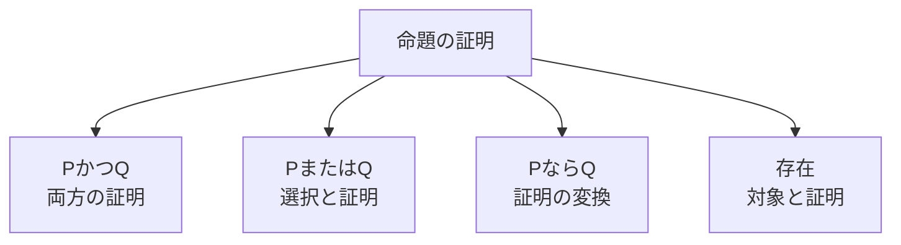

# 02_intuitionistic_logic

直観主義論理（intuitionistic logic）は、命題の真理を、その命題を裏づける**構成的な証明**と結びつける論理です。

古典論理の推論をすべて否定するのではなく、証拠を実際に組み立てられる推論だけを基本にします。この考えは構成的数学、型理論、証明支援系、プログラム抽出へつながります。

---

## 1. このページの到達目標

- 各論理結合子を「どのような証拠を持つか」で説明できる。
- 排中律と二重否定除去が一般には導出できない理由を説明できる。
- 否定を含意として定義できる。
- BHK解釈とカリー＝ハワード対応の入口を説明できる。
- 直観主義論理と古典論理の関係を誤解なく捉えられる。

---

## 2. 真であるとは証明を持つこと

直観主義論理では、命題 $P$ を主張するには、$P$ の証明を構成できなければなりません。

この見方をBHK解釈と呼びます。Brouwer、Heyting、Kolmogorovの考えに由来する名称です。

次の図は、論理結合子を証拠の作り方として読む流れを示します。読み取るポイントは、式の真理条件だけでなく、証明を作るために必要なデータが結合子ごとに定まることです。

---

## 3. 結合子を証拠として読む

### 連言

$$
P\land Q
$$

の証明は、$P$ の証明と $Q$ の証明の組です。

### 選言

$$
P\lor Q
$$

の証明は、左の $P$ を証明したのか右の $Q$ を証明したのかという選択と、選んだ側の証明です。

「どちらかは真のはずだが、どちらか分からない」だけでは、構成的な選言の証明になりません。

### 含意

$$
P\to Q
$$

の証明は、任意の $P$ の証明を受け取り、$Q$ の証明へ変換する方法です。

### 存在量化

$$
\exists x\,P(x)
$$

の証明は、具体的な対象 $a$ と $P(a)$ の証明の組です。

### 全称量化

$$
\forall x\,P(x)
$$

の証明は、任意の対象 $a$ を受け取り、$P(a)$ の証明を返す方法です。

---

## 4. 偽と否定

矛盾、すなわち証明を持たない命題を

$$
\bot
$$

と書きます。

否定は新しい原始記号ではなく、しばしば次の略記として定義されます。

$$
\lnot P\equiv P\to\bot
$$

したがって $\lnot P$ の証明は、$P$ の証明を仮定すると矛盾の証明を作れる方法です。

矛盾から任意の命題を導く規則

$$
\bot\to P
$$

は直観主義論理でも認められます。これは爆発原理と呼ばれます。

---

## 5. 排中律を一般には採用しない

古典論理では任意の命題 $P$ について

$$
P\lor\lnot P
$$

が成立します。

しかし、構成的にこの選言を証明するには、$P$ の証明か、$P\to\bot$ の証明のどちらかを具体的に与える必要があります。任意の未解決命題について、そのどちらかを常に作れるとは限りません。

そのため、直観主義論理では排中律を一般の公理として採用しません。ただし、特定の決定可能な命題について

$$
P\lor\lnot P
$$

を証明できることはあります。

---

## 6. 二重否定

直観主義論理でも

$$
P\to\lnot\lnot P
$$

は証明できます。

$P$ の証明があると仮定し、さらに $\lnot P$ の証明があると仮定すれば、$\lnot P$ は $P$ の証明を矛盾へ変換するので $\bot$ を得ます。したがって、$\lnot P$ から矛盾を導く

$$
\lnot\lnot P
$$

が得られます。

一方

$$
\lnot\lnot P\to P
$$

は一般には証明できません。「$P$ が不可能ではない」という証拠から、$P$ 自体の具体的な証拠を取り出せるとは限らないからです。

二重否定除去をすべての $P$ について加えると、古典論理の強さを回復します。

---

## 7. 例題：存在証明の違い

ある性質 $P(n)$ を満たす自然数が存在することを示したいとします。

古典的な証明では、存在しないと仮定すると矛盾することから

$$
\exists n\,P(n)
$$

を結論できる場合があります。

構成的な証明では、原則として具体的な自然数 $k$ を提示し、

$$
P(k)
$$

の証明を与えます。

ただし、「背理法は一切使えない」という理解は正確ではありません。$\lnot P$ を示すため、$P$ を仮定して矛盾を導くことは、否定の定義そのものです。一般に制限されるのは、$\lnot\lnot P$ から $P$ へ戻る古典的な推論です。

---

## 8. 証明とプログラム

カリー＝ハワード対応では、命題を型、証明をその型を持つプログラムとして対応づけます。

| 論理 | 型・プログラム |
|---|---|
| $P\land Q$ | $P$ 型と $Q$ 型の値の組 |
| $P\lor Q$ | どちら側かを示すタグ付きの値 |
| $P\to Q$ | $P$ 型の値を $Q$ 型へ変換する関数 |
| $\exists x\,P(x)$ | 対象 $x$ と $P(x)$ の証拠の組 |
| 証明の簡約 | プログラムの実行・簡約 |

たとえば

$$
P\land Q\to P
$$

の証明は、$P$ と $Q$ の組を受け取って第1成分を返す関数に対応します。

このため、構成的証明から、仕様を満たすプログラムを抽出するという発想が生まれます。

---

## 9. クリプキ意味論による見方

直観主義論理にもクリプキ意味論があります。世界を「現在までに得られた情報状態」、到達可能関係を「情報の増加」とみなします。

関係は通常、反射的かつ推移的な前順序です。

命題が一度真になったら、情報が増えた後も真であり続ける単調性を課します。

$$
wRv\land w\models P
\Rightarrow
v\models P
$$

含意は、現在より先のすべての情報状態を使って評価します。

$$
w\models P\to Q
\iff
\forall v\,
(wRv\land v\models P\Rightarrow v\models Q)
$$

現在は $P$ の証明がなくても、将来情報が増えて $P$ が証明される可能性があります。このため、現在 $P$ が証明されていないことだけでは $\lnot P$ になりません。

---

## 10. 例題：排中律が成り立たないモデル

2つの情報状態 $w_0,w_1$ があり

$$
w_0 R w_1
$$

とします。$P$ は $w_0$ ではまだ証明されず、$w_1$ で証明されるとします。

$w_0$ では $P$ の証拠がないので

$$
w_0\not\models P
$$

です。

しかし、到達可能な $w_1$ で $P$ が真になるため、$w_0$ で

$$
\lnot P
\equiv
P\to\bot
$$

も真ではありません。将来得られる $P$ の証明を矛盾へ変換できないからです。

したがって $w_0$ では、$P$ も $\lnot P$ も証明されず

$$
w_0\not\models P\lor\lnot P
$$

となり得ます。

---

## 11. 古典論理とのつながり

直観主義論理で証明できる式は、古典論理でも証明できます。

$$
\mathrm{Intuitionistic}\subsetneq\mathrm{Classical}
$$

包含が真に狭いのは、排中律や二重否定除去など、古典論理では証明できるが直観主義論理では一般に証明できない式があるためです。

一方、古典論理の推論を二重否定を用いて直観主義論理へ埋め込む翻訳があります。したがって、両者は完全に無関係な体系ではありません。

---

## 12. つまずきやすい点

### つまずき1：真でも偽でもない第3の値を足しただけだと思う

中心は、真理を証明可能性や情報の成長で解釈することです。単純な3値論理とは異なります。

### つまずき2：排中律の否定を公理にすると思う

一般の排中律を証明できないことと、その否定

$$
\lnot(P\lor\lnot P)
$$

を常に証明することは別です。

### つまずき3：背理法が全面禁止だと思う

否定を証明するための矛盾導出は使えます。一般の二重否定除去が使えない点が重要です。

### つまずき4：証明が見つからないだけで否定できると思う

$P$ の証明をまだ持たないことと、$P$ から矛盾を導く方法を持つことは異なります。

### つまずき5：構成的なら計算効率もよいと思う

プログラムを抽出できることと、そのプログラムが高速であることは別問題です。

---

## 13. 演習問題

### 問1（BHK解釈）

$$
P\lor Q
$$

と

$$
P\to Q
$$

の証明が、それぞれどのようなデータまたは方法を与えるか説明しなさい。

### 問2（否定）

$$
\lnot P
$$

を $\to$ と $\bot$ を使って定義し、その証明の意味を説明しなさい。

### 問3（二重否定）

直観主義論理で

$$
P\to\lnot\lnot P
$$

が証明できる理由を説明しなさい。

### 問4（存在）

構成的に

$$
\exists x\,P(x)
$$

を証明するために必要な2つの要素を答えなさい。

### 問5（カリー＝ハワード対応）

$$
P\land Q\to Q
$$

に対応するプログラムの動作を説明しなさい。

### 問6（モデル）

情報状態 $w_0$ では $P$ が未証明で、将来の $w_1$ で $P$ が証明されるとします。なぜ $w_0$ で $\lnot P$ と結論できないか説明しなさい。

---

## 14. 演習問題の解答

### 解答1

$P\lor Q$ の証明は、どちらを選んだかという情報と、選んだ命題の証明です。$P\to Q$ の証明は、任意の $P$ の証明を受け取り、$Q$ の証明へ変換する方法です。

### 解答2

$$
\lnot P\equiv P\to\bot
$$

です。その証明は、$P$ の任意の証明を矛盾の証明へ変換する方法です。

### 解答3

$P$ の証明を持つとします。$\lnot P$ の証明が与えられれば、それは $P$ の証明を $\bot$ へ変換します。したがって $\lnot P\to\bot$、すなわち $\lnot\lnot P$ を構成できます。

### 解答4

具体的な対象 $a$ と、$P(a)$ の証明です。

### 解答5

$P$ 型と $Q$ 型の値の組を受け取り、第2成分である $Q$ 型の値を返す関数です。

### 解答6

$\lnot P$ を証明するには、今後得られる可能性も含めた任意の $P$ の証明を矛盾へ変換する方法が必要です。$w_1$ では実際に $P$ が証明されるため、そのような方法は $w_0$ では与えられません。

---

## 学習チェック（自己確認）

- BHK解釈で各結合子の証明を説明できる。
- 否定を $P\to\bot$ として読める。
- 排中律と二重否定除去の扱いを説明できる。
- 背理法が全面禁止ではないことを説明できる。
- カリー＝ハワード対応の基本例を挙げられる。
- 情報が増えるクリプキモデルで単調性を説明できる。

---

## ナビゲーション

- 親: [00_overview.md](00_overview.md)
- 前: [01_modal_logic_kripke.md](01_modal_logic_kripke.md)
- 次: [03_other_logics_map.md](03_other_logics_map.md)
