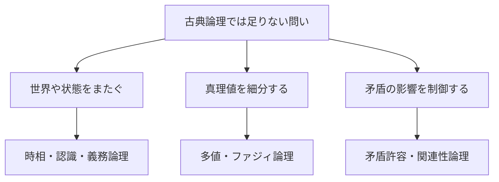

# 03_other_logics_map

非古典論理は、古典論理を一律に置き換える1つの体系ではありません。時間、知識、義務、曖昧さ、矛盾など、**古典論理だけでは区別しにくい対象に合わせて設計された論理の集まり**です。

このページでは個々の体系を深く証明する前に、「何を表したいとき、どの論理を見るべきか」という地図を作ります。

---

## 1. このページの到達目標

- 非古典論理を、目的・意味論・変化する法則の3点で比較できる。
- 時相論理、認識論理、義務論理の様相演算子を区別できる。
- 多値論理とファジィ論理の違いを説明できる。
- 矛盾許容論理が爆発原理を制限する理由を説明できる。
- 用途から候補となる論理体系を選べる。

---

## 2. 古典論理から何を変えるのか

古典命題論理では、命題は真または偽であり、たとえば排中律

$$
P\lor\lnot P
$$

や爆発原理

$$
P,\ \lnot P\vdash Q
$$

が成り立ちます。

非古典論理では、目的に応じて次のいずれかを変更・拡張します。

1. **言語**：時間や知識を表す演算子を加える。
2. **意味論**：複数世界、複数時点、複数の真理値などで評価する。
3. **推論規則**：排中律や爆発原理などの扱いを変える。

「真理値を増やす」だけが非古典化ではありません。

---

## 3. 非古典論理の見取り図

次の図では、最初に「何を表現したいか」で分岐します。読み取るポイントは、同じ様相論理の枠組みでも、世界を時点・知識状態・規範状態のどれと読むかで用途が変わることです。



---

## 4. 時相論理：いつ成り立つか

時相論理は、時間に沿ったシステムの性質を表します。代表的な演算子には次があります。

$$
\mathbf{G}P
$$

は「今後ずっと $P$」、

$$
\mathbf{F}P
$$

は「将来いつか $P$」、

$$
\mathbf{X}P
$$

は「次の時点で $P$」と読みます。

たとえば、リクエストを受けたらいつか応答するという性質は

$$
\mathbf{G}(\mathrm{request}\to\mathbf{F}\mathrm{response})
$$

と表せます。これは「現在の1状態が正しいか」ではなく、実行経路全体の性質です。

---

## 5. 認識論理：誰が何を知っているか

認識論理では

$$
K_aP
$$

を「エージェント $a$ は $P$ を知っている」と読みます。

意味論では、$a$ が現在の情報から区別できない世界を考え、そのすべてで $P$ が真なら $K_aP$ とします。

重要なのは

$$
P
$$

と

$$
K_aP
$$

が異なることです。事実として $P$ でも、エージェントがその証拠を持たなければ、$P$ を知っているとは限りません。

複数人では「全員が知っている」と「全員が、全員が知っていることを知っている」を区別する必要があり、分散システムやゲーム理論につながります。

---

## 6. 義務論理：何をすべきか

義務論理では、たとえば

$$
O(P)
$$

を「$P$ であるべきだ」、

$$
\mathrm{Perm}(P)
$$

を「$P$ が許される」と読みます。

事実と規範は別です。

$$
O(P)\not\Rightarrow P
$$

「期限を守るべきだ」から、実際に期限が守られたとは推論できません。

現実の規則には例外や優先順位があるため、単純な義務論理では「相反する義務」や「違反後に何をすべきか」の扱いが難しくなります。法・規程・ポリシーを形式化するときは、どの義務論理を採用するかが重要です。

---

## 7. 多値論理：真と偽以外を区別する

多値論理は、真と偽以外の値を持つ論理です。SQLの条件評価は代表的な3値論理の応用で、

$$
\{\mathrm{TRUE},\mathrm{FALSE},\mathrm{UNKNOWN}\}
$$

を使います。

NULLとの比較

```sql
salary > 500000
```

は、`salary` がNULLならFALSEではなくUNKNOWNになります。WHERE句が残すのはTRUEの行だけなので、UNKNOWNも除外されます。

多値論理では、追加された値の意味と、各結合子の真理表を確認しなければなりません。

---

## 8. ファジィ論理：程度を扱う

ファジィ論理では、命題の所属度や真理度を、しばしば

$$
[0,1]
$$

の値で表します。

たとえば「室温が高い」の程度を0.8と評価できます。ただし、これは「80%の確率で室温が高い」と同じではありません。

- 確率：どの事象が起きるかについての不確実性
- ファジィ度：「高い」という曖昧な概念への適合度

演算子の定義には複数の流儀があるため、0.8という値だけでは推論規則は決まりません。

---

## 9. 矛盾許容論理：矛盾からすべてを導かない

古典論理では、矛盾

$$
P\land\lnot P
$$

があると任意の $Q$ を導けます。これが爆発原理です。

矛盾許容論理は、矛盾が局所的に存在しても、無関係な結論まで自動的に導かれないよう推論を設計します。

これは「矛盾を真として歓迎する」という意味ではありません。複数ソースを統合した知識ベースなどで、矛盾を発見しつつ推論全体が無意味になることを防ぐ考えです。

---

## 10. 関連性論理：前提と結論の関係を要求する

古典論理では、$Q$ が真なら

$$
P\to Q
$$

も真になります。日常語の「ならば」としては、$P$ と $Q$ が無関係に見える場合があります。

関連性論理は、含意の前件と後件の間に、証明上または意味上の関連を要求します。矛盾から無関係な結論が広がるのを防ぐ方向ともつながります。

---

## 11. 比較表

| 論理 | 中心となる問い | 主な仕組み | 典型用途 |
|---|---|---|---|
| 時相論理 | いつ成り立つか | 時間上の演算子 | モデル検査、プロトコル |
| 認識論理 | 誰が何を知るか | 情報的に可能な世界 | 分散系、ゲーム |
| 義務論理 | 何をすべきか | 理想・許容される世界 | 法、規程、ポリシー |
| 多値論理 | 未定・不明をどう扱うか | 3個以上の真理値 | SQL、部分情報 |
| ファジィ論理 | 概念にどの程度当てはまるか | 連続的な真理度 | 制御、曖昧分類 |
| 矛盾許容論理 | 矛盾を局所化できるか | 爆発原理の制限 | 知識統合 |
| 関連性論理 | 含意に関連があるか | 関連性を保つ推論 | 含意分析、矛盾制御 |

---

## 12. 例題：監視システムに必要な論理

次の要求を分類します。

1. 「障害が起きたら、いつか復旧する」
2. 「運用者は障害を知っている」
3. 「個人情報は暗号化されるべきだ」
4. 「欠損値を含む条件を評価する」
5. 「矛盾する台帳を統合しても検索を続ける」

対応は順に、時相論理、認識論理、義務論理、多値論理、矛盾許容論理です。

同じシステムでも要求ごとに異なる論理を組み合わせる場合があります。

---

## 13. つまずきやすい点

### つまずき1：非古典論理ほど古典論理より強いと思う

多くは目的に合わせて表現を増やす一方、古典的な推論を制限します。「強い・弱い」だけでは比較できません。

### つまずき2：可能性を確率と同一視する

様相論理の可能性は到達可能世界の存在であり、確率値ではありません。

### つまずき3：UNKNOWNをFALSEとみなす

SQLの3値論理では別の値です。NOT UNKNOWNもUNKNOWNです。

### つまずき4：矛盾許容論理では何でも許されると思う

目的は、矛盾から無関係な主張が導かれることを防ぐことです。

### つまずき5：名前だけで体系が一意に決まると思う

時相論理やファジィ論理にも複数の体系があります。構文、意味論、公理を確認します。

---

## 14. 演習問題

### 問1

「処理は次の状態でも実行中である」を時相演算子を使って表しなさい。

### 問2

$P$ と $K_aP$ の違いを説明しなさい。

### 問3

ファジィ度0.7と確率0.7の違いを説明しなさい。

### 問4

古典論理で $P$ と $\lnot P$ から任意の $Q$ を導ける原理の名称を答えなさい。

### 問5

SQLで `NOT (x = 1)` を評価するとき、`x` がNULLなら結果は何になりますか。

### 問6

規則「バックアップを取得すべきだ」と事実「バックアップを取得した」を区別する理由を説明しなさい。

---

## 15. 演習問題の解答

### 解答1

「実行中」を $R$ とすれば

$$
\mathbf{X}R
$$

です。

### 解答2

$P$ は事実として $P$ が真であること、$K_aP$ はエージェント $a$ の情報と整合する全世界で $P$ が真であることです。

### 解答3

ファジィ度は曖昧な概念への適合の程度、確率は事象の発生に関する不確実性を表します。

### 解答4

爆発原理です。

### 解答5

UNKNOWNです。`x = 1` がUNKNOWNであり、NOT UNKNOWNもUNKNOWNです。

### 解答6

義務は規範、取得したことは事実だからです。義務が成立しても履行されたとは限りません。

---

## 学習チェック（自己確認）

- 表したい問いから論理体系の候補を選べる。
- 時相・認識・義務の様相を区別できる。
- 多値論理とファジィ論理を区別できる。
- 爆発原理を制限する目的を説明できる。
- 各体系では構文・意味論・推論規則の確認が必要だと分かる。

---

## ナビゲーション

- 親: [00_overview.md](00_overview.md)
- 前: [02_intuitionistic_logic.md](02_intuitionistic_logic.md)
- 次: [../90_essays/README.md](../90_essays/README.md)
