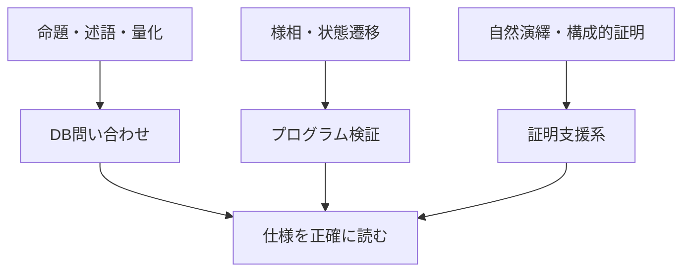

# 発展・応用エッセイ

この章は、教科書本編で学んだ論理学を、数学基礎論、回路・SAT、データベース、プログラム検証、量子計算、AI・形式数学へ接続する**全68記事の橋渡しノート**です。

本編で記号や定理を学んだあと、「実務のどこで同じ考え方が使われているか」を具体例から確かめます。応用だけを先に読み、必要になった基礎へ戻る使い方もできます。

---

## 1. この章の到達目標

- 論理式とSQLの検索条件の対応を説明できる。
- プログラムの実行を状態遷移として捉え、時相論理の仕様を読める。
- 証明支援系を、論理規則を機械的に確認する道具として説明できる。
- 理論と応用を往復し、分からない箇所の戻り先を選べる。

---

## 2. 本編から応用への地図

次の図は、本編の概念が3つの応用へどうつながるかを示します。読み取るポイントは、1つの基礎概念が複数の実務領域で再利用されることです。

---

## 3. 3本のノート

### 3.1 論理とデータベース問い合わせ

[logic_and_database_queries.md](logic_and_database_queries.md) では、WHERE句を論理式として読みます。

$$
P\land Q,\quad P\lor Q,\quad \lnot P
$$

だけでなく、存在量化と `EXISTS`、全称量化と二重の `NOT EXISTS`、SQLのNULLによる3値論理を扱います。

戻り先は、[命題論理](../01_propositional_logic/00_overview.md) と [述語論理](../02_predicate_logic/00_overview.md) です。

### 3.2 様相論理と計算

[modal_logic_and_computation.md](modal_logic_and_computation.md) では、プログラムを状態と遷移のグラフとして読みます。

「常に安全」と「いつか応答する」の違いを、時相論理の

$$
\mathbf{G},\quad \mathbf{F},\quad \mathbf{X}
$$

で表し、モデル検査の入口まで進みます。

戻り先は、[様相論理とクリプキ意味論](../05_modal_and_nonclassical/01_modal_logic_kripke.md) です。

### 3.3 証明支援系と論理

[proof_assistants_and_logic.md](proof_assistants_and_logic.md) では、自然演繹の規則とLeanやCoqの操作を結びます。

カリー＝ハワード対応

$$
\text{命題}\leftrightarrow\text{型},
\qquad
\text{証明}\leftrightarrow\text{プログラム}
$$

を手がかりに、機械が何を検査し、何を自動で保証しないかを整理します。

戻り先は、[自然演繹](../01_propositional_logic/04_natural_deduction.md) と [直観主義論理](../05_modal_and_nonclassical/02_intuitionistic_logic.md) です。

## 4. 発展カテゴリ

既存3記事を正本として残し、その周囲に6カテゴリ・65記事の支線を本文化しました。

- [論理の粒度・表現力・限界](foundations_and_expressiveness/)：自然言語、原子命題、数学的量化、一階・高階論理、Lindströmの定理
- [Boolean代数・回路・SAT](hardware_and_sat/)：論理ゲート、NAND、回路等価性、SAT、BDD
- [論理とデータベース設計](databases/)：関係、関数従属性、Armstrong公理、正規化、無損失分解
- [様相論理・時間・知識・検証](modal_logic_and_verification/)：標準翻訳、時相・認識・証明可能性論理、数学・物理
- [量子計算と論理](quantum_computing_and_logic/)：可逆計算、量子ゲート、測定、量子論理
- [AI・形式数学・証明探索](ai_mathematics_and_logic/)：LLM、証明探索、形式検証、予想・反例、人間との共同研究

各カテゴリREADMEと全65子ページは本文化済みです。単独記事から読んでも、各カテゴリの番号順に読んでも、本編へ戻れる構成です。進捗の正本は [PROGRESS.md](../PROGRESS.md) です。

### 疑問から選ぶ

| 疑問 | 最初に読む場所 |
|---|---|
| 自然言語の命題は本当に明確か | [論理の粒度・表現力・限界](foundations_and_expressiveness/) |
| 命題論理は現代でも使われるか | [Boolean代数・回路・SAT](hardware_and_sat/) |
| 正規化は論理とどう関係するか | [論理とデータベース設計](databases/) |
| 量子計算では古典論理を捨てるのか | [量子計算と論理](quantum_computing_and_logic/) |
| LLMは数学をどう解くのか | [AI・形式数学・証明探索](ai_mathematics_and_logic/) |

---

## 5. 共通する読み方

各ノートでは次の順で考えます。

1. 自然言語の要求を明確にする。
2. 論理式または状態遷移へ翻訳する。
3. 式の意味をモデル上で確かめる。
4. SQL、検証器、証明支援系などの実装へ落とす。
5. 実行結果と元の要求が一致するか見直す。

道具が正しく動いても、最初の形式化が間違っていれば、意図した性質は保証されません。

---

## 6. 例：同じ「すべて」を3領域で読む

### データベース

「すべての注文が出荷済み」は

$$
\forall x\,(\mathrm{Order}(x)\to\mathrm{Shipped}(x))
$$

です。

### プログラム検証

「すべての到達可能状態で権限検査を通る」は、全経路・全状態を量化する安全性です。

### 証明支援系

「すべての自然数 $n$ で性質 $P(n)$」を示すには

$$
\forall n\in\mathbb{N}\,P(n)
$$

の証明項を構成します。

共通しているのは、対象範囲を明確にし、例外が存在しないことを確認する点です。

---

## 7. つまずきやすい点

### つまずき1：ツールが正しければ仕様も正しいと思う

SQLエンジンや証明カーネルは、与えられた式を処理します。式が要求を表しているかは別に確認します。

### つまずき2：自然言語の「または」「すべて」をそのまま写す

含意の範囲、量化の対象、NULL、実行経路の分岐を明示する必要があります。

### つまずき3：応用固有の意味論を無視する

SQLには3値論理があり、時相論理には経路があり、証明支援系には採用する公理と型理論があります。

### つまずき4：コードが動くことと定理が証明されたことを混同する

有限個のテスト成功と、すべての場合についての証明は異なります。

---

## 8. 演習問題

### 問1

SQLの `EXISTS` は、どの量化記号に対応しますか。

### 問2

「障害が起きても、いつか復旧する」は安全性と活性のどちらに近いですか。

### 問3

証明支援系で短い定理を証明するとき、本編のどの分野が直接役立ちますか。2つ挙げなさい。

### 問4

ツールによる検証が成功しても、要求が保証されない場合を1つ説明しなさい。

---

## 9. 演習問題の解答

### 解答1

存在量化

$$
\exists
$$

に対応します。

### 解答2

活性に近い性質です。望ましい状態へいつか到達することを要求しています。

### 解答3

たとえば命題論理の自然演繹と直観主義論理です。含意導入や連言の分解が、証明構築の操作に対応します。

### 解答4

自然言語の要求を誤った論理式へ翻訳し、その誤った式を完全に検証した場合です。

---

## 10. 推奨する読み順

データ基盤や分析に関心がある場合はDB問い合わせから、ソフトウェア検証に関心がある場合は様相論理から、数学的証明や型理論に関心がある場合は証明支援系から始めて構いません。

どの順でも、分からない記号が出たときに本編へ戻り、応用例へ再び進む往復を推奨します。

---

## 学習チェック（自己確認）

- 既存3記事と6発展カテゴリから、自分の疑問に合う入口を選べる。
- 自然言語から形式化までの5段階を使える。
- ツールの正しさと仕様の正しさを区別できる。
- 自分の関心に合う最初の1本を選べる。

---

## ナビゲーション

- 親: [../README.md](../README.md)
- 前: [../05_modal_and_nonclassical/03_other_logics_map.md](../05_modal_and_nonclassical/03_other_logics_map.md)
- 子:
  - [logic_and_database_queries.md](logic_and_database_queries.md)
  - [modal_logic_and_computation.md](modal_logic_and_computation.md)
  - [proof_assistants_and_logic.md](proof_assistants_and_logic.md)
  - [foundations_and_expressiveness/](foundations_and_expressiveness/)
  - [hardware_and_sat/](hardware_and_sat/)
  - [databases/](databases/)
  - [modal_logic_and_verification/](modal_logic_and_verification/)
  - [quantum_computing_and_logic/](quantum_computing_and_logic/)
  - [ai_mathematics_and_logic/](ai_mathematics_and_logic/)

