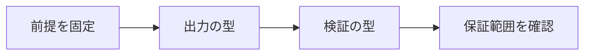

# AIが数学を解くとはどういうことか

> 種別：発展・応用  
> 状態：本文化済み  
> 前提：述語論理・証明・計算可能性  
> 難易度：基礎〜発展  
> 想定読了時間：23分

『AIが数学を解いた』は、数値解答、自然言語証明、形式証明、反例発見、予想生成、研究支援のどれを指すかで保証が異なります。入力・出力・検証者・計算予算・新規性を分けて評価します。

---

## 1. このページの到達目標

- AI数学の成果を分類する
- 生成と検証の主体を特定する
- ベンチマーク成功と研究発見を区別する

---

## 2. 全体像

この図では、「前提を固定する → 中心概念を形式化する → 具体例で検算する → 保証範囲を確認する」という流れを読み取ります。

式を操作する前に、対象・意味論・評価範囲を固定します。同じ記号でも、採用したモデルが違えば保証内容も変わります。

---

## 3. 基本事項

### 1. 出力の型

答えだけ、自然言語の論証、証明支援系が受理する証明項、プログラムや構成例では、検査方法が異なります。

### 2. 検証の型

自動採点、数値代入、外部ソルバー、証明カーネル、専門家査読は信頼境界が違います。形式検査は形式化した命題への保証です。

### 3. 成果の文脈

既知問題の再解決、未公開テスト、公開問題、未解決問題、再利用可能な概念発見を区別し、時間・計算資源・人手を記録します。

---

## 4. 段階例

IMO問題で正解を出すことと、未解決研究問題へ新しい概念を導入することは、どちらも数学能力ですが同じ評価軸ではありません。

中心となる式は次です。

$$
\text{主張}=(\text{課題},\text{出力},\text{検証},\text{資源},\text{新規性})
$$

1. 式に現れる対象・変数・演算の意味を固定します。
2. 各部分式が要求する内容を日本語へ戻します。
3. 最小の具体例または反例で境界条件を調べます。
4. 結論が、採用したモデルと探索範囲を越えていないか確認します。

---

## 5. 四つの軸から見る

| 軸 | このページでの見方 |
|---|---|
| 表現力 | どの区別や性質を直接表せるか |
| 推論可能性 | 規則・定義・同値変形から何を導けるか |
| 計算可能性 | 有限手続きで判定・探索できる範囲はどこか |
| 実用性 | 必要な情報を保ちながら、レビュー・実装しやすいか |

表現を増やせば常に良くなるわけではありません。必要な区別を保ち、検証できる粒度を選びます。

---

## 6. つまずきやすい点

### 1. 正答率だけで理解を断定

データ汚染、試行回数、検証器利用、一般化範囲を確認します。

### 2. 形式証明なら元問題も解決

形式化が自然言語の意図と一致するかは別に検証します。

### 3. 人間の助力があればAI成果でない

分業内容を明示して共同系として評価します。

### 復帰手順

1. 何を個体・状態・値としているか一行で書きます。
2. 量化・否定・演算のスコープへ括弧を付けます。
3. 成立例だけでなく、最小の反例候補も試します。
4. 「証明済み」「モデル内で確認」「経験的に支持」「解釈」を区別します。
5. 元の自然言語要求と形式化を再照合します。

---

## 7. 演習問題

### 問1

「出力の型」を、自分の言葉で説明してください。

### 問2

「検証の型」は、このページでどの役割を持ちますか。

### 問3

「成果の文脈」について、前提または保証範囲を一つ挙げてください。

### 問4

段階例の式は、どの内容を形式化していますか。

### 問5

「正答率だけで理解を断定」という誤解を、どのように修正しますか。

### 問6

このページの結論を別の問題へ適用するとき、最初に何を確認すべきですか。

---

## 8. 演習問題の解答

### 解答1

答えだけ、自然言語の論証、証明支援系が受理する証明項、プログラムや構成例では、検査方法が異なります。

### 解答2

自動採点、数値代入、外部ソルバー、証明カーネル、専門家査読は信頼境界が違います。形式検査は形式化した命題への保証です。

### 解答3

既知問題の再解決、未公開テスト、公開問題、未解決問題、再利用可能な概念発見を区別し、時間・計算資源・人手を記録します。

### 解答4

IMO問題で正解を出すことと、未解決研究問題へ新しい概念を導入することは、どちらも数学能力ですが同じ評価軸ではありません。 という内容を、対象と演算を明示して表しています。

### 解答5

データ汚染、試行回数、検証器利用、一般化範囲を確認します。

### 解答6

対象領域、記号の意味、採用するモデル、量化範囲を固定し、元の要求に必要な区別が保存されているか確認します。

---

## 9. 一次資料・公式資料

- [Polu & Sutskever, Generative Language Modeling for Automated Theorem Proving](https://arxiv.org/abs/2009.03393)（2020）
- [Google DeepMind, AI achieves silver-medal standard at IMO](https://deepmind.google/blog/ai-solves-imo-problems-at-silver-medal-level/)（2024-07-25）
- [Hubert et al., Olympiad-level formal mathematical reasoning with reinforcement learning](https://www.nature.com/articles/s41586-025-09833-y)（2025）

本文中の現在的な成果・製品名は上記資料を2026年7月25日に確認しました。定義的説明と、日付に依存する実証結果を分けて読んでください。

---

## 学習チェック

- [ ] AI数学の成果を分類する
- [ ] 生成と検証の主体を特定する
- [ ] ベンチマーク成功と研究発見を区別する
- [ ] 事実・定理・解釈・仮説を区別できる
- [ ] 結論を前提とモデルに相対化して説明できる

---

## ナビゲーション

- 親：[README.md](README.md)
- 前：[カテゴリREADME](README.md)
- 次：[LLMは証明検査器ではない](01_llms_are_not_proof_checkers.md)
- タワー入口：[../../README.md](../../README.md)
- 進捗：[../../PROGRESS.md](../../PROGRESS.md)
