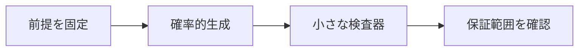

# LLMは証明検査器ではない

> 種別：発展・応用  
> 状態：本文化済み  
> 前提：述語論理・証明・計算可能性  
> 難易度：基礎〜発展  
> 想定読了時間：21分

LLMは証明らしい文章や次のタクティク候補を柔軟に生成できますが、各推論が固定規則に従うことを決定的に保証する証明検査器ではありません。候補生成とカーネル検査を分離します。

---

## 1. このページの到達目標

- 生成器と検査器を区別する
- LLM出力の失敗型を説明する
- 形式検査を組み込む構成を描く

---

## 2. 全体像

この図では、「前提を固定する → 中心概念を形式化する → 具体例で検算する → 保証範囲を確認する」という流れを読み取ります。

式を操作する前に、対象・意味論・評価範囲を固定します。同じ記号でも、採用したモデルが違えば保証内容も変わります。

---

## 3. 基本事項

### 1. 確率的生成

LLMは文脈に続く候補を確率的に生成し、存在しない補題、変数条件の違反、隠れた前提を出すことがあります。

### 2. 小さな検査器

証明カーネルは証明項を型検査し、採用した公理・定義・推論規則の範囲で受理または拒否します。

### 3. 役割分担

LLMが有望な補題やタクティクを提案し、探索器が分岐を管理し、カーネルが最終結果を検査します。

---

## 4. 段階例

LLMが `by exact theorem_name` を提案しても、定理の型がゴールと一致しなければLeanは拒否します。

中心となる式は次です。

$$
\text{LLM候補生成}+\text{探索}+\text{形式検査}
$$

1. 式に現れる対象・変数・演算の意味を固定します。
2. 各部分式が要求する内容を日本語へ戻します。
3. 最小の具体例または反例で境界条件を調べます。
4. 結論が、採用したモデルと探索範囲を越えていないか確認します。

---

## 5. 四つの軸から見る

| 軸 | このページでの見方 |
|---|---|
| 表現力 | どの区別や性質を直接表せるか |
| 推論可能性 | 規則・定義・同値変形から何を導けるか |
| 計算可能性 | 有限手続きで判定・探索できる範囲はどこか |
| 実用性 | 必要な情報を保ちながら、レビュー・実装しやすいか |

表現を増やせば常に良くなるわけではありません。必要な区別を保ち、検証できる粒度を選びます。

---

## 6. つまずきやすい点

### 1. 流暢なら正しい

文章品質と推論の妥当性は別です。

### 2. カーネルが拒否したらアイデアも無価値

候補修正や補題発見の手掛かりにはなり得ます。

### 3. 受理されたら自然言語の意図も保証

形式化の妥当性と依存公理を別途点検します。

### 復帰手順

1. 何を個体・状態・値としているか一行で書きます。
2. 量化・否定・演算のスコープへ括弧を付けます。
3. 成立例だけでなく、最小の反例候補も試します。
4. 「証明済み」「モデル内で確認」「経験的に支持」「解釈」を区別します。
5. 元の自然言語要求と形式化を再照合します。

---

## 7. 演習問題

### 問1

「確率的生成」を、自分の言葉で説明してください。

### 問2

「小さな検査器」は、このページでどの役割を持ちますか。

### 問3

「役割分担」について、前提または保証範囲を一つ挙げてください。

### 問4

段階例の式は、どの内容を形式化していますか。

### 問5

「流暢なら正しい」という誤解を、どのように修正しますか。

### 問6

このページの結論を別の問題へ適用するとき、最初に何を確認すべきですか。

---

## 8. 演習問題の解答

### 解答1

LLMは文脈に続く候補を確率的に生成し、存在しない補題、変数条件の違反、隠れた前提を出すことがあります。

### 解答2

証明カーネルは証明項を型検査し、採用した公理・定義・推論規則の範囲で受理または拒否します。

### 解答3

LLMが有望な補題やタクティクを提案し、探索器が分岐を管理し、カーネルが最終結果を検査します。

### 解答4

LLMが `by exact theorem_name` を提案しても、定理の型がゴールと一致しなければLeanは拒否します。 という内容を、対象と演算を明示して表しています。

### 解答5

文章品質と推論の妥当性は別です。

### 解答6

対象領域、記号の意味、採用するモデル、量化範囲を固定し、元の要求に必要な区別が保存されているか確認します。

---

## 9. 一次資料・公式資料

- [Lean公式サイト](https://lean-lang.org/)（確認日：2026-07-25）
- [Theorem Proving in Lean 4](https://leanprover.github.io/theorem_proving_in_lean4/)（確認日：2026-07-25）
- [Rocq Prover公式](https://rocq-prover.org/)（確認日：2026-07-25）
- [Rocq 9.0 Core language](https://rocq-prover.org/doc/V9.0.0/refman/language/core/)（確認日：2026-07-25）
- [Polu & Sutskever, Generative Language Modeling for Automated Theorem Proving](https://arxiv.org/abs/2009.03393)（2020）

本文中の現在的な成果・製品名は上記資料を2026年7月25日に確認しました。定義的説明と、日付に依存する実証結果を分けて読んでください。

---

## 学習チェック

- [ ] 生成器と検査器を区別する
- [ ] LLM出力の失敗型を説明する
- [ ] 形式検査を組み込む構成を描く
- [ ] 事実・定理・解釈・仮説を区別できる
- [ ] 結論を前提とモデルに相対化して説明できる

---

## ナビゲーション

- 親：[README.md](README.md)
- 前：[AIが数学を解くとはどういうことか](00_what_does_it_mean_for_ai_to_solve_math.md)
- 次：[証明生成と証明検証](02_proof_generation_and_verification.md)
- タワー入口：[../../README.md](../../README.md)
- 進捗：[../../PROGRESS.md](../../PROGRESS.md)
