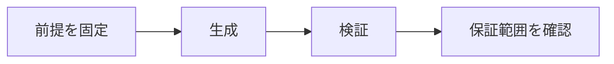

# 証明生成と証明検証

> 種別：発展・応用  
> 状態：本文化済み  
> 前提：述語論理・証明・計算可能性  
> 難易度：基礎〜発展  
> 想定読了時間：22分

証明を見つける問題と、与えられた証明を検査する問題は非対称です。探索空間は巨大でも、完全な証明項が与えられれば小さなカーネルが局所規則を追って検査できます。

---

## 1. このページの到達目標

- 生成と検証の計算を区別する
- proof-producingな構成を説明する
- 信頼基盤を列挙する

---

## 2. 全体像

この図では、「前提を固定する → 中心概念を形式化する → 具体例で検算する → 保証範囲を確認する」という流れを読み取ります。

式を操作する前に、対象・意味論・評価範囲を固定します。同じ記号でも、採用したモデルが違えば保証内容も変わります。

---

## 3. 基本事項

### 1. 生成

どの補題を使い、どう代入し、どの中間命題を立てるかを探索します。正解への距離が見えにくい疎な探索です。

### 2. 検証

証明項の各構成子を型規則に照らし、最終型が定理文と一致するかを確認します。失敗箇所を局所化できます。

### 3. 信頼基盤

カーネルだけでなく、定理文の形式化、採用公理、コンパイラやハードウェアまでどこを信頼するかを明記します。独立検査は境界を狭めます。

---

## 4. 段階例

SATソルバーやAIが証明証明書を出し、別実装のチェッカーが検査する構成は、探索器全体を信頼せずに済みます。

中心となる式は次です。

$$
\text{hard to find}\;\not\Rightarrow\;\text{hard to check}
$$

1. 式に現れる対象・変数・演算の意味を固定します。
2. 各部分式が要求する内容を日本語へ戻します。
3. 最小の具体例または反例で境界条件を調べます。
4. 結論が、採用したモデルと探索範囲を越えていないか確認します。

---

## 5. 四つの軸から見る

| 軸 | このページでの見方 |
|---|---|
| 表現力 | どの区別や性質を直接表せるか |
| 推論可能性 | 規則・定義・同値変形から何を導けるか |
| 計算可能性 | 有限手続きで判定・探索できる範囲はどこか |
| 実用性 | 必要な情報を保ちながら、レビュー・実装しやすいか |

表現を増やせば常に良くなるわけではありません。必要な区別を保ち、検証できる粒度を選びます。

---

## 6. つまずきやすい点

### 1. 検証が容易なら生成も容易

候補空間の探索は別の難しさを持ちます。

### 2. カーネルだけ信頼すれば十分

形式化と公理が目的に合うかも確認します。

### 3. 自然言語証明は検証不能

人間査読は可能ですが、機械的で決定的な保証とは異なります。

### 復帰手順

1. 何を個体・状態・値としているか一行で書きます。
2. 量化・否定・演算のスコープへ括弧を付けます。
3. 成立例だけでなく、最小の反例候補も試します。
4. 「証明済み」「モデル内で確認」「経験的に支持」「解釈」を区別します。
5. 元の自然言語要求と形式化を再照合します。

---

## 7. 演習問題

### 問1

「生成」を、自分の言葉で説明してください。

### 問2

「検証」は、このページでどの役割を持ちますか。

### 問3

「信頼基盤」について、前提または保証範囲を一つ挙げてください。

### 問4

段階例の式は、どの内容を形式化していますか。

### 問5

「検証が容易なら生成も容易」という誤解を、どのように修正しますか。

### 問6

このページの結論を別の問題へ適用するとき、最初に何を確認すべきですか。

---

## 8. 演習問題の解答

### 解答1

どの補題を使い、どう代入し、どの中間命題を立てるかを探索します。正解への距離が見えにくい疎な探索です。

### 解答2

証明項の各構成子を型規則に照らし、最終型が定理文と一致するかを確認します。失敗箇所を局所化できます。

### 解答3

カーネルだけでなく、定理文の形式化、採用公理、コンパイラやハードウェアまでどこを信頼するかを明記します。独立検査は境界を狭めます。

### 解答4

SATソルバーやAIが証明証明書を出し、別実装のチェッカーが検査する構成は、探索器全体を信頼せずに済みます。 という内容を、対象と演算を明示して表しています。

### 解答5

候補空間の探索は別の難しさを持ちます。

### 解答6

対象領域、記号の意味、採用するモデル、量化範囲を固定し、元の要求に必要な区別が保存されているか確認します。

---

## 9. 一次資料・公式資料

- [Lean公式サイト](https://lean-lang.org/)（確認日：2026-07-25）
- [Theorem Proving in Lean 4](https://leanprover.github.io/theorem_proving_in_lean4/)（確認日：2026-07-25）
- [Rocq Prover公式](https://rocq-prover.org/)（確認日：2026-07-25）
- [Rocq 9.0 Core language](https://rocq-prover.org/doc/V9.0.0/refman/language/core/)（確認日：2026-07-25）

本文中の現在的な成果・製品名は上記資料を2026年7月25日に確認しました。定義的説明と、日付に依存する実証結果を分けて読んでください。

---

## 学習チェック

- [ ] 生成と検証の計算を区別する
- [ ] proof-producingな構成を説明する
- [ ] 信頼基盤を列挙する
- [ ] 事実・定理・解釈・仮説を区別できる
- [ ] 結論を前提とモデルに相対化して説明できる

---

## ナビゲーション

- 親：[README.md](README.md)
- 前：[LLMは証明検査器ではない](01_llms_are_not_proof_checkers.md)
- 次：[数学的証明の探索空間](03_search_space_of_mathematical_proofs.md)
- タワー入口：[../../README.md](../../README.md)
- 進捗：[../../PROGRESS.md](../../PROGRESS.md)
