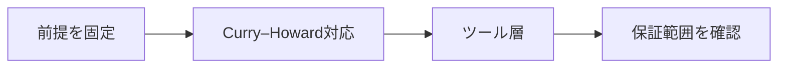

# Lean・Rocqと形式数学

> 種別：発展・応用  
> 状態：本文化済み  
> 前提：述語論理・証明・計算可能性  
> 難易度：基礎〜発展  
> 想定読了時間：25分

LeanとRocq（旧Coq）は、依存型理論を基盤に定義・定理・証明項を記述し、カーネルで型検査する証明支援系です。表面言語や自動化、ライブラリは異なるため、同じ『形式証明』でも移植は自動ではありません。

---

## 1. このページの到達目標

- 証明項と型の対応を説明する
- エラボレータ・タクティク・カーネルを分ける
- ライブラリ依存性を評価する

---

## 2. 全体像

この図では、「前提を固定する → 中心概念を形式化する → 具体例で検算する → 保証範囲を確認する」という流れを読み取ります。

式を操作する前に、対象・意味論・評価範囲を固定します。同じ記号でも、採用したモデルが違えば保証内容も変わります。

---

## 3. 基本事項

### 1. Curry–Howard対応

命題を型、証明をその型の項として扱います。定理を証明するとは、指定型を持つ項を構成することです。

### 2. ツール層

記法と暗黙引数を補うエラボレータ、証明項を作るタクティク、最終項を検査するカーネルの責任を分けます。

### 3. 形式数学の資産

定義、補題、型クラス、記法、既存証明の大規模ライブラリが探索と再利用を支えます。証明の正しさと保守しやすさは別です。

---

## 4. 段階例

自動化タクティクが複雑でも、最終的に生成した証明項をカーネルが受理する構成なら、自動化実装を信頼基盤の外へ置けます。

中心となる式は次です。

$$
p:P\quad\text{を構成することが命題Pの証明}
$$

1. 式に現れる対象・変数・演算の意味を固定します。
2. 各部分式が要求する内容を日本語へ戻します。
3. 最小の具体例または反例で境界条件を調べます。
4. 結論が、採用したモデルと探索範囲を越えていないか確認します。

---

## 5. 四つの軸から見る

| 軸 | このページでの見方 |
|---|---|
| 表現力 | どの区別や性質を直接表せるか |
| 推論可能性 | 規則・定義・同値変形から何を導けるか |
| 計算可能性 | 有限手続きで判定・探索できる範囲はどこか |
| 実用性 | 必要な情報を保ちながら、レビュー・実装しやすいか |

表現を増やせば常に良くなるわけではありません。必要な区別を保ち、検証できる粒度を選びます。

---

## 6. つまずきやすい点

### 1. Coqは現在も製品名

2025年にRocq 9.0として正式名称が変わっていますが、既存文献ではCoq表記が残ります。

### 2. タクティク実行成功が唯一の成果

生成された項、依存公理、定理文を確認します。

### 3. カーネル受理なら読みやすい

正しさと説明性・保守性は別評価です。

### 復帰手順

1. 何を個体・状態・値としているか一行で書きます。
2. 量化・否定・演算のスコープへ括弧を付けます。
3. 成立例だけでなく、最小の反例候補も試します。
4. 「証明済み」「モデル内で確認」「経験的に支持」「解釈」を区別します。
5. 元の自然言語要求と形式化を再照合します。

---

## 7. 演習問題

### 問1

「Curry–Howard対応」を、自分の言葉で説明してください。

### 問2

「ツール層」は、このページでどの役割を持ちますか。

### 問3

「形式数学の資産」について、前提または保証範囲を一つ挙げてください。

### 問4

段階例の式は、どの内容を形式化していますか。

### 問5

「Coqは現在も製品名」という誤解を、どのように修正しますか。

### 問6

このページの結論を別の問題へ適用するとき、最初に何を確認すべきですか。

---

## 8. 演習問題の解答

### 解答1

命題を型、証明をその型の項として扱います。定理を証明するとは、指定型を持つ項を構成することです。

### 解答2

記法と暗黙引数を補うエラボレータ、証明項を作るタクティク、最終項を検査するカーネルの責任を分けます。

### 解答3

定義、補題、型クラス、記法、既存証明の大規模ライブラリが探索と再利用を支えます。証明の正しさと保守しやすさは別です。

### 解答4

自動化タクティクが複雑でも、最終的に生成した証明項をカーネルが受理する構成なら、自動化実装を信頼基盤の外へ置けます。 という内容を、対象と演算を明示して表しています。

### 解答5

2025年にRocq 9.0として正式名称が変わっていますが、既存文献ではCoq表記が残ります。

### 解答6

対象領域、記号の意味、採用するモデル、量化範囲を固定し、元の要求に必要な区別が保存されているか確認します。

---

## 9. 一次資料・公式資料

- [Lean公式サイト](https://lean-lang.org/)（確認日：2026-07-25）
- [Theorem Proving in Lean 4](https://leanprover.github.io/theorem_proving_in_lean4/)（確認日：2026-07-25）
- [Rocq Prover公式](https://rocq-prover.org/)（確認日：2026-07-25）
- [Rocq 9.0 Core language](https://rocq-prover.org/doc/V9.0.0/refman/language/core/)（確認日：2026-07-25）

本文中の現在的な成果・製品名は上記資料を2026年7月25日に確認しました。定義的説明と、日付に依存する実証結果を分けて読んでください。

---

## 学習チェック

- [ ] 証明項と型の対応を説明する
- [ ] エラボレータ・タクティク・カーネルを分ける
- [ ] ライブラリ依存性を評価する
- [ ] 事実・定理・解釈・仮説を区別できる
- [ ] 結論を前提とモデルに相対化して説明できる

---

## ナビゲーション

- 親：[README.md](README.md)
- 前：[タクティク予測](04_tactic_prediction.md)
- 次：[ニューラル定理証明](06_neural_theorem_proving.md)
- タワー入口：[../../README.md](../../README.md)
- 進捗：[../../PROGRESS.md](../../PROGRESS.md)
