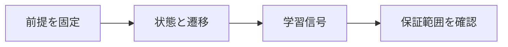

# 強化学習による証明探索

> 種別：発展・応用  
> 状態：本文化済み  
> 前提：述語論理・証明・計算可能性  
> 難易度：基礎〜発展  
> 想定読了時間：25分

証明探索の強化学習では、証明状態を環境、タクティクや項を行動、完全な証明の発見を報酬として方策を改善します。報酬が疎で分岐が大きいため、自己生成問題・探索再利用・価値学習が重要です。

---

## 1. このページの到達目標

- 証明探索をMDPとして表す
- 疎な報酬問題を説明する
- 自己改善ループの限界を述べる

---

## 2. 全体像

この図では、「前提を固定する → 中心概念を形式化する → 具体例で検算する → 保証範囲を確認する」という流れを読み取ります。

式を操作する前に、対象・意味論・評価範囲を固定します。同じ記号でも、採用したモデルが違えば保証内容も変わります。

---

## 3. 基本事項

### 1. 状態と遷移

形式環境が現在のゴールを返し、行動が有効なら新しいサブゴール状態へ遷移、無効なら失敗します。

### 2. 学習信号

完全証明だけを正報酬にすると信号が疎いため、過去の成功軌跡、難易度カリキュラム、価値推定を使います。

### 3. 自己生成

自然言語問題の形式化や既知定理の変形から大量の練習課題を作れますが、分布の偏りや不正確な形式化を監査します。

---

## 4. 段階例

AlphaProofはLean環境で証明を探索し、AlphaZero型の強化学習を用いました。2024年IMOでは単体で非幾何5問中3問を証明しました。

中心となる式は次です。

$$
\pi_{new}\leftarrow\text{学習}(\text{探索で得た証明軌跡})
$$

1. 式に現れる対象・変数・演算の意味を固定します。
2. 各部分式が要求する内容を日本語へ戻します。
3. 最小の具体例または反例で境界条件を調べます。
4. 結論が、採用したモデルと探索範囲を越えていないか確認します。

---

## 5. 四つの軸から見る

| 軸 | このページでの見方 |
|---|---|
| 表現力 | どの区別や性質を直接表せるか |
| 推論可能性 | 規則・定義・同値変形から何を導けるか |
| 計算可能性 | 有限手続きで判定・探索できる範囲はどこか |
| 実用性 | 必要な情報を保ちながら、レビュー・実装しやすいか |

表現を増やせば常に良くなるわけではありません。必要な区別を保ち、検証できる粒度を選びます。

---

## 6. つまずきやすい点

### 1. 報酬を入れれば理解が生まれる

最適化対象と一般化範囲を具体的に評価します。

### 2. カーネル報酬なら形式化も正しい

誤った定理文を正確に証明することは可能です。

### 3. 自己学習は人間データ不要

初期モデル、形式ライブラリ、問題生成規則など人間資産に依存します。

### 復帰手順

1. 何を個体・状態・値としているか一行で書きます。
2. 量化・否定・演算のスコープへ括弧を付けます。
3. 成立例だけでなく、最小の反例候補も試します。
4. 「証明済み」「モデル内で確認」「経験的に支持」「解釈」を区別します。
5. 元の自然言語要求と形式化を再照合します。

---

## 7. 演習問題

### 問1

「状態と遷移」を、自分の言葉で説明してください。

### 問2

「学習信号」は、このページでどの役割を持ちますか。

### 問3

「自己生成」について、前提または保証範囲を一つ挙げてください。

### 問4

段階例の式は、どの内容を形式化していますか。

### 問5

「報酬を入れれば理解が生まれる」という誤解を、どのように修正しますか。

### 問6

このページの結論を別の問題へ適用するとき、最初に何を確認すべきですか。

---

## 8. 演習問題の解答

### 解答1

形式環境が現在のゴールを返し、行動が有効なら新しいサブゴール状態へ遷移、無効なら失敗します。

### 解答2

完全証明だけを正報酬にすると信号が疎いため、過去の成功軌跡、難易度カリキュラム、価値推定を使います。

### 解答3

自然言語問題の形式化や既知定理の変形から大量の練習課題を作れますが、分布の偏りや不正確な形式化を監査します。

### 解答4

AlphaProofはLean環境で証明を探索し、AlphaZero型の強化学習を用いました。2024年IMOでは単体で非幾何5問中3問を証明しました。 という内容を、対象と演算を明示して表しています。

### 解答5

最適化対象と一般化範囲を具体的に評価します。

### 解答6

対象領域、記号の意味、採用するモデル、量化範囲を固定し、元の要求に必要な区別が保存されているか確認します。

---

## 9. 一次資料・公式資料

- [Google DeepMind, AI achieves silver-medal standard at IMO](https://deepmind.google/blog/ai-solves-imo-problems-at-silver-medal-level/)（2024-07-25）
- [Hubert et al., Olympiad-level formal mathematical reasoning with reinforcement learning](https://www.nature.com/articles/s41586-025-09833-y)（2025）

本文中の現在的な成果・製品名は上記資料を2026年7月25日に確認しました。定義的説明と、日付に依存する実証結果を分けて読んでください。

---

## 学習チェック

- [ ] 証明探索をMDPとして表す
- [ ] 疎な報酬問題を説明する
- [ ] 自己改善ループの限界を述べる
- [ ] 事実・定理・解釈・仮説を区別できる
- [ ] 結論を前提とモデルに相対化して説明できる

---

## ナビゲーション

- 親：[README.md](README.md)
- 前：[ニューラル定理証明](06_neural_theorem_proving.md)
- 次：[AlphaProofとオリンピック数学](08_alphaproof_and_olympiad_mathematics.md)
- タワー入口：[../../README.md](../../README.md)
- 進捗：[../../PROGRESS.md](../../PROGRESS.md)
