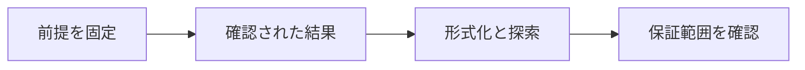

# AlphaProofとオリンピック数学

> 種別：発展・応用  
> 状態：本文化済み  
> 前提：述語論理・証明・計算可能性  
> 難易度：基礎〜発展  
> 想定読了時間：28分

AlphaProofの成果は、2024年IMOの非幾何問題をLeanへ形式化し、強化学習で形式証明を探索したことです。AlphaGeometry 2との合計28/42点が銀メダル相当であり、AlphaProof単体の得点や人間と異なる条件を分けます。

---

## 1. このページの到達目標

- 2024年成果を正確に要約する
- AlphaProofとAlphaGeometry 2を区別する
- 評価条件と限界を説明する

---

## 2. 全体像

この図では、「前提を固定する → 中心概念を形式化する → 具体例で検算する → 保証範囲を確認する」という流れを読み取ります。

式を操作する前に、対象・意味論・評価範囲を固定します。同じ記号でも、採用したモデルが違えば保証内容も変わります。

---

## 3. 基本事項

### 1. 確認された結果

2024年7月の発表では、AlphaProofが問題1・2・6、AlphaGeometry 2が問題4を解き、合計28点で銀メダル相当でした。

### 2. 形式化と探索

自然言語問題を形式言語へ移すautoformalizationと、Lean内の証明探索は別工程です。採点された最終解答は専門家が評価しました。

### 3. 計算条件

一部問題には数日規模の計算を要し、人間のIMO制限時間とは異なりました。競技成績は研究数学での自律的発見と同義ではありません。

---

## 4. 段階例

『AlphaProofが銀メダルを取った』は略記としては通じますが、厳密にはAlphaProofとAlphaGeometry 2の結合得点です。

中心となる式は次です。

$$
21\text{点（AlphaProof）}+7\text{点（AlphaGeometry 2）}=28/42
$$

1. 式に現れる対象・変数・演算の意味を固定します。
2. 各部分式が要求する内容を日本語へ戻します。
3. 最小の具体例または反例で境界条件を調べます。
4. 結論が、採用したモデルと探索範囲を越えていないか確認します。

---

## 5. 四つの軸から見る

| 軸 | このページでの見方 |
|---|---|
| 表現力 | どの区別や性質を直接表せるか |
| 推論可能性 | 規則・定義・同値変形から何を導けるか |
| 計算可能性 | 有限手続きで判定・探索できる範囲はどこか |
| 実用性 | 必要な情報を保ちながら、レビュー・実装しやすいか |

表現を増やせば常に良くなるわけではありません。必要な区別を保ち、検証できる粒度を選びます。

---

## 6. つまずきやすい点

### 1. AlphaProof単体が4問

AlphaProofは3問、幾何1問はAlphaGeometry 2です。

### 2. 2025年の別モデル成果を遡及

AlphaProofの2024年評価と、後の自然言語モデルの成果は別に記録します。

### 3. 形式証明だから計算時間は無関係

比較対象と実用性の評価には資源条件が必要です。

### 復帰手順

1. 何を個体・状態・値としているか一行で書きます。
2. 量化・否定・演算のスコープへ括弧を付けます。
3. 成立例だけでなく、最小の反例候補も試します。
4. 「証明済み」「モデル内で確認」「経験的に支持」「解釈」を区別します。
5. 元の自然言語要求と形式化を再照合します。

---

## 7. 演習問題

### 問1

「確認された結果」を、自分の言葉で説明してください。

### 問2

「形式化と探索」は、このページでどの役割を持ちますか。

### 問3

「計算条件」について、前提または保証範囲を一つ挙げてください。

### 問4

段階例の式は、どの内容を形式化していますか。

### 問5

「AlphaProof単体が4問」という誤解を、どのように修正しますか。

### 問6

このページの結論を別の問題へ適用するとき、最初に何を確認すべきですか。

---

## 8. 演習問題の解答

### 解答1

2024年7月の発表では、AlphaProofが問題1・2・6、AlphaGeometry 2が問題4を解き、合計28点で銀メダル相当でした。

### 解答2

自然言語問題を形式言語へ移すautoformalizationと、Lean内の証明探索は別工程です。採点された最終解答は専門家が評価しました。

### 解答3

一部問題には数日規模の計算を要し、人間のIMO制限時間とは異なりました。競技成績は研究数学での自律的発見と同義ではありません。

### 解答4

『AlphaProofが銀メダルを取った』は略記としては通じますが、厳密にはAlphaProofとAlphaGeometry 2の結合得点です。 という内容を、対象と演算を明示して表しています。

### 解答5

AlphaProofは3問、幾何1問はAlphaGeometry 2です。

### 解答6

対象領域、記号の意味、採用するモデル、量化範囲を固定し、元の要求に必要な区別が保存されているか確認します。

---

## 9. 一次資料・公式資料

- [Google DeepMind, AI achieves silver-medal standard at IMO](https://deepmind.google/blog/ai-solves-imo-problems-at-silver-medal-level/)（2024-07-25）
- [Hubert et al., Olympiad-level formal mathematical reasoning with reinforcement learning](https://www.nature.com/articles/s41586-025-09833-y)（2025）

本文中の現在的な成果・製品名は上記資料を2026年7月25日に確認しました。定義的説明と、日付に依存する実証結果を分けて読んでください。

---

## 学習チェック

- [ ] 2024年成果を正確に要約する
- [ ] AlphaProofとAlphaGeometry 2を区別する
- [ ] 評価条件と限界を説明する
- [ ] 事実・定理・解釈・仮説を区別できる
- [ ] 結論を前提とモデルに相対化して説明できる

---

## ナビゲーション

- 親：[README.md](README.md)
- 前：[強化学習による証明探索](07_reinforcement_learning_for_proofs.md)
- 次：[AIによる予想生成](09_conjecture_generation.md)
- タワー入口：[../../README.md](../../README.md)
- 進捗：[../../PROGRESS.md](../../PROGRESS.md)
