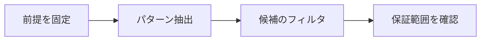

# AIによる予想生成

> 種別：発展・応用  
> 状態：本文化済み  
> 前提：述語論理・証明・計算可能性  
> 難易度：基礎〜発展  
> 想定読了時間：23分

予想生成は、例・計算データ・既知定理から、未証明だが検証価値のある一般命題を提案する仕事です。真らしさだけでなく、新規性、非自明性、説明力、反証可能性、研究上の有用性を評価します。

---

## 1. このページの到達目標

- 予想と定理を区別する
- 生成・反例探索・証明を分業する
- 予想の価値を複数軸で評価する

---

## 2. 全体像

この図では、「前提を固定する → 中心概念を形式化する → 具体例で検算する → 保証範囲を確認する」という流れを読み取ります。

式を操作する前に、対象・意味論・評価範囲を固定します。同じ記号でも、採用したモデルが違えば保証内容も変わります。

---

## 3. 基本事項

### 1. パターン抽出

有限例の列から不変量、境界、等式、単調性を推測します。補間で必ず合う式を作れるため、外挿検証が必要です。

### 2. 候補のフィルタ

既知定理との重複、簡単な反例、定義から自明、表記だけ新しい命題を除きます。

### 3. 研究サイクル

AIが候補を列挙し、計算機が小さい反例を探し、人間が概念的意義を選び、証明器が形式化可能な部分を検査します。

---

## 4. 段階例

最初の100例で成立する整数命題でも、101番目に反例があるかもしれません。有限確認は証明ではなく予想の根拠です。

中心となる式は次です。

$$
\text{data}\to\text{pattern}\to\text{conjecture}\to\text{counterexample/proof}
$$

1. 式に現れる対象・変数・演算の意味を固定します。
2. 各部分式が要求する内容を日本語へ戻します。
3. 最小の具体例または反例で境界条件を調べます。
4. 結論が、採用したモデルと探索範囲を越えていないか確認します。

---

## 5. 四つの軸から見る

| 軸 | このページでの見方 |
|---|---|
| 表現力 | どの区別や性質を直接表せるか |
| 推論可能性 | 規則・定義・同値変形から何を導けるか |
| 計算可能性 | 有限手続きで判定・探索できる範囲はどこか |
| 実用性 | 必要な情報を保ちながら、レビュー・実装しやすいか |

表現を増やせば常に良くなるわけではありません。必要な区別を保ち、検証できる粒度を選びます。

---

## 6. つまずきやすい点

### 1. 未見の文なら新しい数学

同値な既知定理や自明な言い換えを調査します。

### 2. 大量例で真なら定理

無限領域では有限確認だけで一般性を保証できません。

### 3. 反例が出たら失敗

境界条件を洗い出し、より正確な予想へ改善できます。

### 復帰手順

1. 何を個体・状態・値としているか一行で書きます。
2. 量化・否定・演算のスコープへ括弧を付けます。
3. 成立例だけでなく、最小の反例候補も試します。
4. 「証明済み」「モデル内で確認」「経験的に支持」「解釈」を区別します。
5. 元の自然言語要求と形式化を再照合します。

---

## 7. 演習問題

### 問1

「パターン抽出」を、自分の言葉で説明してください。

### 問2

「候補のフィルタ」は、このページでどの役割を持ちますか。

### 問3

「研究サイクル」について、前提または保証範囲を一つ挙げてください。

### 問4

段階例の式は、どの内容を形式化していますか。

### 問5

「未見の文なら新しい数学」という誤解を、どのように修正しますか。

### 問6

このページの結論を別の問題へ適用するとき、最初に何を確認すべきですか。

---

## 8. 演習問題の解答

### 解答1

有限例の列から不変量、境界、等式、単調性を推測します。補間で必ず合う式を作れるため、外挿検証が必要です。

### 解答2

既知定理との重複、簡単な反例、定義から自明、表記だけ新しい命題を除きます。

### 解答3

AIが候補を列挙し、計算機が小さい反例を探し、人間が概念的意義を選び、証明器が形式化可能な部分を検査します。

### 解答4

最初の100例で成立する整数命題でも、101番目に反例があるかもしれません。有限確認は証明ではなく予想の根拠です。 という内容を、対象と演算を明示して表しています。

### 解答5

同値な既知定理や自明な言い換えを調査します。

### 解答6

対象領域、記号の意味、採用するモデル、量化範囲を固定し、元の要求に必要な区別が保存されているか確認します。

---

## 学習チェック

- [ ] 予想と定理を区別する
- [ ] 生成・反例探索・証明を分業する
- [ ] 予想の価値を複数軸で評価する
- [ ] 事実・定理・解釈・仮説を区別できる
- [ ] 結論を前提とモデルに相対化して説明できる

---

## ナビゲーション

- 親：[README.md](README.md)
- 前：[AlphaProofとオリンピック数学](08_alphaproof_and_olympiad_mathematics.md)
- 次：[AIによる反例探索](10_counterexample_search.md)
- タワー入口：[../../README.md](../../README.md)
- 進捗：[../../PROGRESS.md](../../PROGRESS.md)
