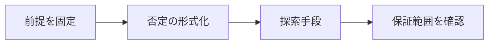

# AIによる反例探索

> 種別：発展・応用  
> 状態：本文化済み  
> 前提：述語論理・証明・計算可能性  
> 難易度：基礎〜発展  
> 想定読了時間：24分

反例探索は、全称主張を否定する具体例を一つ見つける課題です。有限列挙、SAT/SMT、制約プログラミング、プログラム生成、LLMによる構造提案を組み合わせます。探索失敗を証明と誤認しません。

---

## 1. このページの到達目標

- 主張の否定を探索問題へ変換する
- 有界探索の保証範囲を説明する
- 発見した反例を最小化・検証する

---

## 2. 全体像

この図では、「前提を固定する → 中心概念を形式化する → 具体例で検算する → 保証範囲を確認する」という流れを読み取ります。

式を操作する前に、対象・意味論・評価範囲を固定します。同じ記号でも、採用したモデルが違えば保証内容も変わります。

---

## 3. 基本事項

### 1. 否定の形式化

$\forall x\,P(x)$ の反例は $\exists x\,\lnot P(x)$ の証人です。型・定義域・前提を正確に符号化します。

### 2. 探索手段

有限領域は列挙、算術制約はSMT、組合せ構造はSATやCP、実行可能性はプログラム生成で扱えます。

### 3. 検証と縮小

候補を独立計算や証明支援系で再検証し、delta debuggingなどで不要部分を削って原因が見える最小反例へ近づけます。

---

## 4. 段階例

グラフ命題を頂点数n以下でSAT符号化し、SATなら具体的グラフ、UNSATでもnを超える反例は排除できません。

中心となる式は次です。

$$
\lnot\forall x\,P(x)\equiv\exists x\,\lnot P(x)
$$

1. 式に現れる対象・変数・演算の意味を固定します。
2. 各部分式が要求する内容を日本語へ戻します。
3. 最小の具体例または反例で境界条件を調べます。
4. 結論が、採用したモデルと探索範囲を越えていないか確認します。

---

## 5. 四つの軸から見る

| 軸 | このページでの見方 |
|---|---|
| 表現力 | どの区別や性質を直接表せるか |
| 推論可能性 | 規則・定義・同値変形から何を導けるか |
| 計算可能性 | 有限手続きで判定・探索できる範囲はどこか |
| 実用性 | 必要な情報を保ちながら、レビュー・実装しやすいか |

表現を増やせば常に良くなるわけではありません。必要な区別を保ち、検証できる粒度を選びます。

---

## 6. つまずきやすい点

### 1. 反例が見つからないから真

探索範囲・完全性・タイムアウトを確認します。

### 2. LLM候補はそのまま反例

前提を満たし結論を破るか機械的に再検証します。

### 3. 大きな反例ほど価値

最小化すると失敗機構が理解しやすくなります。

### 復帰手順

1. 何を個体・状態・値としているか一行で書きます。
2. 量化・否定・演算のスコープへ括弧を付けます。
3. 成立例だけでなく、最小の反例候補も試します。
4. 「証明済み」「モデル内で確認」「経験的に支持」「解釈」を区別します。
5. 元の自然言語要求と形式化を再照合します。

---

## 7. 演習問題

### 問1

「否定の形式化」を、自分の言葉で説明してください。

### 問2

「探索手段」は、このページでどの役割を持ちますか。

### 問3

「検証と縮小」について、前提または保証範囲を一つ挙げてください。

### 問4

段階例の式は、どの内容を形式化していますか。

### 問5

「反例が見つからないから真」という誤解を、どのように修正しますか。

### 問6

このページの結論を別の問題へ適用するとき、最初に何を確認すべきですか。

---

## 8. 演習問題の解答

### 解答1

$\forall x\,P(x)$ の反例は $\exists x\,\lnot P(x)$ の証人です。型・定義域・前提を正確に符号化します。

### 解答2

有限領域は列挙、算術制約はSMT、組合せ構造はSATやCP、実行可能性はプログラム生成で扱えます。

### 解答3

候補を独立計算や証明支援系で再検証し、delta debuggingなどで不要部分を削って原因が見える最小反例へ近づけます。

### 解答4

グラフ命題を頂点数n以下でSAT符号化し、SATなら具体的グラフ、UNSATでもnを超える反例は排除できません。 という内容を、対象と演算を明示して表しています。

### 解答5

探索範囲・完全性・タイムアウトを確認します。

### 解答6

対象領域、記号の意味、採用するモデル、量化範囲を固定し、元の要求に必要な区別が保存されているか確認します。

---

## 学習チェック

- [ ] 主張の否定を探索問題へ変換する
- [ ] 有界探索の保証範囲を説明する
- [ ] 発見した反例を最小化・検証する
- [ ] 事実・定理・解釈・仮説を区別できる
- [ ] 結論を前提とモデルに相対化して説明できる

---

## ナビゲーション

- 親：[README.md](README.md)
- 前：[AIによる予想生成](09_conjecture_generation.md)
- 次：[形式化ボトルネック](11_formalization_bottleneck.md)
- タワー入口：[../../README.md](../../README.md)
- 進捗：[../../PROGRESS.md](../../PROGRESS.md)
