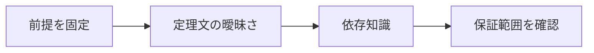

# 形式化ボトルネック

> 種別：発展・応用  
> 状態：本文化済み  
> 前提：述語論理・証明・計算可能性  
> 難易度：基礎〜発展  
> 想定読了時間：25分

自然言語の数学を証明支援系へ移すには、定義、型、暗黙の前提、既知補題、表記、境界条件をすべて明示する必要があります。証明探索が速くなっても、正しい定理文と再利用可能なライブラリを作る労力は残ります。

---

## 1. このページの到達目標

- autoformalizationの下位課題を分解する
- 意味保存を評価する
- ライブラリ設計の負担を説明する

---

## 2. 全体像

この図では、「前提を固定する → 中心概念を形式化する → 具体例で検算する → 保証範囲を確認する」という流れを読み取ります。

式を操作する前に、対象・意味論・評価範囲を固定します。同じ記号でも、採用したモデルが違えば保証内容も変わります。

---

## 3. 基本事項

### 1. 定理文の曖昧さ

『明らかに』『一般の位置』『十分大きい』などを、量化・定義域・例外条件へ展開します。誤形式化は誤った問題を正確に解かせます。

### 2. 依存知識

紙では省略する補題も、ライブラリ内の定義と定理へ接続する必要があります。同じ概念の異なる表現が再利用を妨げます。

### 3. 保守性

動くだけの長大な証明と、抽象化され将来のライブラリ変更に耐える証明は違います。人間レビューは数学的意義と設計品質も見ます。

---

## 4. 段階例

自然言語の『連続関数』を形式化すると、位相空間、フィルター、列など複数の同値定義から既存ライブラリに合う表現を選ぶ必要があります。

中心となる式は次です。

$$
\text{informal statement}\xrightarrow{?}\text{formal statement}
$$

1. 式に現れる対象・変数・演算の意味を固定します。
2. 各部分式が要求する内容を日本語へ戻します。
3. 最小の具体例または反例で境界条件を調べます。
4. 結論が、採用したモデルと探索範囲を越えていないか確認します。

---

## 5. 四つの軸から見る

| 軸 | このページでの見方 |
|---|---|
| 表現力 | どの区別や性質を直接表せるか |
| 推論可能性 | 規則・定義・同値変形から何を導けるか |
| 計算可能性 | 有限手続きで判定・探索できる範囲はどこか |
| 実用性 | 必要な情報を保ちながら、レビュー・実装しやすいか |

表現を増やせば常に良くなるわけではありません。必要な区別を保ち、検証できる粒度を選びます。

---

## 6. つまずきやすい点

### 1. 証明が通れば翻訳も正しい

カーネルは元の自然言語との対応を検査しません。

### 2. 定義を全部自動生成すればよい

既存ライブラリとの整合と再利用性が重要です。

### 3. ボトルネックは入力速度だけ

概念設計、レビュー、保守まで含みます。

### 復帰手順

1. 何を個体・状態・値としているか一行で書きます。
2. 量化・否定・演算のスコープへ括弧を付けます。
3. 成立例だけでなく、最小の反例候補も試します。
4. 「証明済み」「モデル内で確認」「経験的に支持」「解釈」を区別します。
5. 元の自然言語要求と形式化を再照合します。

---

## 7. 演習問題

### 問1

「定理文の曖昧さ」を、自分の言葉で説明してください。

### 問2

「依存知識」は、このページでどの役割を持ちますか。

### 問3

「保守性」について、前提または保証範囲を一つ挙げてください。

### 問4

段階例の式は、どの内容を形式化していますか。

### 問5

「証明が通れば翻訳も正しい」という誤解を、どのように修正しますか。

### 問6

このページの結論を別の問題へ適用するとき、最初に何を確認すべきですか。

---

## 8. 演習問題の解答

### 解答1

『明らかに』『一般の位置』『十分大きい』などを、量化・定義域・例外条件へ展開します。誤形式化は誤った問題を正確に解かせます。

### 解答2

紙では省略する補題も、ライブラリ内の定義と定理へ接続する必要があります。同じ概念の異なる表現が再利用を妨げます。

### 解答3

動くだけの長大な証明と、抽象化され将来のライブラリ変更に耐える証明は違います。人間レビューは数学的意義と設計品質も見ます。

### 解答4

自然言語の『連続関数』を形式化すると、位相空間、フィルター、列など複数の同値定義から既存ライブラリに合う表現を選ぶ必要があります。 という内容を、対象と演算を明示して表しています。

### 解答5

カーネルは元の自然言語との対応を検査しません。

### 解答6

対象領域、記号の意味、採用するモデル、量化範囲を固定し、元の要求に必要な区別が保存されているか確認します。

---

## 9. 一次資料・公式資料

- [Lean公式サイト](https://lean-lang.org/)（確認日：2026-07-25）
- [Theorem Proving in Lean 4](https://leanprover.github.io/theorem_proving_in_lean4/)（確認日：2026-07-25）
- [LeanDojo](https://arxiv.org/abs/2306.15626)（2023）

本文中の現在的な成果・製品名は上記資料を2026年7月25日に確認しました。定義的説明と、日付に依存する実証結果を分けて読んでください。

---

## 学習チェック

- [ ] autoformalizationの下位課題を分解する
- [ ] 意味保存を評価する
- [ ] ライブラリ設計の負担を説明する
- [ ] 事実・定理・解釈・仮説を区別できる
- [ ] 結論を前提とモデルに相対化して説明できる

---

## ナビゲーション

- 親：[README.md](README.md)
- 前：[AIによる反例探索](10_counterexample_search.md)
- 次：[LLMは新しい数学を発見できるか](12_can_llms_discover_new_mathematics.md)
- タワー入口：[../../README.md](../../README.md)
- 進捗：[../../PROGRESS.md](../../PROGRESS.md)
