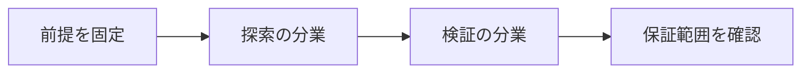

# 人間とAIの数学共同研究

> 種別：発展・応用  
> 状態：本文化済み  
> 前提：述語論理・証明・計算可能性  
> 難易度：基礎〜発展  
> 想定読了時間：23分

人間とAIの共同研究では、問いの選択、例の生成、文献検索、反例探索、補題提案、形式化、証明、説明、査読を役割分解します。能力比較より、どこで誰が判断し、どう検証するかを設計します。

---

## 1. このページの到達目標

- 研究工程を役割分解する
- 受け渡し成果物を定義する
- 失敗時の責任点を追跡する

---

## 2. 全体像

この図では、「前提を固定する → 中心概念を形式化する → 具体例で検算する → 保証範囲を確認する」という流れを読み取ります。

式を操作する前に、対象・意味論・評価範囲を固定します。同じ記号でも、採用したモデルが違えば保証内容も変わります。

---

## 3. 基本事項

### 1. 探索の分業

AIは大量の例・候補・関連定理を列挙し、人間は概念的な筋と価値を選びます。

### 2. 検証の分業

形式系が局所的正しさを検査し、人間が定理文、数学的意義、説明、倫理・優先順位を評価します。

### 3. 来歴管理

モデル、プロンプト、検索結果、反例、採用・棄却理由、最終証明を記録すると、再現とクレジット配分が可能になります。

---

## 4. 段階例

AIが100個の補題候補を出し、反例探索で90個を落とし、人間が5個を統合し、Leanで最終定理を検査する流れを一つの共同成果として記録します。

中心となる式は次です。

$$
\text{問い}\to\text{候補}\to\text{反例}\to\text{証明}\to\text{説明}
$$

1. 式に現れる対象・変数・演算の意味を固定します。
2. 各部分式が要求する内容を日本語へ戻します。
3. 最小の具体例または反例で境界条件を調べます。
4. 結論が、採用したモデルと探索範囲を越えていないか確認します。

---

## 5. 四つの軸から見る

| 軸 | このページでの見方 |
|---|---|
| 表現力 | どの区別や性質を直接表せるか |
| 推論可能性 | 規則・定義・同値変形から何を導けるか |
| 計算可能性 | 有限手続きで判定・探索できる範囲はどこか |
| 実用性 | 必要な情報を保ちながら、レビュー・実装しやすいか |

表現を増やせば常に良くなるわけではありません。必要な区別を保ち、検証できる粒度を選びます。

---

## 6. つまずきやすい点

### 1. AIに全部任せるか使わないか

工程ごとに適性とリスクを評価します。

### 2. 形式検査が人間査読を代替

意義・表現・先行研究・形式化妥当性は人間判断が残ります。

### 3. 最終著者だけ記録

生成・選別・修正・検証の来歴を残します。

### 復帰手順

1. 何を個体・状態・値としているか一行で書きます。
2. 量化・否定・演算のスコープへ括弧を付けます。
3. 成立例だけでなく、最小の反例候補も試します。
4. 「証明済み」「モデル内で確認」「経験的に支持」「解釈」を区別します。
5. 元の自然言語要求と形式化を再照合します。

---

## 7. 演習問題

### 問1

「探索の分業」を、自分の言葉で説明してください。

### 問2

「検証の分業」は、このページでどの役割を持ちますか。

### 問3

「来歴管理」について、前提または保証範囲を一つ挙げてください。

### 問4

段階例の式は、どの内容を形式化していますか。

### 問5

「AIに全部任せるか使わないか」という誤解を、どのように修正しますか。

### 問6

このページの結論を別の問題へ適用するとき、最初に何を確認すべきですか。

---

## 8. 演習問題の解答

### 解答1

AIは大量の例・候補・関連定理を列挙し、人間は概念的な筋と価値を選びます。

### 解答2

形式系が局所的正しさを検査し、人間が定理文、数学的意義、説明、倫理・優先順位を評価します。

### 解答3

モデル、プロンプト、検索結果、反例、採用・棄却理由、最終証明を記録すると、再現とクレジット配分が可能になります。

### 解答4

AIが100個の補題候補を出し、反例探索で90個を落とし、人間が5個を統合し、Leanで最終定理を検査する流れを一つの共同成果として記録します。 という内容を、対象と演算を明示して表しています。

### 解答5

工程ごとに適性とリスクを評価します。

### 解答6

対象領域、記号の意味、採用するモデル、量化範囲を固定し、元の要求に必要な区別が保存されているか確認します。

---

## 学習チェック

- [ ] 研究工程を役割分解する
- [ ] 受け渡し成果物を定義する
- [ ] 失敗時の責任点を追跡する
- [ ] 事実・定理・解釈・仮説を区別できる
- [ ] 結論を前提とモデルに相対化して説明できる

---

## ナビゲーション

- 親：[README.md](README.md)
- 前：[AI生成証明をいつ信頼できるか](13_when_an_ai_proof_should_be_trusted.md)
- 次：[なぜ数学は検証可能AIに向くのか](15_why_math_is_good_for_verifiable_ai.md)
- タワー入口：[../../README.md](../../README.md)
- 進捗：[../../PROGRESS.md](../../PROGRESS.md)
