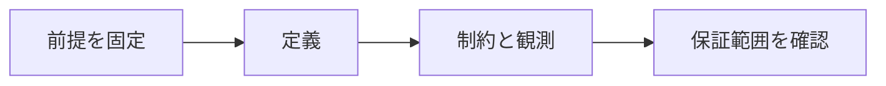

# 関数従属性

> 種別：発展・応用  
> 状態：本文化済み  
> 前提：集合・関係・述語論理  
> 難易度：基礎〜発展  
> 想定読了時間：20分

関数従属性 $X\to Y$ は、同じ関係内の任意の2タプルが $X$ で一致すれば $Y$ でも一致するという全称制約です。データの偶然の一致ではなく、許される全インスタンスに課す設計上の主張です。

---

## 1. このページの到達目標

- 関数従属性を2タプルの条件で定義する
- 成立例と反例を作る
- 現在データとスキーマ制約を区別する

---

## 2. 全体像

この図では、「前提を固定する → 中心概念を形式化する → 具体例で検算する → 保証範囲を確認する」という流れを読み取ります。

式を操作する前に、対象・意味論・評価範囲を固定します。同じ記号でも、採用したモデルが違えば保証内容も変わります。

---

## 3. 基本事項

### 1. 定義

関係 $r$ が $X\to Y$ を満たすとは、任意の $t_1,t_2\in r$ について $t_1[X]=t_2[X]$ なら $t_1[Y]=t_2[Y]$ となることです。

### 2. 制約と観測

現在の数行で偶然成立しても、業務規則として将来も成立するとは限りません。関数従属性は許容インスタンスの集合を狭めます。

### 3. 自明・非自明

$Y\subseteq X$ なら $X\to Y$ は自明です。正規化で重要なのは、属性間の意味的規則から生じる非自明な従属性です。

---

## 4. 段階例

社員番号が社員名を一意に決めるなら、同じ社員番号を持つ2行は社員名も一致しなければなりません。

中心となる式は次です。

$$
\forall t_1,t_2\in r\;(t_1[X]=t_2[X]\to t_1[Y]=t_2[Y])
$$

1. 式に現れる対象・変数・演算の意味を固定します。
2. 各部分式が要求する内容を日本語へ戻します。
3. 最小の具体例または反例で境界条件を調べます。
4. 結論が、採用したモデルと探索範囲を越えていないか確認します。

---

## 5. 四つの軸から見る

| 軸 | このページでの見方 |
|---|---|
| 表現力 | どの区別や性質を直接表せるか |
| 推論可能性 | 規則・定義・同値変形から何を導けるか |
| 計算可能性 | 有限手続きで判定・探索できる範囲はどこか |
| 実用性 | 必要な情報を保ちながら、レビュー・実装しやすいか |

表現を増やせば常に良くなるわけではありません。必要な区別を保ち、検証できる粒度を選びます。

---

## 6. つまずきやすい点

### 1. 値から値への関数

属性集合間の制約であり、プログラミング言語の関数そのものではありません。

### 2. サンプルで成立すれば制約

少量データの観測だけでは業務規則を確定できません。

### 3. NULLを無視

古典的定義とSQLのNULLを含む一意性は同一ではありません。

### 復帰手順

1. 何を個体・状態・値としているか一行で書きます。
2. 量化・否定・演算のスコープへ括弧を付けます。
3. 成立例だけでなく、最小の反例候補も試します。
4. 「証明済み」「モデル内で確認」「経験的に支持」「解釈」を区別します。
5. 元の自然言語要求と形式化を再照合します。

---

## 7. 演習問題

### 問1

「定義」を、自分の言葉で説明してください。

### 問2

「制約と観測」は、このページでどの役割を持ちますか。

### 問3

「自明・非自明」について、前提または保証範囲を一つ挙げてください。

### 問4

段階例の式は、どの内容を形式化していますか。

### 問5

「値から値への関数」という誤解を、どのように修正しますか。

### 問6

このページの結論を別の問題へ適用するとき、最初に何を確認すべきですか。

---

## 8. 演習問題の解答

### 解答1

関係 $r$ が $X\to Y$ を満たすとは、任意の $t_1,t_2\in r$ について $t_1[X]=t_2[X]$ なら $t_1[Y]=t_2[Y]$ となることです。

### 解答2

現在の数行で偶然成立しても、業務規則として将来も成立するとは限りません。関数従属性は許容インスタンスの集合を狭めます。

### 解答3

$Y\subseteq X$ なら $X\to Y$ は自明です。正規化で重要なのは、属性間の意味的規則から生じる非自明な従属性です。

### 解答4

社員番号が社員名を一意に決めるなら、同じ社員番号を持つ2行は社員名も一致しなければなりません。 という内容を、対象と演算を明示して表しています。

### 解答5

属性集合間の制約であり、プログラミング言語の関数そのものではありません。

### 解答6

対象領域、記号の意味、採用するモデル、量化範囲を固定し、元の要求に必要な区別が保存されているか確認します。

---

## 学習チェック

- [ ] 関数従属性を2タプルの条件で定義する
- [ ] 成立例と反例を作る
- [ ] 現在データとスキーマ制約を区別する
- [ ] 事実・定理・解釈・仮説を区別できる
- [ ] 結論を前提とモデルに相対化して説明できる

---

## ナビゲーション

- 親：[README.md](README.md)
- 前：[関係代数と一階述語論理](01_relational_algebra_and_first_order_logic.md)
- 次：[Armstrong公理](03_armstrongs_axioms.md)
- タワー入口：[../../README.md](../../README.md)
- 進捗：[../../PROGRESS.md](../../PROGRESS.md)
