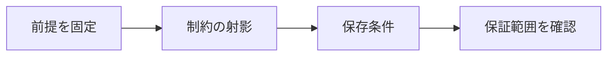

# 依存性保存

> 種別：発展・応用  
> 状態：本文化済み  
> 前提：集合・関係・述語論理  
> 難易度：基礎〜発展  
> 想定読了時間：22分

依存性保存は、分解後の各関係に射影された制約だけから、元の関数従属性をすべて導ける性質です。無損失性とは独立で、JOINせず制約を検査できるかに関係します。

---

## 1. このページの到達目標

- 従属性の射影を求める
- 依存性保存を閉包で判定する
- 無損失性と区別する

---

## 2. 全体像

この図では、「前提を固定する → 中心概念を形式化する → 具体例で検算する → 保証範囲を確認する」という流れを読み取ります。

式を操作する前に、対象・意味論・評価範囲を固定します。同じ記号でも、採用したモデルが違えば保証内容も変わります。

---

## 3. 基本事項

### 1. 制約の射影

各分解先の属性だけで表せ、元の従属性集合から導ける関数従属性を集めます。

### 2. 保存条件

各分解先への射影従属性の合併の閉包が、元の従属性集合を含意できれば依存性保存です。

### 3. 実務的意味

保存されない制約は、複数表をJOINしなければ違反を検出できない場合があります。更新時の局所検査が難しくなります。

---

## 4. 段階例

$R(A,B,C)$ で $A\to B$, $B\to C$ を $AB$ と $BC$ に分ければ、両従属性を各表で検査でき、$A\to C$ も推移的に導けます。

中心となる式は次です。

$$
\left(\bigcup_i \pi_{R_i}(F)\right)^+=F^+
$$

1. 式に現れる対象・変数・演算の意味を固定します。
2. 各部分式が要求する内容を日本語へ戻します。
3. 最小の具体例または反例で境界条件を調べます。
4. 結論が、採用したモデルと探索範囲を越えていないか確認します。

---

## 5. 四つの軸から見る

| 軸 | このページでの見方 |
|---|---|
| 表現力 | どの区別や性質を直接表せるか |
| 推論可能性 | 規則・定義・同値変形から何を導けるか |
| 計算可能性 | 有限手続きで判定・探索できる範囲はどこか |
| 実用性 | 必要な情報を保ちながら、レビュー・実装しやすいか |

表現を増やせば常に良くなるわけではありません。必要な区別を保ち、検証できる粒度を選びます。

---

## 6. つまずきやすい点

### 1. 元の従属性が各表に文字通り残る必要

射影従属性の合併から推論できれば保存です。

### 2. 無損失なら保存

情報復元と制約推論は別の問いです。

### 3. 保存されないとDBを作れない

JOINやアサーション、アプリ側検査など代替はありますがコストが増えます。

### 復帰手順

1. 何を個体・状態・値としているか一行で書きます。
2. 量化・否定・演算のスコープへ括弧を付けます。
3. 成立例だけでなく、最小の反例候補も試します。
4. 「証明済み」「モデル内で確認」「経験的に支持」「解釈」を区別します。
5. 元の自然言語要求と形式化を再照合します。

---

## 7. 演習問題

### 問1

「制約の射影」を、自分の言葉で説明してください。

### 問2

「保存条件」は、このページでどの役割を持ちますか。

### 問3

「実務的意味」について、前提または保証範囲を一つ挙げてください。

### 問4

段階例の式は、どの内容を形式化していますか。

### 問5

「元の従属性が各表に文字通り残る必要」という誤解を、どのように修正しますか。

### 問6

このページの結論を別の問題へ適用するとき、最初に何を確認すべきですか。

---

## 8. 演習問題の解答

### 解答1

各分解先の属性だけで表せ、元の従属性集合から導ける関数従属性を集めます。

### 解答2

各分解先への射影従属性の合併の閉包が、元の従属性集合を含意できれば依存性保存です。

### 解答3

保存されない制約は、複数表をJOINしなければ違反を検出できない場合があります。更新時の局所検査が難しくなります。

### 解答4

$R(A,B,C)$ で $A\to B$, $B\to C$ を $AB$ と $BC$ に分ければ、両従属性を各表で検査でき、$A\to C$ も推移的に導けます。 という内容を、対象と演算を明示して表しています。

### 解答5

射影従属性の合併から推論できれば保存です。

### 解答6

対象領域、記号の意味、採用するモデル、量化範囲を固定し、元の要求に必要な区別が保存されているか確認します。

---

## 学習チェック

- [ ] 従属性の射影を求める
- [ ] 依存性保存を閉包で判定する
- [ ] 無損失性と区別する
- [ ] 事実・定理・解釈・仮説を区別できる
- [ ] 結論を前提とモデルに相対化して説明できる

---

## ナビゲーション

- 親：[README.md](README.md)
- 前：[無損失結合分解](08_lossless_join_decomposition.md)
- 次：[多値従属性と第4正規形](10_multivalued_dependencies_and_4nf.md)
- タワー入口：[../../README.md](../../README.md)
- 進捗：[../../PROGRESS.md](../../PROGRESS.md)
