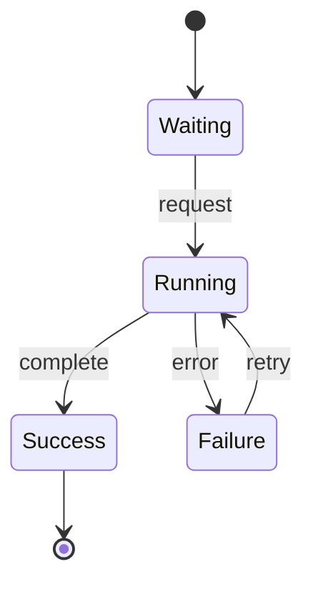

# modal_logic_and_computation

プログラムや分散システムは、1つの静止した状態ではなく、状態から状態へ移り続ける対象です。様相論理は、この「到達可能な状態」を式の意味に組み込みます。

このページでは、状態遷移系、時相論理、モデル検査をつなぎ、「常に安全」と「いつか進む」を区別します。

---

## 1. このページの到達目標

- プログラムを状態遷移系として表せる。
- 安全性と活性の違いを説明できる。
- LTLの基本演算子を読める。
- LTLとCTLの経路の扱いの違いを説明できる。
- モデル検査が保証する範囲と限界を説明できる。

---

## 2. 計算を状態と遷移で表す

状態遷移系を

$$
M=(S,R,L)
$$

とします。

- $S$：状態の集合
- $R\subseteq S\times S$：遷移関係
- $L(s)$：状態 $s$ で真となる原子命題の集合

状態は、変数値、プログラムカウンタ、ロックの所有者、メッセージキューなどをまとめたスナップショットです。

実行は

$$
s_0Rs_1Rs_2R\cdots
$$

という経路になります。

---

## 3. 実行グラフ

次の図は、待機状態から処理へ進み、成功または失敗へ分岐する遷移系です。読み取るポイントは、「次に起き得る状態」が複数あり、1本の実行例だけでは全挙動を確認できないことです。

通常の命題論理は各状態の中で命題を評価できます。様相・時相論理は、遷移先や経路にわたる性質を評価します。

---

## 4. 安全性と活性

システム仕様は大きく2種類に分けられます。

### 安全性

「悪いことが起きない」という性質です。

- 2人が同時にクリティカルセクションへ入らない。
- 権限のない利用者がデータを読まない。
- 残高が負にならない。

違反は有限の実行接頭辞で目撃できます。

### 活性

「良いことがいつか起きる」という性質です。

- リクエストにはいつか応答する。
- 待機中の処理はいつか実行される。
- 障害後にいつか復旧する。

有限時点まで起きていないだけでは、将来も起きないとは断定できません。

---

## 5. LTLの基本演算子

線形時相論理LTLは、1本の実行経路に沿って式を評価します。

### 次

$$
\mathbf{X}P
$$

次の状態で $P$ が真です。

### 将来いつか

$$
\mathbf{F}P
$$

現在以降のどこかで $P$ が真です。

### 今後ずっと

$$
\mathbf{G}P
$$

現在以降のすべての状態で $P$ が真です。

### Until

$$
P\ \mathbf{U}\ Q
$$

$Q$ が将来成立し、それまで $P$ が成立し続けます。

---

## 6. 要求をLTLで書く

### 常に相互排他

2プロセスが同時にクリティカルセクションへ入らないことは

$$
\mathbf{G}\lnot
(\mathrm{critical}_1\land\mathrm{critical}_2)
$$

です。

### 要求にはいつか応答

$$
\mathbf{G}
(\mathrm{request}\to\mathbf{F}\mathrm{response})
$$

です。外側の $\mathbf{G}$ により、どの時点で発生した要求にも適用します。

### ログインするまで閲覧不可

$$
\lnot\mathrm{view}\ \mathbf{U}\ \mathrm{login}
$$

と書けます。ただし強いUntilはloginが将来必ず起きることも要求します。ログインしない実行を許すなら、弱いUntilなど別の演算子が必要です。

---

## 7. 分岐する時間：CTL

状態から複数の将来へ分岐することを式で明示したい場合、CTLでは経路量化子を使います。

$$
\mathbf{A}
$$

は「すべての経路で」、

$$
\mathbf{E}
$$

は「ある経路で」です。

たとえば

$$
\mathbf{AG}\,\mathrm{safe}
$$

は「すべての経路のすべての状態でsafe」、

$$
\mathbf{EF}\,\mathrm{success}
$$

は「successへ到達する経路が少なくとも1つある」です。

$$
\mathbf{AF}\,\mathrm{success}
$$

なら「すべての経路で、いつかsuccess」です。成功可能と成功保証の差が式に現れます。

---

## 8. LTLとCTLの違い

| 観点 | LTL | CTL |
|---|---|---|
| 基本の評価 | 実行経路 | 分岐する状態木 |
| 経路量化 | 通常はモデル検査側で全経路を考える | $\mathbf{A}$ / $\mathbf{E}$ を式に書く |
| 得意な表現 | 実行の時間順序 | 可能な将来と必然の将来の区別 |
| 例 | $\mathbf{G}\mathbf{F}P$ | $\mathbf{AG}\mathbf{EF}P$ |

両者は単純な上下関係ではなく、表現できる性質に違いがあります。

---

## 9. モデル検査

モデル検査は、有限状態モデル $M$ が仕様 $\varphi$ を満たすか

$$
M\models\varphi
$$

を機械的に調べる方法です。

基本手順は次のとおりです。

1. システムを状態遷移系としてモデル化する。
2. 要求を時相論理式として書く。
3. 到達可能状態を探索する。
4. 仕様違反なら反例経路を返す。

反例は「どの入力と遷移で違反へ至ったか」を示すため、デバッグに役立ちます。

---

## 10. 状態爆発

状態変数が増えると、状態数は組合せ的に増えます。

$n$ 個の真偽変数だけでも最大状態数は

$$
2^n
$$

です。

複数プロセス、キュー、タイマーを組み合わせると全探索が難しくなります。そのため、記号表現、抽象化、部分順序簡約、有界モデル検査などが使われます。

ただし、抽象化が粗すぎれば偽の反例が生まれ、モデルが実装を落としていれば現実のバグを見逃します。

---

## 11. 公平性

「要求にはいつか応答する」を検証するとき、スケジューラが対象処理を永遠に選ばない経路を許すと、活性が失敗します。

公平性は、継続的に実行可能な処理が不当に永遠に無視されない、などの仮定です。

活性の検証結果は

$$
\text{モデル}+\text{公平性仮定}+\text{仕様}
$$

の組に依存します。仮定を隠すと、保証を過大評価します。

---

## 12. 例題：リトライ処理

失敗時にリトライする処理について、

$$
\mathbf{G}
(\mathrm{failure}\to\mathbf{F}\mathrm{success})
$$

を要求するとします。

リトライ回数に上限があり、その後Failedで停止する実装なら、この式は満たされない可能性があります。逆に無限リトライを許しても、成功する遷移が「存在する」だけでは不十分です。失敗を繰り返す経路があれば、全経路での活性は成立しません。

ここで、成功可能

$$
\mathbf{EF}\,\mathrm{success}
$$

と、必ず成功

$$
\mathbf{AF}\,\mathrm{success}
$$

を区別できます。

---

## 13. つまずきやすい点

### つまずき1：テストとモデル検査を同一視する

テストは選んだ実行を確認します。モデル検査は有限モデル内の状態・経路を体系的に調べます。

### つまずき2：$\mathbf{F}P$ に期限があると思う

通常のLTLの「いつか」は時間上限を与えません。期限には実時間論理などが必要です。

### つまずき3：成功可能と成功保証を混同する

$\mathbf{EF}$ と $\mathbf{AF}$ は異なります。

### つまずき4：モデルを検証すれば実装も完全に正しいと思う

保証はモデルと仕様の範囲内です。モデル化漏れや実装との差は別途確認します。

### つまずき5：活性から公平性仮定を落とす

スケジューリング仮定によって結果が変わります。

---

## 14. 演習問題

### 問1

「今後ずっとエラーではない」をLTLで表しなさい。

### 問2

「どの時点の要求にも、将来いつか応答する」をLTLで表しなさい。

### 問3

$\mathbf{EF}P$ と $\mathbf{AF}P$ の違いを説明しなさい。

### 問4

相互排他違反は安全性と活性のどちらですか。

### 問5

10個の真偽変数で表される状態は最大何個ですか。

### 問6

モデル検査に成功しても実装の正しさを断定できない理由を2つ挙げなさい。

---

## 15. 演習問題の解答

### 解答1

$$
\mathbf{G}\lnot\mathrm{error}
$$

です。

### 解答2

$$
\mathbf{G}
(\mathrm{request}\to\mathbf{F}\mathrm{response})
$$

です。

### 解答3

$\mathbf{EF}P$ は $P$ へ至る経路が1つ以上あること、$\mathbf{AF}P$ はすべての経路でいつか $P$ に至ることです。

### 解答4

安全性です。2者が同時に入った有限の実行で違反を目撃できます。

### 解答5

$$
2^{10}=1024
$$

個です。

### 解答6

たとえば、モデルが実装の挙動をすべて表していないこと、形式化した仕様が本来の要求とずれていることです。

---

## 学習チェック（自己確認）

- 状態、遷移、経路を区別できる。
- 安全性と活性の例を挙げられる。
- $\mathbf{X}$、$\mathbf{F}$、$\mathbf{G}$、$\mathbf{U}$ を読める。
- LTLとCTLの経路の扱いを区別できる。
- 状態爆発、公平性、モデル化誤差を説明できる。

---

## ナビゲーション

- 親: [README.md](README.md)
- 前: [logic_and_database_queries.md](logic_and_database_queries.md)
- 次: [proof_assistants_and_logic.md](proof_assistants_and_logic.md)

