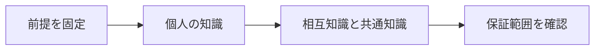

# 認識論理と分散システム

> 種別：発展・応用  
> 状態：本文化済み  
> 前提：述語論理・様相論理  
> 難易度：基礎〜発展  
> 想定読了時間：25分

認識論理は、主体ごとの情報状態を『その主体にとって区別できない世界』で表します。分散システムでは、事実が真であることと、各プロセスがその事実を知ること、共通知識になることを区別できます。

---

## 1. このページの到達目標

- 知識演算子をKripke意味論で読む
- 相互知識と共通知識を区別する
- 分散合意の情報制約を説明する

---

## 2. 全体像

この図では、「前提を固定する → 中心概念を形式化する → 具体例で検算する → 保証範囲を確認する」という流れを読み取ります。

式を操作する前に、対象・意味論・評価範囲を固定します。同じ記号でも、採用したモデルが違えば保証内容も変わります。

---

## 3. 基本事項

### 1. 個人の知識

$K_iP$ は、主体$i$が現在世界と区別できないすべての世界で $P$ が成り立つことです。知識の性質は関係の反射性・推移性などに依存します。

### 2. 相互知識と共通知識

全員が知る $E_G P$ と、全員が知ることを全員が知る…を無限に反復した共通知識 $C_G P$ は異なります。

### 3. 通信と不可能性

メッセージが届いた事実だけで、相手が受信を知ったことや、その知識をこちらが知ることまでは保証されません。通信障害は知識階層を断ちます。

---

## 4. 段階例

二将軍問題では確認応答を重ねても、最後のメッセージ到達が不確実なら攻撃時刻の共通知識を有限回通信で作れません。

中心となる式は次です。

$$
C_G P=\bigwedge_{n\ge1}E_G^nP
$$

1. 式に現れる対象・変数・演算の意味を固定します。
2. 各部分式が要求する内容を日本語へ戻します。
3. 最小の具体例または反例で境界条件を調べます。
4. 結論が、採用したモデルと探索範囲を越えていないか確認します。

---

## 5. 四つの軸から見る

| 軸 | このページでの見方 |
|---|---|
| 表現力 | どの区別や性質を直接表せるか |
| 推論可能性 | 規則・定義・同値変形から何を導けるか |
| 計算可能性 | 有限手続きで判定・探索できる範囲はどこか |
| 実用性 | 必要な情報を保ちながら、レビュー・実装しやすいか |

表現を増やせば常に良くなるわけではありません。必要な区別を保ち、検証できる粒度を選びます。

---

## 6. つまずきやすい点

### 1. 真なら全員が知る

世界の事実と主体の情報は別です。

### 2. 全員が知れば共通知識

知識の反復がすべての深さで必要です。

### 3. 知識は心理状態だけ

プロトコルで観測可能な情報を形式化する工学的用途があります。

### 復帰手順

1. 何を個体・状態・値としているか一行で書きます。
2. 量化・否定・演算のスコープへ括弧を付けます。
3. 成立例だけでなく、最小の反例候補も試します。
4. 「証明済み」「モデル内で確認」「経験的に支持」「解釈」を区別します。
5. 元の自然言語要求と形式化を再照合します。

---

## 7. 演習問題

### 問1

「個人の知識」を、自分の言葉で説明してください。

### 問2

「相互知識と共通知識」は、このページでどの役割を持ちますか。

### 問3

「通信と不可能性」について、前提または保証範囲を一つ挙げてください。

### 問4

段階例の式は、どの内容を形式化していますか。

### 問5

「真なら全員が知る」という誤解を、どのように修正しますか。

### 問6

このページの結論を別の問題へ適用するとき、最初に何を確認すべきですか。

---

## 8. 演習問題の解答

### 解答1

$K_iP$ は、主体$i$が現在世界と区別できないすべての世界で $P$ が成り立つことです。知識の性質は関係の反射性・推移性などに依存します。

### 解答2

全員が知る $E_G P$ と、全員が知ることを全員が知る…を無限に反復した共通知識 $C_G P$ は異なります。

### 解答3

メッセージが届いた事実だけで、相手が受信を知ったことや、その知識をこちらが知ることまでは保証されません。通信障害は知識階層を断ちます。

### 解答4

二将軍問題では確認応答を重ねても、最後のメッセージ到達が不確実なら攻撃時刻の共通知識を有限回通信で作れません。 という内容を、対象と演算を明示して表しています。

### 解答5

世界の事実と主体の情報は別です。

### 解答6

対象領域、記号の意味、採用するモデル、量化範囲を固定し、元の要求に必要な区別が保存されているか確認します。

---

## 学習チェック

- [ ] 知識演算子をKripke意味論で読む
- [ ] 相互知識と共通知識を区別する
- [ ] 分散合意の情報制約を説明する
- [ ] 事実・定理・解釈・仮説を区別できる
- [ ] 結論を前提とモデルに相対化して説明できる

---

## ナビゲーション

- 親：[README.md](README.md)
- 前：[時相論理とモデル検査](02_temporal_logic_and_model_checking.md)
- 次：[証明可能性論理](04_provability_logic.md)
- タワー入口：[../../README.md](../../README.md)
- 進捗：[../../PROGRESS.md](../../PROGRESS.md)
