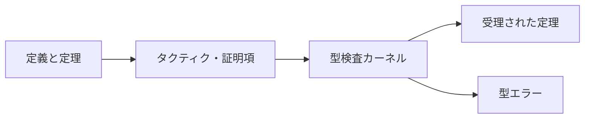

# proof_assistants_and_logic

証明支援系は、数学者や開発者の代わりに定理の意味を考える機械ではありません。人が定義・定理・証明を形式言語で与え、その証明が採用した論理体系の規則に従うかを小さなカーネルで検査する道具です。

このページでは、紙の自然演繹からLeanやCoqなどの証明支援系へ移るための見取り図を作ります。

---

## 1. このページの到達目標

- 証明支援系、証明自動化、通常のテストを区別できる。
- カリー＝ハワード対応の基本例を説明できる。
- ゴールとローカルコンテキストを読める。
- 自然演繹の規則と基本的な証明操作を対応づけられる。
- カーネル、採用公理、定義という信頼境界を説明できる。

---

## 2. 証明を機械が確認する流れ

次の図は、利用者が書いた定理と証明をカーネルが検査する流れです。読み取るポイントは、タクティクや自動化が複雑でも、最終的には小さな証明項へ展開され、カーネルが確認する設計が多いことです。



証明支援系ごとに基礎理論や実装は異なりますが、「小さな信頼できる核が最終確認する」という考えが重要です。

---

## 3. 命題は型、証明は値

カリー＝ハワード対応では、

$$
\text{命題}\leftrightarrow\text{型}
$$

$$
\text{証明}\leftrightarrow\text{その型の値}
$$

と見ます。

命題 $P$ が証明可能であるとは、型 $P$ の値を構成できることに対応します。

### 含意

$$
P\to Q
$$

の証明は、$P$ の証明を受け取って $Q$ の証明を返す関数です。

### 連言

$$
P\land Q
$$

の証明は、$P$ の証明と $Q$ の証明の組です。

### 選言

$$
P\lor Q
$$

の証明は、左右どちらを選ぶかというタグと、選んだ命題の証明です。

---

## 4. ゴールとコンテキスト

証明中の状態は、概念的に

$$
\Gamma\vdash G
$$

と書けます。

- $\Gamma$：現在使える仮定・変数
- $G$：現在証明すべきゴール

たとえば

$$
P,Q\vdash P\land Q
$$

では、コンテキストに $P$ と $Q$ の証明があり、ゴールはその組を作ることです。

証明が止まったら、タクティク名を増やす前に「手元に何があり、何を作る必要があるか」を日本語で読みます。

---

## 5. 自然演繹と証明操作

代表的な対応を整理します。具体的なコマンド名は証明支援系やライブラリで異なります。

| 論理上の形 | 証明の操作 | よくある考え方 |
|---|---|---|
| $P\to Q$ を示す | $P$ を仮定する | `intro` |
| $P\land Q$ を示す | 2つのゴールに分ける | `constructor` / `split` |
| $P\land Q$ を使う | 成分へ分解する | `cases` / `destruct` |
| $P\lor Q$ を示す | 左右を選ぶ | `left` / `right` |
| $P\lor Q$ を使う | 場合分けする | `cases` / `destruct` |
| $\forall x\,P(x)$ を示す | 任意の $x$ を導入する | `intro` |
| $\exists x\,P(x)$ を示す | 証人を与える | `use` / `exists` |

操作を丸暗記するより、ゴールの最外側の論理記号を見る方が再利用できます。

---

## 6. 例題1：恒等関数

定理

$$
P\to P
$$

を考えます。

1. $P$ の証明 $h$ を仮定する。
2. ゴールは $P$ になる。
3. 仮定 $h$ をそのまま返す。

証明項は概念的に

$$
\lambda h.h
$$

です。プログラムとしては恒等関数です。

Lean風には次のように書けます。

```lean
theorem id_proof (P : Prop) : P → P := by
  intro h
  exact h
```

このコードは考え方の例です。実際の構文は利用するバージョンと環境で確認します。

---

## 7. 例題2：連言から成分を取り出す

$$
P\land Q\to Q
$$

を示します。

1. $P\land Q$ の証明 $h$ を仮定する。
2. $h$ を $P$ の証明と $Q$ の証明へ分解する。
3. $Q$ の証明を返す。

```lean
theorem and_right (P Q : Prop) : P ∧ Q → Q := by
  intro h
  exact h.right
```

証明は組の第2成分を返す関数と同じ構造です。

---

## 8. 例題3：存在命題

自然数について

$$
\exists n\in\mathbb{N},\ n+1=3
$$

を示すには、証人として2を与え、

$$
2+1=3
$$

を示します。

構成的な存在証明では、存在だけでなく具体的な対象と性質の証明を組にします。

---

## 9. 定義展開と書き換え

紙の証明では「定義より明らか」と省略する箇所も、機械には明示が必要です。

等式

$$
a=b
$$

と、$a$ を含む命題 $P(a)$ があれば、書き換えて $P(b)$ を得られます。

証明支援系では、定義を展開する操作、既知の等式で書き換える操作、式を正規化する操作を区別します。

「同じに見えるのに通らない」ときは、

- 定義上同じか
- 証明が必要な等式か
- 型が本当に一致しているか

を確認します。

---

## 10. 帰納法

自然数について

$$
\forall n\in\mathbb{N}\,P(n)
$$

を示す典型的方法は数学的帰納法です。

1. 基底：$P(0)$ を示す。
2. 帰納段階：任意の $n$ について、$P(n)$ を仮定して $P(n+1)$ を示す。

証明支援系では、自然数の帰納原理を適用すると、この2つが別ゴールとして現れます。

データ型ごとに帰納原理があり、リストなら空リストと先頭要素を追加したリストのケースに分かれます。

---

## 11. 直観主義論理と古典公理

多くの型理論ベースの証明支援系では、基本部分は構成的です。そのため、一般の排中律

$$
P\lor\lnot P
$$

や二重否定除去

$$
\lnot\lnot P\to P
$$

を使うには、古典公理を明示的に導入する場合があります。

古典公理を使うこと自体が誤りなのではありません。どの公理に依存した定理なのかを把握することが重要です。

---

## 12. 自動化とカーネル

タクティク、決定手続き、外部ソルバは証明探索を助けます。

$$
\text{探索}
\neq
\text{最終検査}
$$

自動化が生成した証明項をカーネルが再検査できる設計では、複雑な自動化全体を同じ程度に信頼する必要を減らせます。

一方、外部計算結果を公理として受け入れる機能や、未証明の穴を許す機能を使えば、保証範囲は変わります。

---

## 13. テストとの違い

テストは選んだ入力でプログラムを実行します。

```text
f(0) = 0
f(1) = 1
f(2) = 4
```

が通っても

$$
\forall n\in\mathbb{N}\,f(n)=n^2
$$

は証明されません。

形式証明は、定義したモデルと前提のもとで全称命題を示せます。ただし、仕様やモデルが現実のプログラムを正しく表すかは別問題です。テストと証明は競合ではなく、異なる不具合を見つける手段です。

---

## 14. 信頼境界

「証明済み」の意味を判断するには、少なくとも次を確認します。

1. どの論理・型理論を使うか。
2. どの公理を追加したか。
3. 定義が意図した対象を表すか。
4. 未証明の穴が残っていないか。
5. カーネルとコード生成系のどこを信頼するか。

証明支援系は、曖昧な仕様を自動で正してはくれません。

---

## 15. 学習の進め方

1. 紙で3〜8行の自然演繹を書く。
2. 各行で使った規則を明記する。
3. ゴールの最外側の記号を見る。
4. 1つの規則に対応する操作を選ぶ。
5. エラー時はコンテキストとゴールを日本語に戻す。
6. 最後に公理依存や未証明箇所を確認する。

最初は自動化を減らし、証明状態がどう変化するかを観察すると理解しやすくなります。

---

## 16. つまずきやすい点

### つまずき1：タクティクを総当たりする

まずゴールの論理構造と使える仮定を読みます。

### つまずき2：数学的に同じなら型も同じだと思う

定義上の等しさ、証明が必要な等しさ、型変換を区別します。

### つまずき3：自動化が成功した理由を見ない

学習時は、生成されたゴールや使われた補題を確認します。

### つまずき4：古典推論が常に標準で使えると思う

基礎論理とインポートした公理を確認します。

### つまずき5：形式化すれば現実も自動的に正しいと思う

証明は定義と前提に相対的です。仕様妥当性もレビューします。

---

## 17. 演習問題

### 問1

カリー＝ハワード対応で、$P\to Q$ の証明はどのようなプログラムに対応しますか。

### 問2

コンテキストに $h:P\land Q$ があり、ゴールが $P$ のとき、何をすればよいですか。

### 問3

$P\lor Q$ を証明するために必要な情報を説明しなさい。

### 問4

存在命題 $\exists x\,P(x)$ の構成的証明に必要な2要素を答えなさい。

### 問5

自然数に関する帰納法で生じる2つのゴールを答えなさい。

### 問6

証明支援系で定理が受理されても、現実のシステムの正しさを断定できない理由を説明しなさい。

---

## 18. 演習問題の解答

### 解答1

$P$ の証明を入力として受け取り、$Q$ の証明を返す関数です。

### 解答2

$h$ を2成分へ分解するか、第1成分 $h.1$ を取り出してゴールに与えます。

### 解答3

左の $P$ と右の $Q$ のどちらを示すかという選択と、選んだ側の証明です。

### 解答4

具体的な証人 $a$ と、$P(a)$ の証明です。

### 解答5

基底 $P(0)$ と、帰納仮定 $P(n)$ から $P(n+1)$ を示す帰納段階です。

### 解答6

定理は形式化された定義と前提に対して証明されています。その定義が現実の挙動や本来の要求を取りこぼしていれば、現実の正しさまでは保証しません。

---

## 学習チェック（自己確認）

- 命題・型、証明・値の対応を説明できる。
- $\Gamma\vdash G$ をコンテキストとゴールとして読める。
- ゴールの最外側の記号から次の操作を選べる。
- 自動化とカーネル検査を区別できる。
- 公理・定義・未証明箇所という信頼境界を確認できる。

---

## ナビゲーション

- 親: [README.md](README.md)
- 前: [modal_logic_and_computation.md](modal_logic_and_computation.md)
- 次: [../PROGRESS.md](../PROGRESS.md)

