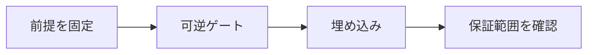

# 可逆計算

> 種別：発展・応用  
> 状態：本文化済み  
> 前提：命題論理・線形代数の初歩  
> 難易度：基礎〜発展  
> 想定読了時間：24分

可逆計算では、出力から入力を一意に復元できるゲートだけで計算を構成します。任意の古典関数は、入力を保持し補助ビットへ結果を書き込む形なら可逆写像へ埋め込めます。

---

## 1. このページの到達目標

- 可逆ゲートを置換として読む
- 不可逆関数を可逆埋め込みする
- garbageとuncomputationを説明する

---

## 2. 全体像

この図では、「前提を固定する → 中心概念を形式化する → 具体例で検算する → 保証範囲を確認する」という流れを読み取ります。

式を操作する前に、対象・意味論・評価範囲を固定します。同じ記号でも、採用したモデルが違えば保証内容も変わります。

---

## 3. 基本事項

### 1. 可逆ゲート

nビット可逆ゲートは $2^n$ 個の基底状態の置換です。NOT、CNOT、Toffoliは代表例です。

### 2. 埋め込み

任意の $f$ を $(x,y)\mapsto(x,y\oplus f(x))$ とすれば、同じ操作をもう一度施して元へ戻せます。

### 3. 補助情報の後始末

計算途中のgarbageを残すと量子計算では目的レジスタと絡み得ます。結果をコピーできる古典的状況では、逆計算で補助ビットを0へ戻すuncomputationを使います。

---

## 4. 段階例

ANDをToffoliで $(a,b,0)\mapsto(a,b,a\land b)$ と計算すれば入力を保持するため可逆です。

中心となる式は次です。

$$
U_f:(x,y)\mapsto(x,y\oplus f(x))
$$

1. 式に現れる対象・変数・演算の意味を固定します。
2. 各部分式が要求する内容を日本語へ戻します。
3. 最小の具体例または反例で境界条件を調べます。
4. 結論が、採用したモデルと探索範囲を越えていないか確認します。

---

## 5. 四つの軸から見る

| 軸 | このページでの見方 |
|---|---|
| 表現力 | どの区別や性質を直接表せるか |
| 推論可能性 | 規則・定義・同値変形から何を導けるか |
| 計算可能性 | 有限手続きで判定・探索できる範囲はどこか |
| 実用性 | 必要な情報を保ちながら、レビュー・実装しやすいか |

表現を増やせば常に良くなるわけではありません。必要な区別を保ち、検証できる粒度を選びます。

---

## 6. つまずきやすい点

### 1. 可逆なら入力数と出力数が違ってよい

全状態上の一対一写像には同じ大きさの状態空間が必要です。

### 2. 結果だけ残して入力を消せる

それを無条件に行えば再び不可逆になります。

### 3. 可逆計算は量子計算だけ

古典的な可逆計算理論として独立に研究されます。

### 復帰手順

1. 何を個体・状態・値としているか一行で書きます。
2. 量化・否定・演算のスコープへ括弧を付けます。
3. 成立例だけでなく、最小の反例候補も試します。
4. 「証明済み」「モデル内で確認」「経験的に支持」「解釈」を区別します。
5. 元の自然言語要求と形式化を再照合します。

---

## 7. 演習問題

### 問1

「可逆ゲート」を、自分の言葉で説明してください。

### 問2

「埋め込み」は、このページでどの役割を持ちますか。

### 問3

「補助情報の後始末」について、前提または保証範囲を一つ挙げてください。

### 問4

段階例の式は、どの内容を形式化していますか。

### 問5

「可逆なら入力数と出力数が違ってよい」という誤解を、どのように修正しますか。

### 問6

このページの結論を別の問題へ適用するとき、最初に何を確認すべきですか。

---

## 8. 演習問題の解答

### 解答1

nビット可逆ゲートは $2^n$ 個の基底状態の置換です。NOT、CNOT、Toffoliは代表例です。

### 解答2

任意の $f$ を $(x,y)\mapsto(x,y\oplus f(x))$ とすれば、同じ操作をもう一度施して元へ戻せます。

### 解答3

計算途中のgarbageを残すと量子計算では目的レジスタと絡み得ます。結果をコピーできる古典的状況では、逆計算で補助ビットを0へ戻すuncomputationを使います。

### 解答4

ANDをToffoliで $(a,b,0)\mapsto(a,b,a\land b)$ と計算すれば入力を保持するため可逆です。 という内容を、対象と演算を明示して表しています。

### 解答5

全状態上の一対一写像には同じ大きさの状態空間が必要です。

### 解答6

対象領域、記号の意味、採用するモデル、量化範囲を固定し、元の要求に必要な区別が保存されているか確認します。

---

## 学習チェック

- [ ] 可逆ゲートを置換として読む
- [ ] 不可逆関数を可逆埋め込みする
- [ ] garbageとuncomputationを説明する
- [ ] 事実・定理・解釈・仮説を区別できる
- [ ] 結論を前提とモデルに相対化して説明できる

---

## ナビゲーション

- 親：[README.md](README.md)
- 前：[古典ゲートはなぜ不可逆でもよいのか](01_why_classical_gates_can_be_irreversible.md)
- 次：[量子ビットは三値ビットではない](03_qubits_are_not_three_valued_bits.md)
- タワー入口：[../../README.md](../../README.md)
- 進捗：[../../PROGRESS.md](../../PROGRESS.md)
