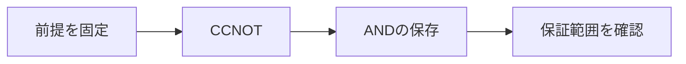

# ToffoliゲートとBoolean計算の埋め込み

> 種別：発展・応用  
> 状態：本文化済み  
> 前提：命題論理・線形代数の初歩  
> 難易度：基礎〜発展  
> 想定読了時間：24分

Toffoliゲートは二つの制御ビットが1のとき標的ビットを反転します。古典基底上では可逆で、NOTと組み合わせれば任意のBoolean計算を可逆回路へ埋め込めます。量子回路では振幅全体へ線形に作用します。

---

## 1. このページの到達目標

- Toffoliの真理動作を書く
- ANDの可逆埋め込みを示す
- 古典万能性と量子万能性を区別する

---

## 2. 全体像

この図では、「前提を固定する → 中心概念を形式化する → 具体例で検算する → 保証範囲を確認する」という流れを読み取ります。

式を操作する前に、対象・意味論・評価範囲を固定します。同じ記号でも、採用したモデルが違えば保証内容も変わります。

---

## 3. 基本事項

### 1. CCNOT

Toffoliは $(a,b,c)\mapsto(a,b,c\oplus ab)$ です。自分自身が逆で、全8基底状態を置換します。

### 2. ANDの保存

標的を0に初期化すると、出力は $(a,b,ab)$。入力を残すことで多対一のANDを可逆化します。

### 3. 万能性の範囲

Toffoliは古典可逆計算に万能ですが、任意の量子ユニタリを近似するにはHadamardや位相ゲートなど非古典的ゲートも必要です。

---

## 4. 段階例

入力 $(1,1,0)$ は $(1,1,1)$ へ、$(1,0,0)$ は変化しません。

中心となる式は次です。

$$
T(a,b,c)=(a,b,c\oplus(a\land b))
$$

1. 式に現れる対象・変数・演算の意味を固定します。
2. 各部分式が要求する内容を日本語へ戻します。
3. 最小の具体例または反例で境界条件を調べます。
4. 結論が、採用したモデルと探索範囲を越えていないか確認します。

---

## 5. 四つの軸から見る

| 軸 | このページでの見方 |
|---|---|
| 表現力 | どの区別や性質を直接表せるか |
| 推論可能性 | 規則・定義・同値変形から何を導けるか |
| 計算可能性 | 有限手続きで判定・探索できる範囲はどこか |
| 実用性 | 必要な情報を保ちながら、レビュー・実装しやすいか |

表現を増やせば常に良くなるわけではありません。必要な区別を保ち、検証できる粒度を選びます。

---

## 6. つまずきやすい点

### 1. Toffoliは三入力AND

3ビットから3ビットへの可逆ゲートで、AND結果を標的へXORします。

### 2. Toffoliだけで全量子計算

古典基底の置換だけでは一般の重ね合わせ・位相操作を生成できません。

### 3. 補助ビットは無料

量子ビット数、初期化、uncomputationに資源が要ります。

### 復帰手順

1. 何を個体・状態・値としているか一行で書きます。
2. 量化・否定・演算のスコープへ括弧を付けます。
3. 成立例だけでなく、最小の反例候補も試します。
4. 「証明済み」「モデル内で確認」「経験的に支持」「解釈」を区別します。
5. 元の自然言語要求と形式化を再照合します。

---

## 7. 演習問題

### 問1

「CCNOT」を、自分の言葉で説明してください。

### 問2

「ANDの保存」は、このページでどの役割を持ちますか。

### 問3

「万能性の範囲」について、前提または保証範囲を一つ挙げてください。

### 問4

段階例の式は、どの内容を形式化していますか。

### 問5

「Toffoliは三入力AND」という誤解を、どのように修正しますか。

### 問6

このページの結論を別の問題へ適用するとき、最初に何を確認すべきですか。

---

## 8. 演習問題の解答

### 解答1

Toffoliは $(a,b,c)\mapsto(a,b,c\oplus ab)$ です。自分自身が逆で、全8基底状態を置換します。

### 解答2

標的を0に初期化すると、出力は $(a,b,ab)$。入力を残すことで多対一のANDを可逆化します。

### 解答3

Toffoliは古典可逆計算に万能ですが、任意の量子ユニタリを近似するにはHadamardや位相ゲートなど非古典的ゲートも必要です。

### 解答4

入力 $(1,1,0)$ は $(1,1,1)$ へ、$(1,0,0)$ は変化しません。 という内容を、対象と演算を明示して表しています。

### 解答5

3ビットから3ビットへの可逆ゲートで、AND結果を標的へXORします。

### 解答6

対象領域、記号の意味、採用するモデル、量化範囲を固定し、元の要求に必要な区別が保存されているか確認します。

---

## 学習チェック

- [ ] Toffoliの真理動作を書く
- [ ] ANDの可逆埋め込みを示す
- [ ] 古典万能性と量子万能性を区別する
- [ ] 事実・定理・解釈・仮説を区別できる
- [ ] 結論を前提とモデルに相対化して説明できる

---

## ナビゲーション

- 親：[README.md](README.md)
- 前：[量子ゲートは線形変換](04_quantum_gates_as_linear_transformations.md)
- 次：[測定と確率](06_measurement_and_probability.md)
- タワー入口：[../../README.md](../../README.md)
- 進捗：[../../PROGRESS.md](../../PROGRESS.md)
