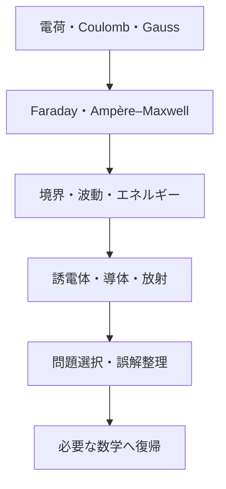

# 電磁気学――電荷から場・物質・放射まで

> 完成状態：電磁気学章の本文・Q&A・補習を本文化済み
> 単位系：SI
> 交流の時間規約：
>
> $$
> e^{-i\omega t}
> $$

## この章を貫く問い

電荷と電流は、離れた場所へどのように力・エネルギー・情報を伝えるのでしょうか。

力学では粒子の運動を追いました。電磁気学では空間の各点に定義された場

$$
\mathbf E,\ \mathbf B
$$

を主役にします。電荷と電流が場を作り、場がLorentz力

$$
\mathbf F=q(\mathbf E+\mathbf v\times\mathbf B)
$$

を通して物質へ作用します。

## 1. 15段階のストーリー

この図は、静的な電荷から時間変化・物質応答・放射へ進む章全体の因果順序を示します。

1. 電荷と電場
2. Coulomb則
3. 対称性とGauss則
4. 時間変化する磁束とFaraday則
5. 電流・磁場とAmpère則
6. 変位電流とMaxwell方程式
7. 境界条件
8. 電磁波
9. エネルギー密度とPoyntingベクトル
10. 誘電体と分極
11. 導体と表皮効果
12. 加速電荷と放射
13. 問題の選び方
14. 誤解・単位・符号の整理
15. 必要な数学への復帰

## 2. Maxwell方程式を二つの記述で整理する

### 2.1 真空中・全電荷による微分形

$$
\nabla\cdot\mathbf E=\frac{\rho}{\varepsilon_0}
$$

$$
\nabla\cdot\mathbf B=0
$$

$$
\nabla\times\mathbf E=-\frac{\partial\mathbf B}{\partial t}
$$

$$
\nabla\times\mathbf B=\mu_0\mathbf J
+\mu_0\varepsilon_0
\frac{\partial\mathbf E}{\partial t}
$$

ここで

$$
\rho,\ \mathbf J
$$

は記述対象に含めた全電荷・全電流です。

### 2.2 物質中・自由電荷による巨視的形

$$
\nabla\cdot\mathbf D=\rho_{\mathrm f}
$$

$$
\nabla\cdot\mathbf B=0
$$

$$
\nabla\times\mathbf E=-\frac{\partial\mathbf B}{\partial t}
$$

$$
\nabla\times\mathbf H=\mathbf J_{\mathrm f}
+\frac{\partial\mathbf D}{\partial t}
$$

補助場は

$$
\mathbf D=\varepsilon_0\mathbf E+\mathbf P
$$

$$
\mathbf H=\frac{\mathbf B}{\mu_0}-\mathbf M
$$

で、束縛電荷・束縛電流を物質応答へ整理します。本章の現象論は主に電気分極を扱い、磁化は定義にとどめます。

構成方程式

$$
\mathbf D=\varepsilon\mathbf E
$$

$$
\mathbf B=\mu\mathbf H
$$

$$
\mathbf J_{\mathrm c}=\sigma\mathbf E
$$

は、Maxwell方程式と同じ普遍法則ではありません。線形・等方・局所・一様など、各記事で明示する媒質モデルの条件に依存します。

## 3. 積分形

$$
\oint_{\partial V}\mathbf D\cdot d\mathbf S=Q_{\mathrm f}
$$

$$
\oint_{\partial V}\mathbf B\cdot d\mathbf S=0
$$

$$
\oint_{\partial S}\mathbf E\cdot d\mathbf l=-\frac{d}{dt}\int_S\mathbf B\cdot d\mathbf S
$$

$$
\oint_{\partial S}\mathbf H\cdot d\mathbf l=I_{\mathrm f}
+\frac{d}{dt}\int_S\mathbf D\cdot d\mathbf S
$$

微分形は各点の局所関係、積分形は面・体積・周回路を通した総量関係です。どちらか一方が本物なのではなく、Gaussの定理とStokesの定理で結ばれます。

## 4. 4式の相互整合

- 電荷は電場の発散源です。
- 磁荷を導入しない標準電磁気では、磁場の発散はゼロです。
- 時間変化する磁場は渦電場を作ります。
- 電流と時間変化する電場は渦磁場を作ります。

Ampère–Maxwell則の発散を取ると

$$
\frac{\partial\rho}{\partial t}
+\nabla\cdot\mathbf J=0
$$

が得られ、変位電流が電荷保存と理論を整合させます。

Faraday則とAmpère–Maxwell則を組み合わせると波動方程式が生まれ、Poynting定理

$$
\frac{\partial u}{\partial t}
+\nabla\cdot\mathbf S
+\mathbf J\cdot\mathbf E=0
$$

が場と物質を含むエネルギー保存を表します。Maxwell方程式は4公式の寄せ集めではなく、保存則・波動・境界条件を同時に支える一つの系です。

## 5. 読み方

### 必修ルート

1. [Coulomb則からGauss則](part01_build_maxwell/01_from_coulomb_to_gauss.md)
2. [Faraday則](part01_build_maxwell/02_faraday_law.md)
3. [Ampère–Maxwell則](part01_build_maxwell/03_ampere_maxwell.md)
4. [境界条件](part02_use_maxwell/01_boundary_conditions.md)
5. [電磁波](part02_use_maxwell/02_em_waves.md)
6. [Poyntingベクトル](part02_use_maxwell/03_poynting_vector.md)
7. [誘電体](part03_phenomenology/01_dielectrics.md)
8. [導体と表皮効果](part03_phenomenology/02_conductors_and_skin_effect.md)
9. [放射](part03_phenomenology/03_radiation_basics.md)

### 数学補習ルート

- grad・div・curlで止まった：[ベクトル解析](remedial/01_vector_calc_for_em.md)
- Poisson・波動・拡散で止まった：[ODE・PDE](remedial/02_ode_pde_refresh.md)
- 位相・損失・複素波数で止まった：[複素表示](remedial/03_complex_representation_ac.md)

### 現象から入るルート

1. [誘電体](part03_phenomenology/01_dielectrics.md)
2. [導体と表皮効果](part03_phenomenology/02_conductors_and_skin_effect.md)
3. [放射](part03_phenomenology/03_radiation_basics.md)
4. 分からない式からpart01・part02へ逆向きに戻る

### 問題演習ルート

1. [問題選択](qa/02_problem_selection.md)
2. 対応する本文の演習
3. [頻出誤解](qa/01_common_misconceptions.md)
4. [単位と符号](qa/03_units_and_signs.md)

## 6. 各パートの完成状態

| パート | 役割 | 状態 |
|---|---|---|
| [part01](part01_build_maxwell/README.md) | Maxwell方程式を組み立てる | 完成・技術レビュー済み |
| [part02](part02_use_maxwell/README.md) | 境界・波動・エネルギーへ使う | 完成・技術レビュー済み |
| [part03](part03_phenomenology/README.md) | 物質と放射へつなぐ | 新規本文化・レビュー済み |
| [qa](qa/README.md) | 誤解・問題選択・検算 | 新規本文化済み |
| [remedial](remedial/README.md) | 数学への最短復帰 | 新規本文化済み |

## 7. 次章との接続

次章の解析力学では、場そのものではなく作用・変分・対称性から運動方程式と保存則を統一します。本章で使った

$$
\text{モデル}
\quad
\text{境界条件}
\quad
\text{保存則}
\quad
\text{対称性}
$$

という考え方はそのまま持ち越します。ただし、本バッチでは解析力学の記事には着手しません。

回路への応用は[10_circuits](../10_circuits/00_overview.md)、量子計算と古典回路・論理の違いは[Logic Towerの発展記事](../../logic_tower/90_essays/quantum_computing_and_logic/README.md)へ接続します。

## 8. 章末チェック

- 真空中と物質中のMaxwell方程式を使い分けられる。
- 自由電荷・束縛電荷・分極・電束密度を区別できる。
- 境界条件、波動、エネルギー保存を同じ方程式系から説明できる。
- 良導体近似と遠方場近似の条件を述べられる。
- 問題文から第一候補の道具を選べる。

## ナビゲーション

- 前：[力学](../01_dynamics/00_overview.md)
- 次：[part01：Maxwell方程式を組み立てる](part01_build_maxwell/README.md)
- 親：[Physics Tower](../README.md)
