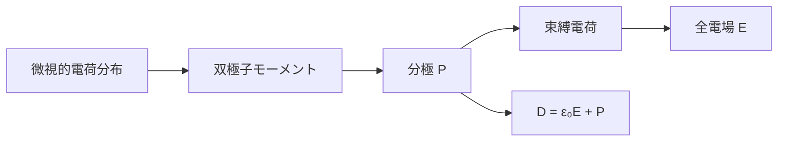

# 誘電体――微視的電荷から分極・束縛電荷・電束密度へ

> 章内位置：10 / 15「誘電体と分極」
> 前提：[境界条件](../part02_use_maxwell/01_boundary_conditions.md)、ガウスの法則
> 到達目標：自由電荷と束縛電荷を分離し、構成方程式の条件を明示してコンデンサを解析できる

## このページで答える問い

- 中性な物質を電場に入れると、なぜ電場が変わるのか。
- 微視的電荷、双極子、分極、束縛電荷はどうつながるのか。
- 電場と電束密度は何が違うのか。
- 誘電体を入れたコンデンサで、電荷固定と電圧固定はどう違うのか。

## 1. 現象と採用するモデル

原子・分子は正負の電荷を含みます。外部電場を加えると、電子雲と原子核の重心がわずかにずれたり、永久双極子の向きが偏ったりします。物質全体は中性でも、この微小な電荷分離が作る電場は外部電場へ重なります。

この流れを読み取る図です。電束密度は新しい力場ではなく、自由電荷を源として数えるために分極の寄与を整理した補助場です。

まず巨視的な連続体として扱い、原子スケールより十分大きく、試料全体より十分小さい体積で平均します。磁気応答は扱わず、静電場または準静的な電場を考えます。

## 2. 物理量と記号

微視的な点電荷の集まりに対し、電気双極子モーメントを

$$
\mathbf{p}=\sum_a q_a\mathbf{r}_a
$$

と定義します。総電荷がゼロなら、原点を平行移動しても値は変わりません。

分極ベクトルは単位体積あたりの双極子モーメントです。

$$
\mathbf{P}(\mathbf{r})=
\frac{\text{小体積内の双極子モーメント}}{\text{小体積}}
$$

単位は

$$
[\mathbf{P}]=\mathrm{C/m^2}
$$

です。自由電荷密度を

$$
\rho_{\mathrm f}
$$

束縛電荷密度を

$$
\rho_{\mathrm b}
$$

全電荷密度を

$$
\rho=\rho_{\mathrm f}+\rho_{\mathrm b}
$$

とします。

## 3. 分極から束縛電荷を導く

一様に分極した細長い試料では、内部の隣接双極子の正負端は打ち消し合い、端面にだけ電荷が残ります。分極が空間変化すると内部でも打ち消しが不完全になります。

結果は

$$
\rho_{\mathrm b}=-\nabla\cdot\mathbf{P}
$$

境界面では、物質から外向きの単位法線を

$$
\hat{\mathbf{n}}
$$

として

$$
\sigma_{\mathrm b}=\mathbf{P}\cdot\hat{\mathbf{n}}
$$

です。

体積領域で確かめると

$$
\int_V\rho_{\mathrm b}\,dV=-\int_V\nabla\cdot\mathbf{P}\,dV=-\oint_{\partial V}\mathbf{P}\cdot d\mathbf{S}
$$

となり、内部に割り当てた束縛電荷と境界面に現れる束縛電荷が整合します。

## 4. 電場と電束密度

電場のガウス則は、自由・束縛を合わせた全電荷を数えます。

$$
\nabla\cdot\mathbf{E}=\frac{\rho_{\mathrm f}+\rho_{\mathrm b}}{\varepsilon_0}
$$

束縛電荷の式を代入すると

$$
\nabla\cdot\left(\varepsilon_0\mathbf{E}+\mathbf{P}\right)=\rho_{\mathrm f}
$$

そこで電束密度を定義します。

$$
\boxed{\mathbf{D}=\varepsilon_0\mathbf{E}+\mathbf{P}}
$$

したがって

$$
\boxed{\nabla\cdot\mathbf{D}=\rho_{\mathrm f}}
$$

です。これは定義とガウス則から従う関係であり、物質の種類をまだ仮定していません。

一方、

$$
\mathbf{D}=\varepsilon\mathbf{E}
$$

は一般法則ではありません。局所的・線形・等方な媒質で

$$
\mathbf{P}=\varepsilon_0\chi_{\mathrm e}\mathbf{E}
$$

とモデル化できるとき、

$$
\mathbf{D}=\varepsilon_0(1+\chi_{\mathrm e})\mathbf{E}=\varepsilon\mathbf{E}
$$

となります。

一様性まで仮定すれば誘電率は位置に依存しません。異方性媒質では誘電率はテンソル、非線形媒質では分極は電場に比例せず、分散媒質では応答は周波数にも依存します。

## 5. 境界条件

媒質1から媒質2へ向く法線を取ると

$$
\hat{\mathbf{n}}\cdot(\mathbf{D}_2-\mathbf{D}_1)=\sigma_{\mathrm f}
$$

です。右辺は自由表面電荷だけです。

電場について全表面電荷を使えば

$$
\hat{\mathbf{n}}\cdot(\mathbf{E}_2-\mathbf{E}_1)=\frac{\sigma_{\mathrm f}+\sigma_{\mathrm b}}{\varepsilon_0}
$$

です。静電場の接線条件は

$$
\hat{\mathbf{n}}\times(\mathbf{E}_2-\mathbf{E}_1)=\mathbf{0}
$$

です。

## 6. 具体例：誘電体を満たした平行板コンデンサ

面積を

$$
A
$$

極板間隔を

$$
d
$$

とし、端効果を無視します。線形・等方・一様な誘電体が全空間を満たすとします。

### 6.1 自由電荷固定

電源から切り離して自由電荷

$$
Q_{\mathrm f}
$$

を固定すると

$$
D=\frac{Q_{\mathrm f}}{A}
$$

です。したがって

$$
E=\frac{D}{\varepsilon}=\frac{Q_{\mathrm f}}{\varepsilon A}
$$

電圧は

$$
V=Ed=\frac{Q_{\mathrm f}d}{\varepsilon A}
$$

です。真空時より電場と電圧が小さくなります。

エネルギーは

$$
U=\frac{Q_{\mathrm f}^2}{2C}
$$

なので、静電容量が増えると減少します。

### 6.2 電圧固定

電源につないで

$$
V
$$

を固定すると

$$
E=\frac{V}{d}
$$

は変わらず、

$$
Q_{\mathrm f}=DA=\varepsilon EA=\frac{\varepsilon A}{d}V
$$

が増えます。追加電荷とエネルギーは電源とのやり取りを含めて考えなければなりません。

静電容量はどちらの場合も

$$
C=\frac{Q_{\mathrm f}}{V}=\frac{\varepsilon A}{d}
$$

ですが、「何が固定されるか」により変化する量とエネルギー収支が違います。

## 7. 検算

- 次元：

$$
[\mathbf{D}]=[\mathbf{P}]=\mathrm{C/m^2}
$$

- 真空極限：

$$
\chi_{\mathrm e}\to0
\quad\Longrightarrow\quad
\mathbf{D}\to\varepsilon_0\mathbf{E}
$$

- 分極一定の内部：

$$
\nabla\cdot\mathbf{P}=0
$$

でも表面束縛電荷は残り得ます。

- 自由電荷がなくても、分極が不均一なら全電場はゼロとは限りません。

## 8. 適用範囲・誤解・復帰手順

このページの単純な比例式は、局所的・線形・等方な応答に限ります。強電場、結晶の異方性、時間遅れ、周波数分散、強誘電体の履歴効果では構成方程式を拡張します。

典型的な誤解は次の通りです。

1. 電束密度を電場とは別の力とみなす。
2. 束縛電荷を「動けない電子」という粒子分類だと思う。
3. 誘電体を入れると電場は必ず弱くなると思う。
4. 比例式をあらゆる媒質へ適用する。

迷ったら、次の順へ戻ります。

1. 自由電荷と全電荷のどちらが与えられたか確認する。
2. まず

$$
\mathbf{D}=\varepsilon_0\mathbf{E}+\mathbf{P}
$$

を書く。
3. その後で物質モデルを選ぶ。
4. 電荷固定か電圧固定かを宣言する。

## 9. 演習問題

1. 一様分極した円柱の側面と端面の束縛表面電荷を求めよ。
2. 分極が

$$
\mathbf{P}=ax\,\hat{\mathbf{x}}
$$

のとき、体積束縛電荷密度を求めよ。
3. 線形・等方媒質で誘電率と感受率の関係を導け。
4. 自由電荷のない媒質境界で、電束密度の法線成分を比較せよ。
5. 電荷固定コンデンサへ比誘電率

$$
\varepsilon_{\mathrm r}
$$

の誘電体を挿入したとき、電場・電圧・エネルギーの比を求めよ。
6. 電圧固定の場合、自由電荷と場のエネルギーの比を求めよ。
7. 「自由電荷がゼロなら電場もゼロである」という主張を反例で修正せよ。
8. 異方性媒質で比例式をどう書き換えるか述べよ。

## 10. 全解答

1. 分極が軸方向なら側面では

$$
\sigma_{\mathrm b}=0
$$

両端面では

$$
\sigma_{\mathrm b}=\pm P
$$

です。

2.

$$
\rho_{\mathrm b}=-\nabla\cdot\mathbf{P}=-a
$$

です。

3.

$$
\mathbf{P}=\varepsilon_0\chi_{\mathrm e}\mathbf{E}
$$

を定義式へ代入して

$$
\varepsilon=\varepsilon_0(1+\chi_{\mathrm e})
$$

です。

4.

$$
D_{2n}-D_{1n}=0
$$

なので連続です。

5.

$$
\frac{E}{E_0}=\frac{V}{V_0}=\frac{U}{U_0}=\frac{1}{\varepsilon_{\mathrm r}}
$$

です。

6.

$$
\frac{Q_{\mathrm f}}{Q_{\mathrm f0}}=\frac{U}{U_0}=\varepsilon_{\mathrm r}
$$

です。場のエネルギー増加だけでなく電源の仕事を含めて収支を取ります。

7. 自発分極した物質や不均一な分極では、自由電荷がゼロでも束縛電荷が場を作れます。正しくは、自由電荷ゼロから従うのは

$$
\nabla\cdot\mathbf{D}=0
$$

です。

8. 誘電率テンソルを使い

$$
D_i=\sum_j\varepsilon_{ij}E_j
$$

と書きます。

## 11. 学習チェックとまとめ

- 微視的電荷、双極子、分極、束縛電荷を順に説明できる。
- 電場のガウス則が全電荷、電束密度のガウス則が自由電荷を数えると説明できる。
- 構成方程式と基本法則を区別できる。
- コンデンサで固定条件を先に判定できる。

## ナビゲーション

- 前：[ポインティングベクトル](../part02_use_maxwell/03_poynting_vector.md)
- 次：[導体と表皮効果](02_conductors_and_skin_effect.md)
- 親：[現象論README](README.md)
- 補習：[ベクトル解析](../remedial/01_vector_calc_for_em.md)
