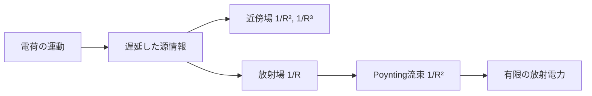

# 加速電荷と電磁放射――近傍場から遠方場へ

> 章内位置：12 / 15「加速電荷と放射」
> 前提：[電磁波](../part02_use_maxwell/02_em_waves.md)、[Poyntingベクトル](../part02_use_maxwell/03_poynting_vector.md)
> 非相対論・真空中を中心に扱う

## このページで答える問い

- 静止電荷、等速電荷、加速電荷の場は何が違うのか。
- 近傍場と放射場を距離依存でどう見分けるのか。
- 双極子放射はどの方向へ強く、エネルギーはどう運ばれるのか。
- Larmor公式とアンテナ理論はどこへつながるのか。

## 1. 遅延の直観

電荷が動いても、その情報は空間全体へ瞬時には届きません。観測時刻を

$$
t
$$

観測点までの距離を

$$
R
$$

とすると、場は概念的に遅延時刻

$$
t_{\mathrm r}=t-\frac{R}{c}
$$

における電荷の状態で決まります。

この図は、源の運動から観測される場とエネルギー流までの因果順序を示します。

厳密な点電荷の場はLiénard–Wiechertポテンシャルから導けますが、本ページでは距離依存と非相対論的双極子放射に絞ります。

## 2. 静止・等速・加速

静止点電荷はCoulomb場を作ります。

$$
E\propto\frac{1}{R^2}
$$

等速電荷の場はLorentz変換により方向依存に変形しますが、一定速度だけを理由に無限遠へ正味の放射電力を送り続けるわけではありません。

加速があると、場の変化に「折れ」が生じ、その情報が外向きへ伝わります。非相対論的な遠方放射場の大きさは概略

$$
E_{\mathrm{rad}}
\propto
\frac{q\,a_\perp(t_{\mathrm r})}
{4\pi\varepsilon_0c^2R}
$$

です。ここで

$$
a_\perp
$$

は観測方向に垂直な加速度成分です。

## 3. 近傍場と放射場

局在した振動源の場には、典型的に異なる距離依存が含まれます。

| 成分 | 代表的距離依存 | 主な役割 |
|---|---:|---|
| 準静的双極子場 | 1/R³ | 源近傍に蓄えられる場 |
| 誘導場 | 1/R² | 近傍でのエネルギー交換 |
| 放射場 | 1/R | 遠方へ進む横波 |

放射場では

$$
B_{\mathrm{rad}}=\frac{E_{\mathrm{rad}}}{c}
$$

で、電場・磁場・伝搬方向は互いに直交します。

ポインティング流束は

$$
S_{\mathrm{rad}}
\propto E_{\mathrm{rad}}^2
\propto\frac{1}{R^2}
$$

です。半径

$$
R
$$

の球面積が

$$
4\pi R^2
$$

で増えるため、球面全体を通る放射電力は有限の一定値へ近づきます。これが

$$
1/R
$$

の場を放射場と呼ぶ決定的な理由です。

## 4. 振動電気双極子

原点に小さな双極子があり、

$$
\mathbf{p}(t)=p_0\cos(\omega t)\,\hat{\mathbf{z}}
$$

と振動するとします。源の大きさが波長より十分小さい

$$
\ell\ll\lambda
$$

という双極子近似を置きます。

遠方で、双極子軸との角度を

$$
\theta
$$

とすると放射電場の振幅は

$$
E_\theta
\simeq
\frac{\omega^2p_0}{4\pi\varepsilon_0c^2R}
\sin\theta
$$

です。

時間平均した単位立体角あたり放射電力は

$$
\boxed{
\frac{d\langle P\rangle}{d\Omega}=
\frac{\omega^4p_0^2}
{32\pi^2\varepsilon_0c^3}
\sin^2\theta
}
$$

となります。

軸方向では

$$
\theta=0,\pi
$$

なのでゼロ、赤道面では最大です。全立体角で積分すると

$$
\boxed{
\langle P\rangle=
\frac{\omega^4p_0^2}
{12\pi\varepsilon_0c^3}
}
$$

です。

## 5. Larmor公式の位置づけ

非相対論的な点電荷が瞬間加速度

$$
a
$$

を持つとき、全放射電力は

$$
\boxed{
P_{\mathrm{Larmor}}=
\frac{q^2a^2}
{6\pi\varepsilon_0c^3}
}
$$

です。

これは加速電荷の放射電力を直接与えます。相対論的速度ではLiénard公式へ拡張が必要です。放射反作用、自己エネルギー、点粒子極限はさらに高度な問題であり、この公式だけでは扱いません。

振動双極子は正負電荷の加速を組み合わせた源です。双極子公式とLarmor公式は競合する法則ではなく、源の記述レベルが違います。

## 6. アンテナとの接続

短い線状アンテナでは交流電流により電荷が周期的に蓄積・減少し、電気双極子モーメントが振動します。

$$
\text{交流電流}
\longrightarrow
\text{振動する電荷分布}
\longrightarrow
\text{振動双極子}
\longrightarrow
\text{遠方放射}
$$

アンテナ近傍では場エネルギーが源へ戻ることもあり、ポインティングベクトルは時刻によって複雑です。十分遠方では外向き成分が支配し、放射パターンとして安定します。

## 7. 検算

- 距離：

$$
E_{\mathrm{rad}}\propto R^{-1}
\quad\Longrightarrow\quad
S\propto R^{-2}
$$

- 角度：双極子軸上で放射ゼロ。
- 静的極限：

$$
\omega\to0
\quad\Longrightarrow\quad
\langle P\rangle\to0
$$

- 次元：Larmor公式は

$$
\mathrm{W}
$$

の次元を持ちます。

## 8. 適用範囲・典型的な誤解・復帰手順

このページは真空中、非相対論、局在源、双極子近似を中心にしています。媒質中の放射、導波路、相対論的ビーミング、多重極展開の高次項は発展事項です。

典型的な誤解は次の通りです。

1. 動く電荷はすべて放射する。
2. 距離が遠いほど電場が弱いので、全放射電力もゼロになる。
3. 近傍の大きな場をそのまま放射と呼ぶ。
4. アンテナから電磁波が瞬時に全空間へ現れる。

迷ったら、

1. 源は静止・等速・加速のどれか。
2. 観測距離に対する項のべきは何か。
3. ポインティング流束を球面積分したとき有限値が残るか。
4. 遅延時刻で源を評価しているか。

を確認します。

## 9. 演習問題

1. Coulomb場のエネルギー流束を遠方放射と呼べない理由を述べよ。
2. 放射電場が距離に反比例するとき、球面全体を通る電力が距離に依存しないことを示せ。
3. 双極子軸上の放射強度を求めよ。
4. 赤道面と軸から45度方向の強度比を求めよ。
5. 振動周波数を2倍にし、双極子振幅を固定したとき全放射電力は何倍か。
6. 加速度を3倍にした点電荷のLarmor放射電力は何倍か。
7. 「等速運動する電荷は、電場が時間変化するので必ず放射する」を修正せよ。
8. 近傍場と放射場を距離依存とエネルギー輸送で比較せよ。

## 10. 全解答

1. 静的Coulomb場は

$$
1/R^2
$$

で、定常的な外向きPoynting流束を持ちません。源近傍に蓄えられた場です。

2.

$$
S\propto E^2\propto\frac{1}{R^2}
$$

なので

$$
P=\int S\,dA
\propto\frac{1}{R^2}4\pi R^2
$$

は一定です。

3.

$$
\sin^2 0=0
$$

なのでゼロです。

4.

$$
\frac{I(45^\circ)}{I(90^\circ)}=\frac{\sin^2 45^\circ}{\sin^2 90^\circ}=\frac{1}{2}
$$

です。

5.

$$
\langle P\rangle\propto\omega^4
$$

なので16倍です。

6.

$$
P\propto a^2
$$

なので9倍です。

7. 一定速度運動は観測点で時間変化する場を作り得ますが、無限遠へ有限の正味電力を運ぶ

$$
1/R
$$

の放射成分を一定速度だけから生じるとは限りません。加速度が放射場の源です。

8. 近傍場は主に

$$
1/R^2,\ 1/R^3
$$

で減衰し、源との間でエネルギーを往復させます。放射場は

$$
1/R
$$

で減衰し、遠方へ正味エネルギーを運びます。

## 11. 学習チェックとまとめ

- 遅延時刻の意味を説明できる。
- 静止・等速・加速を放射の観点から区別できる。
- 近傍場と放射場を距離依存で分類できる。
- 双極子放射の角度分布とLarmor公式の役割を説明できる。

## 回路・アンテナへの接続

本記事を放射場の正本とし、[アンテナと放射](../part05_circuit_applications/12_antennas_and_radiation_connection.md)では放射抵抗、指向性、偏波、給電線との整合へ翻訳します。集中定数回路から空間へ電力が出ていく境界が見える接続です。

## ナビゲーション

- 前：[導体と表皮効果](02_conductors_and_skin_effect.md)
- 次：[Q&A](../qa/README.md)
- 親：[現象論README](README.md)
- 関連：[量子計算と論理](../../../logic_tower/90_essays/quantum_computing_and_logic/README.md)
