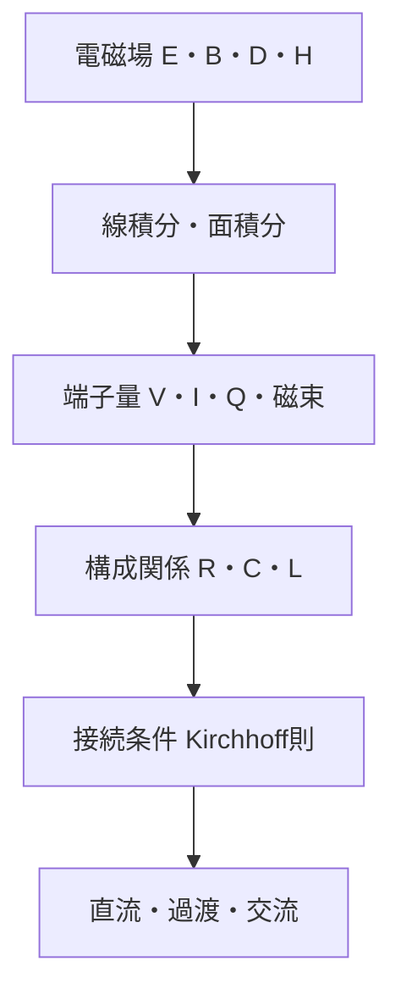

# 電場から電圧へ――線積分で空間を端子量へ縮約する

## このページで答える問い

大学受験で使う電圧は、空間に分布する電場の何をまとめた量なのか。時間変化磁束があると何が変わるのか。

## 前提知識と到達目標

静電場、線積分、Faraday則を前提とし、電位・電位差・起電力・端子電圧を区別できることを目標とする。

## 現象から見る

二点間の電圧は、単位電荷あたりに場が授受するエネルギー差である。一様電場なら距離を掛けるだけだが、本体は経路に沿う線積分である。

この図は、場の自由度を端子量へ圧縮し、どこで近似が入るかを示す。

## モデル・定義・導出

静電場では

$$
\mathbf{E}=-\nabla\phi,\qquad V_{AB}=\phi_A-\phi_B=\int_A^B\mathbf{E}\cdot d\mathbf{l}
$$
であり、回転がゼロなので経路に依らない。一様場と平行な距離を

$$
d
$$
とすれば

$$
|V|=Ed
$$
となる。時間変化磁束があると

$$
\oint_C\mathbf{E}\cdot d\mathbf{l}=-\frac{d\Phi_B}{dt}
$$
で閉路積分がゼロでなく、二点だけでは電圧を一意に定められない。測定リードを含む経路を指定する必要がある。起電力は電気力以外も含む単位電荷あたりの周回仕事、端子電圧は指定端子間の測定量である。電池を理想電圧源とするのは内部の化学場、内部抵抗、過渡電磁場を端子関係へ圧縮する近似である。

## 固有の例

間隔

$$
d=2.0\,\mathrm{mm}
$$
の平行板間に一様場

$$
E=1.5\times10^4\,\mathrm{V/m}
$$
がある。大きさは

$$
V=Ed=30\,\mathrm{V}
$$
である。正負は積分方向と電場方向から決める。

## 適用範囲と検算

静電または電気準静的で、測定経路を鎖交する時間変化磁束が無視できるとき経路独立である。磁束変化が大きい、高周波、広いループでは端子電圧だけの表現に注意する。

## 回路図が省略したもの

電場の空間分布、電池内部の非静電力、リード線の経路、表面電荷、伝播遅延を隠す。

## 典型的な誤解

電圧は一点の量ではない。電位は一点に割り当てるスカラー、電圧は二点間の差である。起電力と電圧降下も同じ語ではない。

## 演習

1. 電場から電圧への定義を、局所的な場または保存量との関係で説明せよ。
2. 中心式を導け。
3. 本文の数値例を、値を2倍にした場合に再計算せよ。
4. このページの集中定数近似が妥当になる条件を一つ、破綻する条件を一つ挙げよ。
5. 次の説明を修正せよ。「電圧は一点の量ではない電位は一点に割り当てるスカラー、電圧は二点間の差である起電力と電圧降下も同じ語ではない」
6. エネルギーまたは電力の収支を説明せよ。

## 全解答

### 1

電場から電圧へは、分布する場を端子または積分量へ縮約した量である。
### 2

本文の定義と積分関係を順に用いる。各等号で一様性・線形性・準静的条件を確認する。
### 3

比例する入力だけを2倍にすれば、本文の中心式から結果の倍率が決まる。単位も同時に確認する。
### 4

静電または電気準静的で、測定経路を鎖交する時間変化磁束が無視できるとき経路独立である。磁束変化が大きい、高周波、広いループでは端子電圧だけの表現に注意する。
### 5

電圧は一点の量ではない。電位は一点に割り当てるスカラー、電圧は二点間の差である。起電力と電圧降下も同じ語ではない。
### 6

Poynting定理または受動符号規約で、境界からの流入、場への蓄積、散逸の三項に分ける。

## 学習チェック

- 中心式をMaxwell方程式または保存則から説明できる。
- 数値例の単位・符号・極限を確認できる。
- 集中定数モデルを使える条件と、場へ戻る条件を言える。

## 半導体への接続

端子電圧はMOS gateやpn接合の境界条件になり、内部電位はPoisson方程式から空間分布として求まります。[電位とcarrier制御](../part06_semiconductor_bridge/02_electric_potential_and_carrier_control.md)では、電子の静電energyが電位と逆符号になる点を確認します。

## ナビゲーション

- 前：[part04入口](README.md)
- 次：[電流密度から電流へ](02_current_from_current_density.md)
- 親：[電磁気学概要](../00_overview.md)
