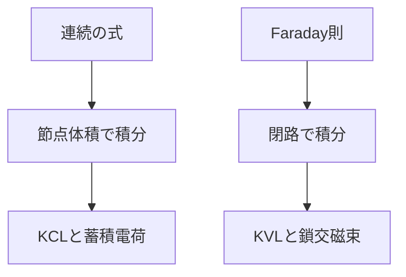

# Maxwell方程式からKirchhoff則へ

## このページで答える問い

節点の電流和と閉路の電圧和は、Maxwell方程式のどこから現れ、どの項を省略しているか。

## 前提知識と到達目標

連続の式とFaraday則を前提とし、KCL・KVLの成立条件と修正式を説明できることを目標とする。

## 現象から見る

Kirchhoff則は自然界の独立な第五・第六法則ではない。電荷保存と電磁誘導を、回路網の節点と枝へ投影した式である。

この図は、局所法則から二つのKirchhoff則が出る経路を示す。

## モデル・定義・導出

節点を囲む体積で連続の式を積分すると

$$
\sum_k I_k=-\frac{dQ_{\mathrm{node}}}{dt}
$$
を得る。節点電荷の時間変化を無視すれば

$$
\sum_k I_k=0
$$
がKCLである。閉路についてFaraday則は

$$
\sum_k V_k=-\frac{d\Phi_{\mathrm{link}}}{dt}
$$
を与える。鎖交磁束を個別のコイル素子へ取り込むか、外部磁束変化を無視すれば

$$
\sum_k V_k=0
$$
というKVLになる。回路網のトポロジーは、どの枝が節点へ接続し、どの枝が閉路を作るかだけを保持する。省略した項を素子や源として戻せば、法則が破れたのではなくモデルが拡張されたと分かる。

## 固有の例

節点へ

$$
2.0\,\mathrm{A}
$$
が流入し、二枝から

$$
0.7\,\mathrm{A},\quad1.1\,\mathrm{A}
$$
が流出する。差

$$
0.2\,\mathrm{A}
$$
は節点容量の充電電流であり、KCLを単純形で使うなら無視してはいけない。

## 適用範囲と検算

節点が等電位とみなせ、蓄積電荷が枝電流に比べて無視でき、閉路を鎖交する外部磁束変化を素子へ局在化できる準静的条件で標準形が有効。

## 回路図が省略したもの

節点の有限サイズ、分布容量、閉路面積、外部磁束、伝播遅延をトポロジーだけへ圧縮する。

## 典型的な誤解

高周波でKCLやKVLが自然法則として破れるのではない。変位電流、蓄積電荷、誘導起電力、伝播を落とした式が不足する。

## 演習

1. Maxwell方程式からKirchhoff則への定義を、局所的な場または保存量との関係で説明せよ。
2. 中心式を導け。
3. 本文の数値例を、値を2倍にした場合に再計算せよ。
4. このページの集中定数近似が妥当になる条件を一つ、破綻する条件を一つ挙げよ。
5. 次の説明を修正せよ。「高周波でKCLやKVLが自然法則として破れるのではない変位電流、蓄積電荷、誘導起電力、伝播を落とした式が不足する」
6. エネルギーまたは電力の収支を説明せよ。

## 全解答

### 1

Maxwell方程式からKirchhoff則へは、分布する場を端子または積分量へ縮約した量である。
### 2

本文の定義と積分関係を順に用いる。各等号で一様性・線形性・準静的条件を確認する。
### 3

比例する入力だけを2倍にすれば、本文の中心式から結果の倍率が決まる。単位も同時に確認する。
### 4

節点が等電位とみなせ、蓄積電荷が枝電流に比べて無視でき、閉路を鎖交する外部磁束変化を素子へ局在化できる準静的条件で標準形が有効。
### 5

高周波でKCLやKVLが自然法則として破れるのではない。変位電流、蓄積電荷、誘導起電力、伝播を落とした式が不足する。
### 6

Poynting定理または受動符号規約で、境界からの流入、場への蓄積、散逸の三項に分ける。

## 学習チェック

- 中心式をMaxwell方程式または保存則から説明できる。
- 数値例の単位・符号・極限を確認できる。
- 集中定数モデルを使える条件と、場へ戻る条件を言える。

## ナビゲーション

- 前：[磁束・Faraday則からインダクタンスへ](05_inductance_from_flux_and_faraday.md)
- 次：[集中定数近似](07_lumped_element_approximation.md)
- 関連：[Ampère–Maxwell則](../part01_build_maxwell/03_ampere_maxwell.md)
